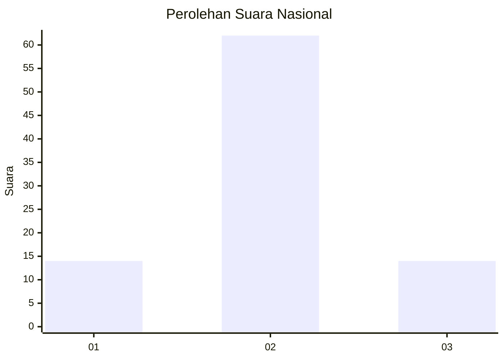
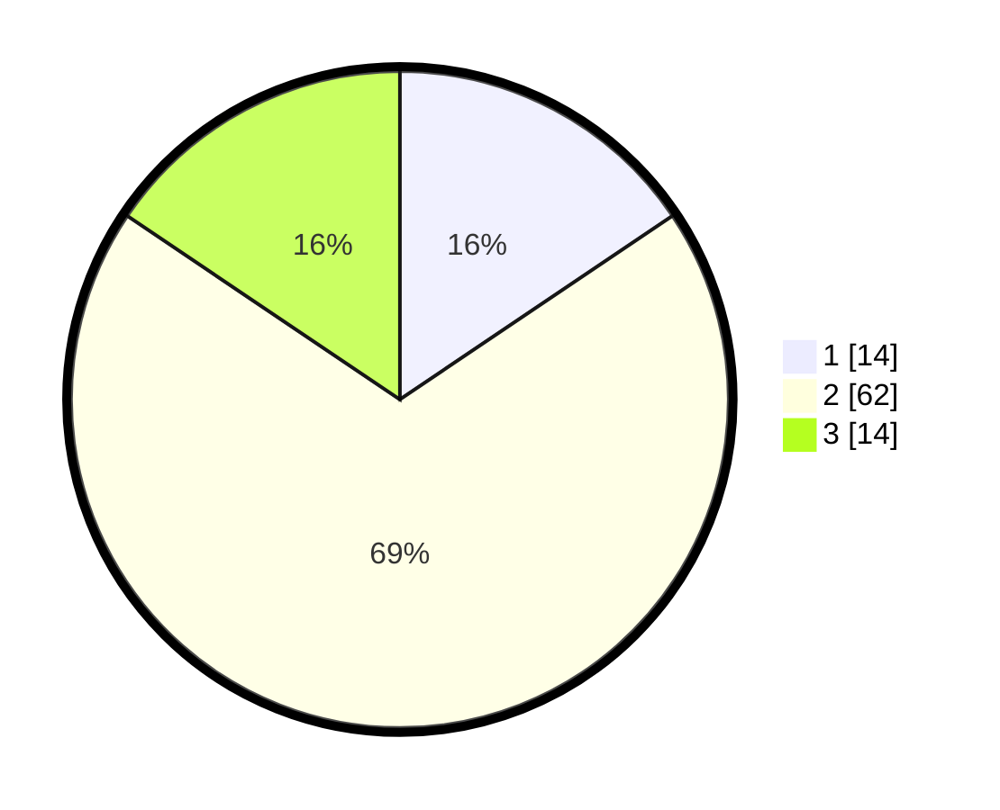

# Hasil

## Grafik

## Tabel

| No. | Nama Paslon    | Suara | Suara (raw) | Persentase |
|:--- |:-------------- | -----:| -----------:| ----------:|
| 1   | ANIES MUHAIMIN | 14    | [14][p-1]   | 15,56      |
| 2   | PRABOWO GIBRAN | 62    | [62][p-2]   | 68,89      |
| 3   | GANJAR MAHFUD  | 14    | [14][p-3]   | 15,56      |

[p-1]: https://github.com/gigit-pemilu/pemilu-2024/blob/main/pilpres/hitung-suara/sub/14-riau/sub/02-indragiri-hulu/sub/08-batang-gangsal/sub/2008-ringin/sub/007-tps/sub/paslon-1.txt
[p-2]: https://github.com/gigit-pemilu/pemilu-2024/blob/main/pilpres/hitung-suara/sub/14-riau/sub/02-indragiri-hulu/sub/08-batang-gangsal/sub/2008-ringin/sub/007-tps/sub/paslon-2.txt
[p-3]: https://github.com/gigit-pemilu/pemilu-2024/blob/main/pilpres/hitung-suara/sub/14-riau/sub/02-indragiri-hulu/sub/08-batang-gangsal/sub/2008-ringin/sub/007-tps/sub/paslon-3.txt

## Foto C Plano

https://sirekap-obj-formc.kpu.go.id/2911/pemilu/ppwp/14/02/08/20/08/1402082008007-20240220-114153--e34d2801-59cc-4522-aa80-d431eac5eebe.jpg

https://sirekap-obj-formc.kpu.go.id/2911/pemilu/ppwp/14/02/08/20/08/1402082008007-20240214-202117--cef54cef-b2a3-479b-91d2-a6069f6e6bff.jpg

https://sirekap-obj-formc.kpu.go.id/2911/pemilu/ppwp/14/02/08/20/08/1402082008007-20240220-115030--29109d86-8793-40c0-bd16-e8ba2dbf7741.jpg

## Metadata

| Key        | Value               |
| ---------- | ------------------- |
| Time Stamp | 2024-02-20 13:00:00 |

