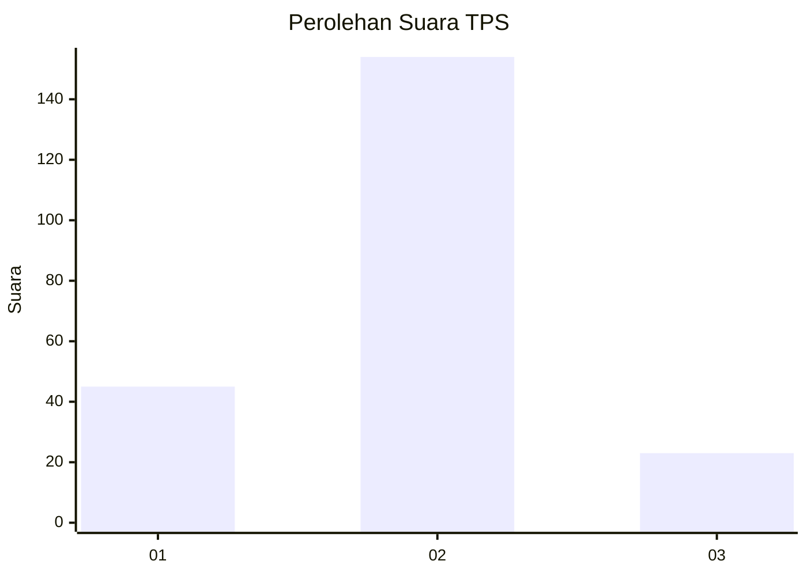

# Hasil

## Grafik

## Tabel

| No. | Nama Paslon    | Suara | Suara (raw) | Persentase |
|:--- |:-------------- | -----:| -----------:| ----------:|
| 1   | ANIES MUHAIMIN | 45    | [45][p-1]   | 20,27      |
| 2   | PRABOWO GIBRAN | 154   | [154][p-2]  | 69,37      |
| 3   | GANJAR MAHFUD  | 23    | [23][p-3]   | 10,36      |

[p-1]: https://github.com/gigit-pemilu/pemilu-2024-14-riau/blob/main/pilpres/hitung-suara/sub/14-riau/sub/02-indragiri-hulu/sub/12-lubuk-batu-jaya/sub/2001-rimpian/sub/002-tps/sub/paslon-1.txt
[p-2]: https://github.com/gigit-pemilu/pemilu-2024-14-riau/blob/main/pilpres/hitung-suara/sub/14-riau/sub/02-indragiri-hulu/sub/12-lubuk-batu-jaya/sub/2001-rimpian/sub/002-tps/sub/paslon-2.txt
[p-3]: https://github.com/gigit-pemilu/pemilu-2024-14-riau/blob/main/pilpres/hitung-suara/sub/14-riau/sub/02-indragiri-hulu/sub/12-lubuk-batu-jaya/sub/2001-rimpian/sub/002-tps/sub/paslon-3.txt

## Foto C Plano

https://sirekap-obj-formc.kpu.go.id/ea57/pemilu/ppwp/14/02/12/20/01/1402122001002-20240218-161138--4dd29aba-ae26-4b7a-8d2b-8ce03a2cc601.jpg

https://sirekap-obj-formc.kpu.go.id/ea57/pemilu/ppwp/14/02/12/20/01/1402122001002-20240218-161402--dd27320d-fd3e-4e35-9a46-34a23fbebed7.jpg

https://sirekap-obj-formc.kpu.go.id/ea57/pemilu/ppwp/14/02/12/20/01/1402122001002-20240218-161538--4f559fc5-f883-42f9-9b9a-f3bb04e1684e.jpg

## Metadata

| Key        | Value               |
| ---------- | ------------------- |
| Time Stamp | 2024-02-19 06:16:00 |

