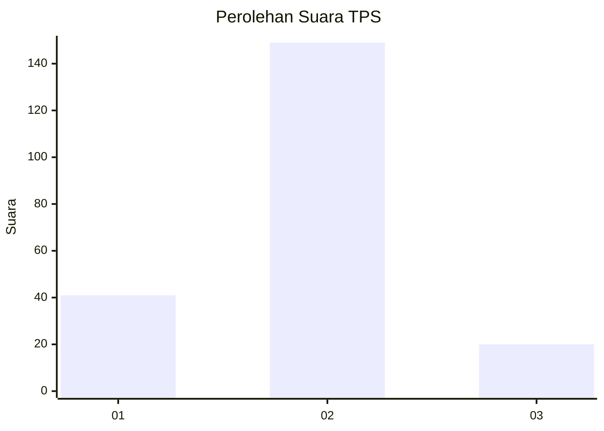
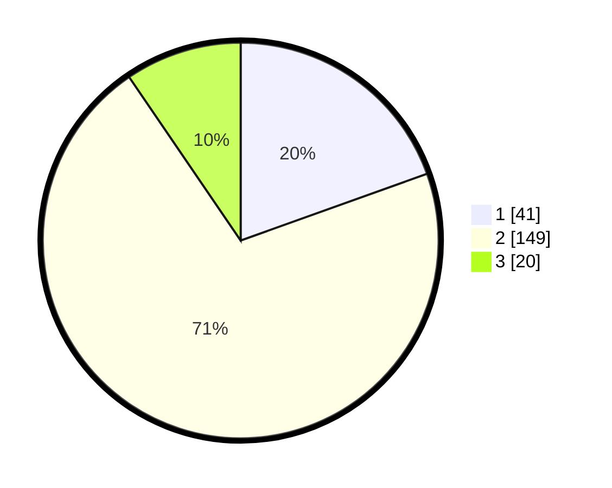

# Hasil

## Grafik

## Tabel

| No. | Nama Paslon    | Suara | Suara (raw) | Persentase |
|:--- |:-------------- | -----:| -----------:| ----------:|
| 1   | ANIES MUHAIMIN | 41    | [41][p-1]   | 19,52      |
| 2   | PRABOWO GIBRAN | 149   | [149][p-2]  | 70,95      |
| 3   | GANJAR MAHFUD  | 20    | [20][p-3]   | 9,52       |

[p-1]: https://github.com/gigit-pemilu/pemilu-2024-14-riau/blob/main/pilpres/hitung-suara/sub/14-riau/sub/02-indragiri-hulu/sub/12-lubuk-batu-jaya/sub/2001-rimpian/sub/004-tps/sub/paslon-1.txt
[p-2]: https://github.com/gigit-pemilu/pemilu-2024-14-riau/blob/main/pilpres/hitung-suara/sub/14-riau/sub/02-indragiri-hulu/sub/12-lubuk-batu-jaya/sub/2001-rimpian/sub/004-tps/sub/paslon-2.txt
[p-3]: https://github.com/gigit-pemilu/pemilu-2024-14-riau/blob/main/pilpres/hitung-suara/sub/14-riau/sub/02-indragiri-hulu/sub/12-lubuk-batu-jaya/sub/2001-rimpian/sub/004-tps/sub/paslon-3.txt

## Foto C Plano

https://sirekap-obj-formc.kpu.go.id/d5fe/pemilu/ppwp/14/02/12/20/01/1402122001004-20240218-150258--7b61ddac-1122-4289-a3b0-96bddafb627f.jpg

https://sirekap-obj-formc.kpu.go.id/d5fe/pemilu/ppwp/14/02/12/20/01/1402122001004-20240218-150509--5dac9006-0dcc-4212-8d77-5ff50ab321ab.jpg

https://sirekap-obj-formc.kpu.go.id/d5fe/pemilu/ppwp/14/02/12/20/01/1402122001004-20240218-151359--bface800-c314-4787-be66-f7e56b0b3f63.jpg

## Metadata

| Key        | Value               |
| ---------- | ------------------- |
| Time Stamp | 2024-02-19 06:16:00 |

