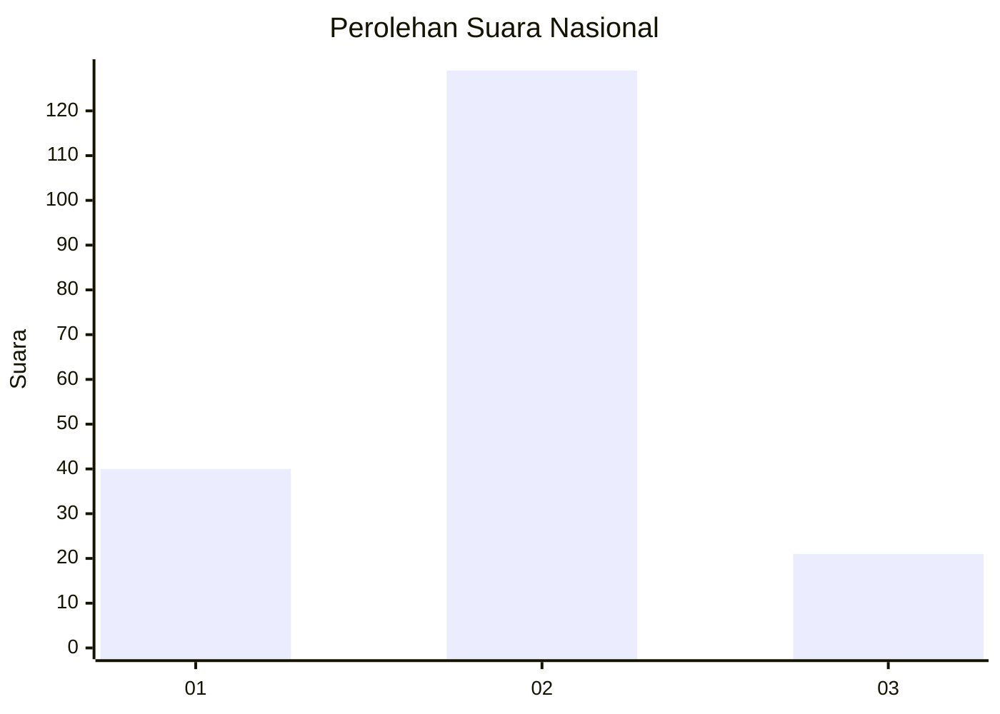
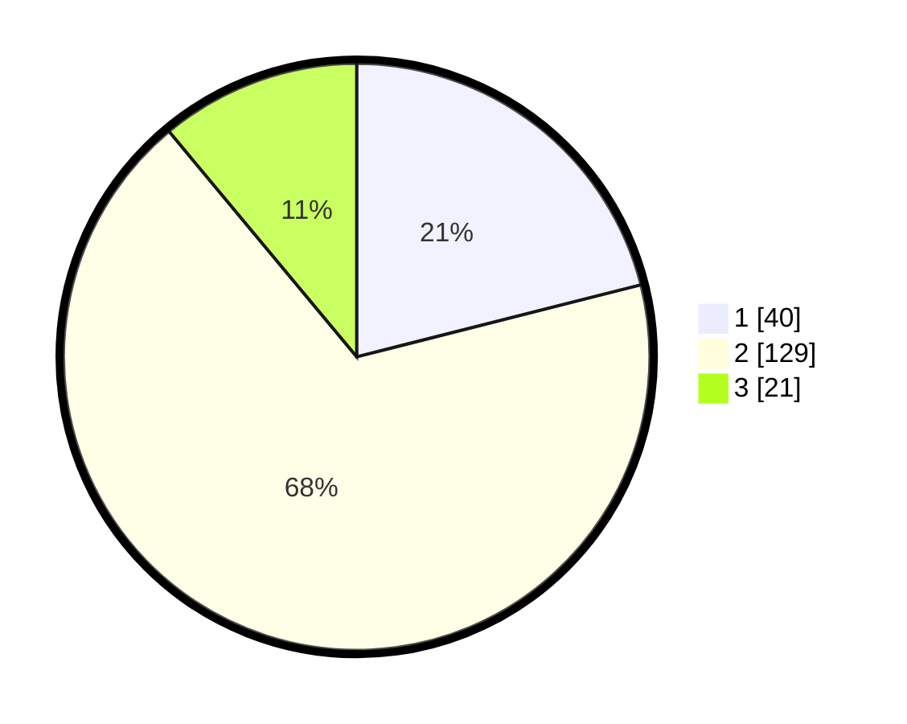

# Hasil

## Grafik

## Tabel

| No. | Nama Paslon    | Suara | Suara (raw) | Persentase |
|:--- |:-------------- | -----:| -----------:| ----------:|
| 1   | ANIES MUHAIMIN | 40    | [40][p-1]   | 21,05      |
| 2   | PRABOWO GIBRAN | 129   | [129][p-2]  | 67,89      |
| 3   | GANJAR MAHFUD  | 21    | [21][p-3]   | 11,05      |

[p-1]: https://github.com/gigit-pemilu/pemilu-2024/blob/main/pilpres/hitung-suara/sub/14-riau/sub/02-indragiri-hulu/sub/12-lubuk-batu-jaya/sub/2001-rimpian/sub/005-tps/sub/paslon-1.txt
[p-2]: https://github.com/gigit-pemilu/pemilu-2024/blob/main/pilpres/hitung-suara/sub/14-riau/sub/02-indragiri-hulu/sub/12-lubuk-batu-jaya/sub/2001-rimpian/sub/005-tps/sub/paslon-2.txt
[p-3]: https://github.com/gigit-pemilu/pemilu-2024/blob/main/pilpres/hitung-suara/sub/14-riau/sub/02-indragiri-hulu/sub/12-lubuk-batu-jaya/sub/2001-rimpian/sub/005-tps/sub/paslon-3.txt

## Foto C Plano

https://sirekap-obj-formc.kpu.go.id/cefc/pemilu/ppwp/14/02/12/20/01/1402122001005-20240219-101016--f9c25ffd-c861-401d-862f-9629a4a15da0.jpg

https://sirekap-obj-formc.kpu.go.id/cefc/pemilu/ppwp/14/02/12/20/01/1402122001005-20240218-155957--dc3b030f-e4b9-44d3-bc66-8116b214806b.jpg

https://sirekap-obj-formc.kpu.go.id/cefc/pemilu/ppwp/14/02/12/20/01/1402122001005-20240218-161031--a92909b8-aac0-4b3d-881f-91e48201aad5.jpg

## Metadata

| Key        | Value               |
| ---------- | ------------------- |
| Time Stamp | 2024-02-19 11:00:00 |

