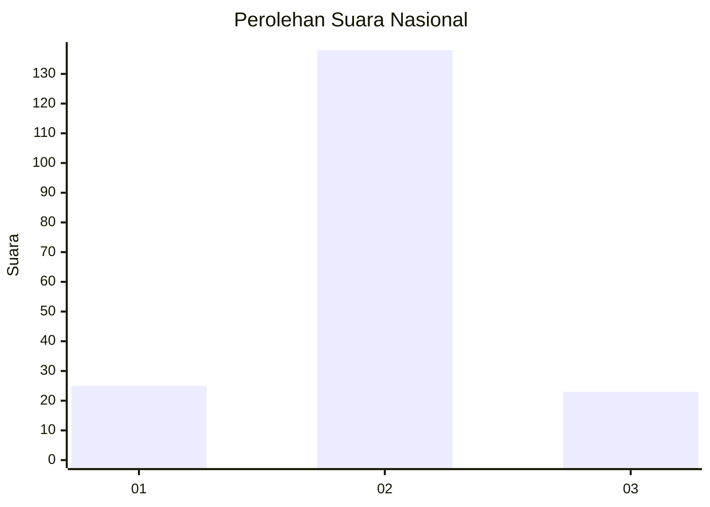
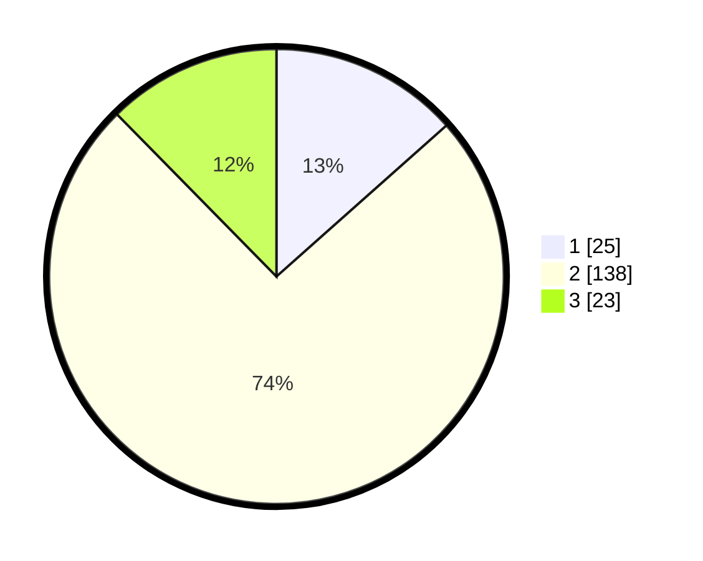

# Hasil

## Grafik

## Tabel

| No. | Nama Paslon    | Suara | Suara (raw) | Persentase |
|:--- |:-------------- | -----:| -----------:| ----------:|
| 1   | ANIES MUHAIMIN | 25    | [25][p-1]   | 13,44      |
| 2   | PRABOWO GIBRAN | 138   | [138][p-2]  | 74,19      |
| 3   | GANJAR MAHFUD  | 23    | [23][p-3]   | 12,37      |

[p-1]: https://github.com/gigit-pemilu/pemilu-2024/blob/main/pilpres/hitung-suara/sub/14-riau/sub/02-indragiri-hulu/sub/12-lubuk-batu-jaya/sub/2006-sungai-beras-beras/sub/003-tps/sub/paslon-1.txt
[p-2]: https://github.com/gigit-pemilu/pemilu-2024/blob/main/pilpres/hitung-suara/sub/14-riau/sub/02-indragiri-hulu/sub/12-lubuk-batu-jaya/sub/2006-sungai-beras-beras/sub/003-tps/sub/paslon-2.txt
[p-3]: https://github.com/gigit-pemilu/pemilu-2024/blob/main/pilpres/hitung-suara/sub/14-riau/sub/02-indragiri-hulu/sub/12-lubuk-batu-jaya/sub/2006-sungai-beras-beras/sub/003-tps/sub/paslon-3.txt

## Foto C Plano

https://sirekap-obj-formc.kpu.go.id/ee5b/pemilu/ppwp/14/02/12/20/06/1402122006003-20240214-155700--ae005cd3-0b46-4bf8-bf94-0f56d68020d8.jpg

https://sirekap-obj-formc.kpu.go.id/ee5b/pemilu/ppwp/14/02/12/20/06/1402122006003-20240214-155802--feebe33b-b5f9-4bf3-9770-3c3b7e73df9e.jpg

https://sirekap-obj-formc.kpu.go.id/ee5b/pemilu/ppwp/14/02/12/20/06/1402122006003-20240214-160115--0ae210bd-abe4-4dea-b827-f8ab4f84824e.jpg

## Metadata

| Key        | Value               |
| ---------- | ------------------- |
| Time Stamp | 2024-02-15 21:01:18 |

