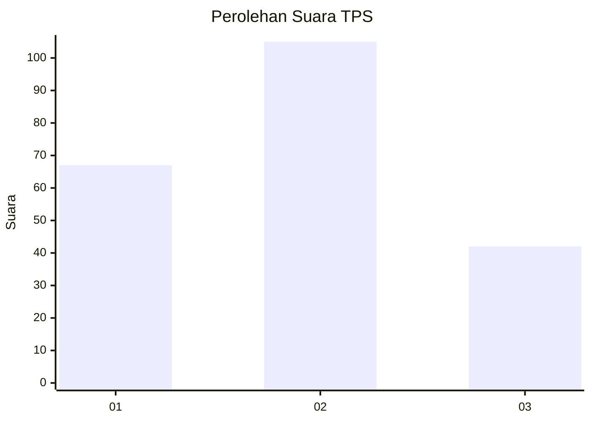
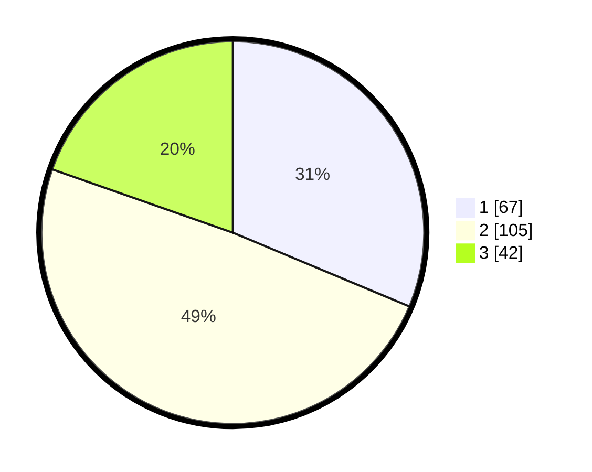

# Hasil

## Grafik

## Tabel

| No. | Nama Paslon    | Suara | Suara (raw) | Persentase |
|:--- |:-------------- | -----:| -----------:| ----------:|
| 1   | ANIES MUHAIMIN | 67    | [67][p-1]   | 31,31      |
| 2   | PRABOWO GIBRAN | 105   | [105][p-2]  | 49,07      |
| 3   | GANJAR MAHFUD  | 42    | [42][p-3]   | 19,63      |

[p-1]: https://github.com/gigit-pemilu/pemilu-2024-14-riau/blob/main/pilpres/hitung-suara/sub/14-riau/sub/02-indragiri-hulu/sub/13-rakit-kulim/sub/2002-talang-durian-cacar/sub/001-tps/sub/paslon-1.txt
[p-2]: https://github.com/gigit-pemilu/pemilu-2024-14-riau/blob/main/pilpres/hitung-suara/sub/14-riau/sub/02-indragiri-hulu/sub/13-rakit-kulim/sub/2002-talang-durian-cacar/sub/001-tps/sub/paslon-2.txt
[p-3]: https://github.com/gigit-pemilu/pemilu-2024-14-riau/blob/main/pilpres/hitung-suara/sub/14-riau/sub/02-indragiri-hulu/sub/13-rakit-kulim/sub/2002-talang-durian-cacar/sub/001-tps/sub/paslon-3.txt

## Foto C Plano

https://sirekap-obj-formc.kpu.go.id/fdb4/pemilu/ppwp/14/02/13/20/02/1402132002001-20240223-101105--d4e4c923-f875-48fa-9fa5-43de9299297b.jpg

https://sirekap-obj-formc.kpu.go.id/fdb4/pemilu/ppwp/14/02/13/20/02/1402132002001-20240223-100517--2ecab90c-e5bb-4bf9-a56b-0147113623a6.jpg

https://sirekap-obj-formc.kpu.go.id/fdb4/pemilu/ppwp/14/02/13/20/02/1402132002001-20240223-100726--ec6284c2-9836-488d-bd45-92ad52a67520.jpg

## Metadata

| Key        | Value               |
| ---------- | ------------------- |
| Time Stamp | 2024-02-25 12:00:00 |

