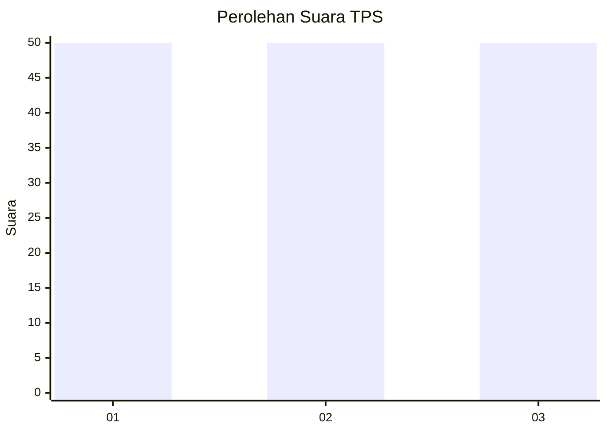
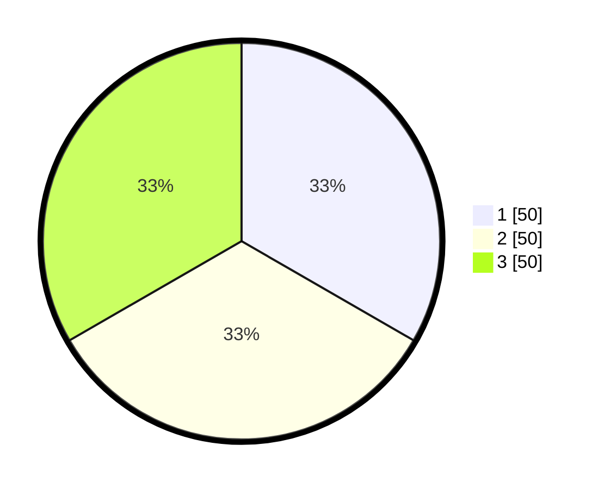

# Hasil

## Grafik

## Tabel

| No. | Nama Paslon    | Suara | Suara (raw) | Persentase |
|:--- |:-------------- | -----:| -----------:| ----------:|
| 1   | ANIES MUHAIMIN | 50    | [50][p-1]   | 33,33      |
| 2   | PRABOWO GIBRAN | 50    | [50][p-2]   | 33,33      |
| 3   | GANJAR MAHFUD  | 50    | [50][p-3]   | 33,33      |

[p-1]: https://github.com/gigit-pemilu/pemilu-2024-14-riau/blob/main/pilpres/hitung-suara/sub/14-riau/sub/02-indragiri-hulu/sub/13-rakit-kulim/sub/2002-talang-durian-cacar/sub/005-tps/sub/paslon-1.txt
[p-2]: https://github.com/gigit-pemilu/pemilu-2024-14-riau/blob/main/pilpres/hitung-suara/sub/14-riau/sub/02-indragiri-hulu/sub/13-rakit-kulim/sub/2002-talang-durian-cacar/sub/005-tps/sub/paslon-2.txt
[p-3]: https://github.com/gigit-pemilu/pemilu-2024-14-riau/blob/main/pilpres/hitung-suara/sub/14-riau/sub/02-indragiri-hulu/sub/13-rakit-kulim/sub/2002-talang-durian-cacar/sub/005-tps/sub/paslon-3.txt

## Foto C Plano

https://sirekap-obj-formc.kpu.go.id/f118/pemilu/ppwp/14/02/13/20/02/1402132002005-20240214-112203--f86cfcdb-eaa4-4d9e-84be-ce61a44d288f.jpg

https://sirekap-obj-formc.kpu.go.id/f118/pemilu/ppwp/14/02/13/20/02/1402132002005-20240214-112730--d4f9c278-4082-4671-8e04-7e6b18760bb2.jpg

https://sirekap-obj-formc.kpu.go.id/f118/pemilu/ppwp/14/02/13/20/02/1402132002005-20240214-125602--f3d745f8-0d58-44c3-9749-2f018e63dd28.jpg

## Metadata

| Key        | Value               |
| ---------- | ------------------- |
| Time Stamp | 2024-02-14 21:46:01 |

## DATA PEMILIH TETAP

Jumlah pemilih dalam DPT: **10**.
 * L: **20**.
 * P: **10**.

## DATA PENGGUNA HAK PILIH

Jumlah pengguna hak pilih dalam DPT: **8**.
 * L: **16**.
 * P: **8**.

Jumlah pengguna hak pilih dalam DPTb: **0**.
 * L: **0**.
 * P: **0**.

Jumlah pengguna hak pilih dalam DPK: **0**.
 * L: **8**.
 * P: **200**.

Jumlah pengguna hak pilih: **160**.
 * L: **800**.
 * P: **50**.

## JUMLAH SUARA SAH DAN TIDAK SAH

JUMLAH SELURUH SUARA SAH: **152**.

JUMLAH SUARA TIDAK SAH: **810**.

JUMLAH SELURUH SUARA SAH DAN SUARA TIDAK SAH: **160**.

