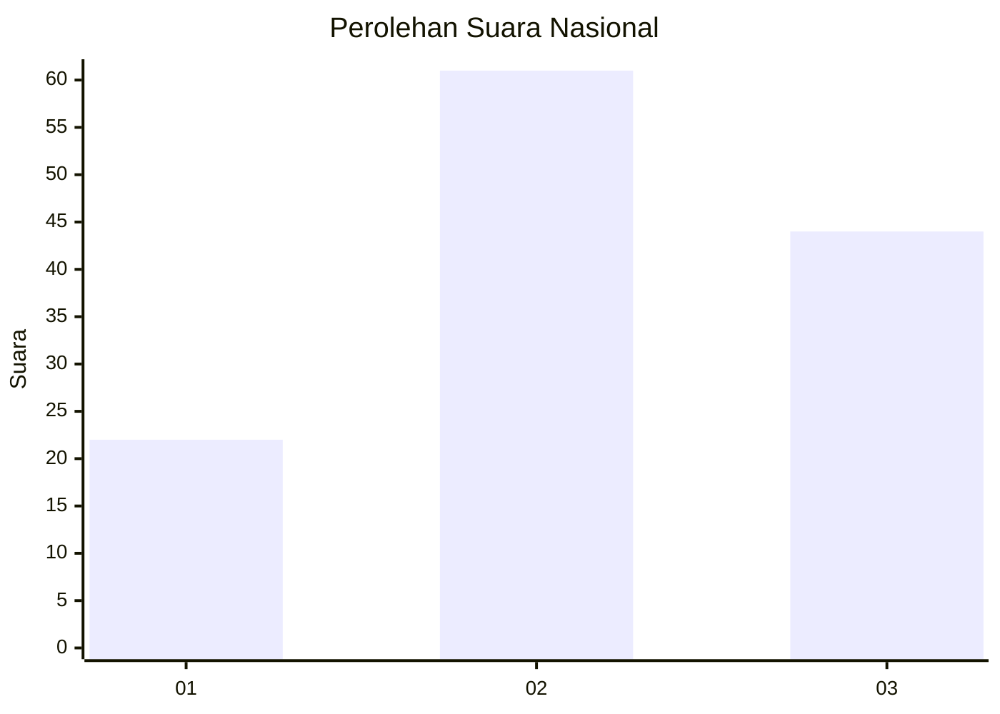
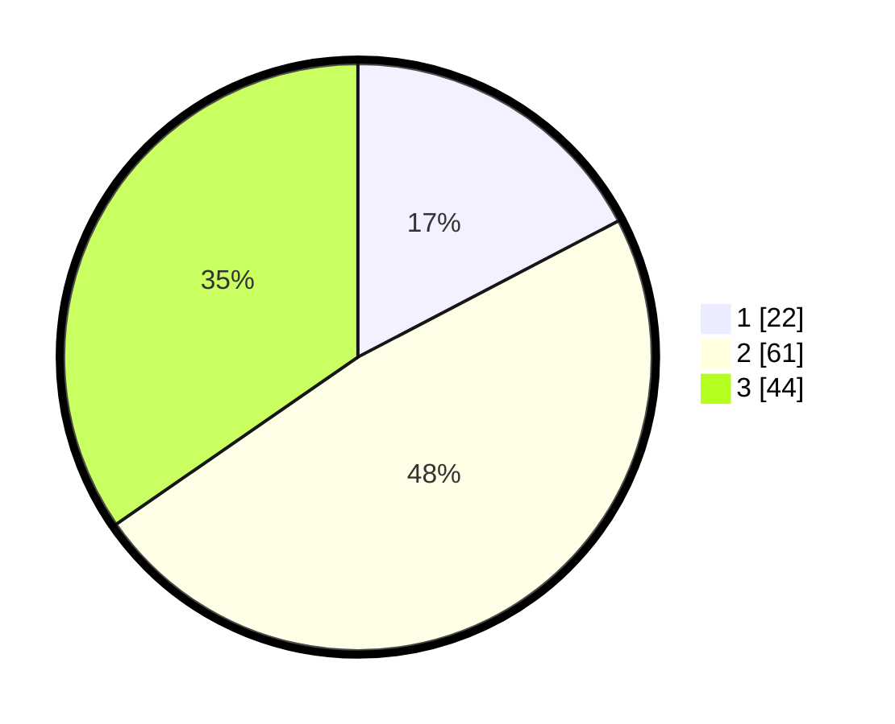

# Hasil

## Grafik

## Tabel

| No. | Nama Paslon    | Suara | Suara (raw) | Persentase |
|:--- |:-------------- | -----:| -----------:| ----------:|
| 1   | ANIES MUHAIMIN | 22    | [22][p-1]   | 17,32      |
| 2   | PRABOWO GIBRAN | 61    | [61][p-2]   | 48,03      |
| 3   | GANJAR MAHFUD  | 44    | [44][p-3]   | 34,65      |

[p-1]: https://github.com/gigit-pemilu/pemilu-2024/blob/main/pilpres/hitung-suara/sub/14-riau/sub/02-indragiri-hulu/sub/13-rakit-kulim/sub/2002-talang-durian-cacar/sub/006-tps/sub/paslon-1.txt
[p-2]: https://github.com/gigit-pemilu/pemilu-2024/blob/main/pilpres/hitung-suara/sub/14-riau/sub/02-indragiri-hulu/sub/13-rakit-kulim/sub/2002-talang-durian-cacar/sub/006-tps/sub/paslon-2.txt
[p-3]: https://github.com/gigit-pemilu/pemilu-2024/blob/main/pilpres/hitung-suara/sub/14-riau/sub/02-indragiri-hulu/sub/13-rakit-kulim/sub/2002-talang-durian-cacar/sub/006-tps/sub/paslon-3.txt

## Foto C Plano

https://sirekap-obj-formc.kpu.go.id/1714/pemilu/ppwp/14/02/13/20/02/1402132002006-20240215-082730--2b0debe4-7931-46ca-bf66-20c7f898e6b0.jpg

https://sirekap-obj-formc.kpu.go.id/1714/pemilu/ppwp/14/02/13/20/02/1402132002006-20240215-001444--1f025403-9d44-435c-b7ae-d192adfc7fb3.jpg

https://sirekap-obj-formc.kpu.go.id/1714/pemilu/ppwp/14/02/13/20/02/1402132002006-20240215-070441--4b751cee-9a3a-4950-bbfd-7e971a79f07f.jpg

## Metadata

| Key        | Value               |
| ---------- | ------------------- |
| Time Stamp | 2024-02-15 15:00:29 |

