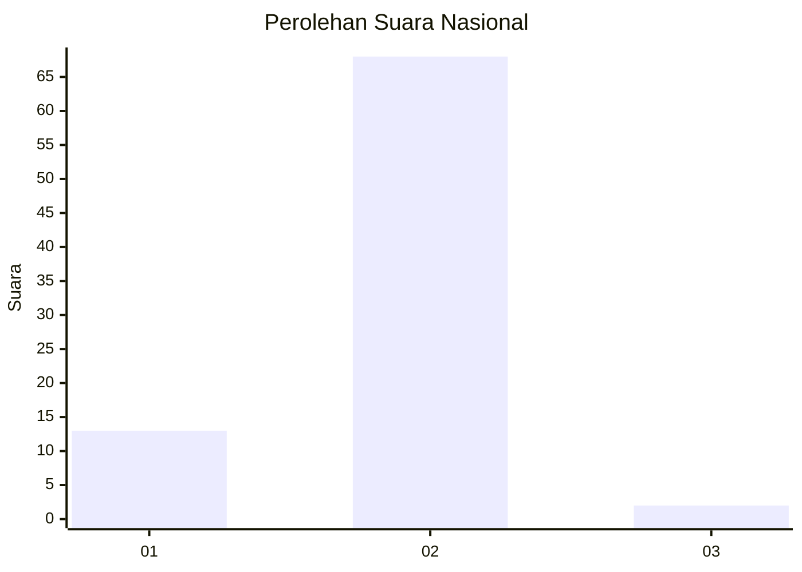
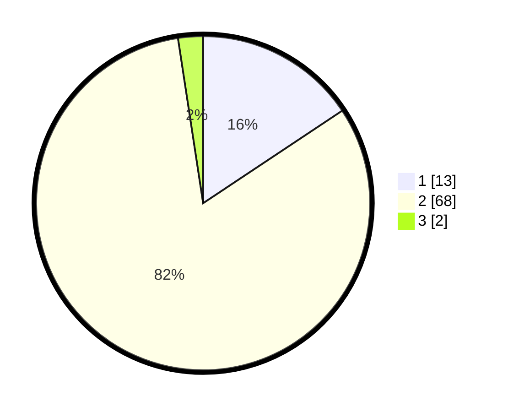

# Hasil

## Grafik

## Tabel

| No. | Nama Paslon    | Suara | Suara (raw) | Persentase |
|:--- |:-------------- | -----:| -----------:| ----------:|
| 1   | ANIES MUHAIMIN | 13    | [13][p-1]   | 15,66      |
| 2   | PRABOWO GIBRAN | 68    | [68][p-2]   | 81,93      |
| 3   | GANJAR MAHFUD  | 2     | [2][p-3]    | 2,41       |

[p-1]: https://github.com/gigit-pemilu/pemilu-2024/blob/main/pilpres/hitung-suara/sub/14-riau/sub/02-indragiri-hulu/sub/13-rakit-kulim/sub/2017-talang-suka-maju/sub/003-tps/sub/paslon-1.txt
[p-2]: https://github.com/gigit-pemilu/pemilu-2024/blob/main/pilpres/hitung-suara/sub/14-riau/sub/02-indragiri-hulu/sub/13-rakit-kulim/sub/2017-talang-suka-maju/sub/003-tps/sub/paslon-2.txt
[p-3]: https://github.com/gigit-pemilu/pemilu-2024/blob/main/pilpres/hitung-suara/sub/14-riau/sub/02-indragiri-hulu/sub/13-rakit-kulim/sub/2017-talang-suka-maju/sub/003-tps/sub/paslon-3.txt

## Foto C Plano

https://sirekap-obj-formc.kpu.go.id/b625/pemilu/ppwp/14/02/13/20/17/1402132017003-20240215-023043--7825da89-25ba-4f0f-a153-54e09c64446f.jpg

https://sirekap-obj-formc.kpu.go.id/b625/pemilu/ppwp/14/02/13/20/17/1402132017003-20240215-023214--b749fae6-5f31-4216-835e-8200dbcc910b.jpg

https://sirekap-obj-formc.kpu.go.id/b625/pemilu/ppwp/14/02/13/20/17/1402132017003-20240215-023852--4f6a2b8d-8c10-48d0-9afc-304cd3a954cf.jpg

## Metadata

| Key        | Value               |
| ---------- | ------------------- |
| Time Stamp | 2024-02-17 17:30:00 |

