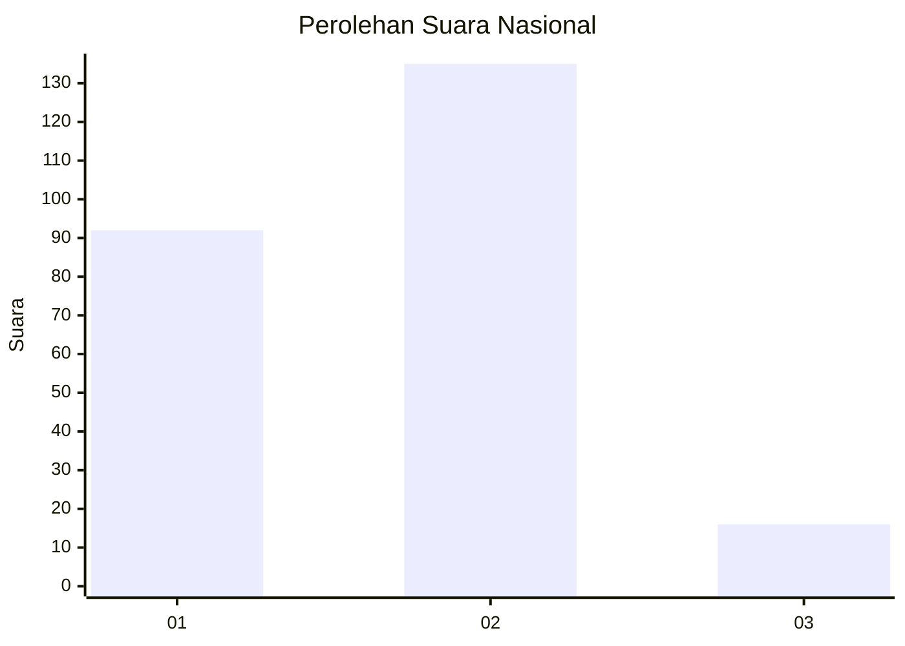
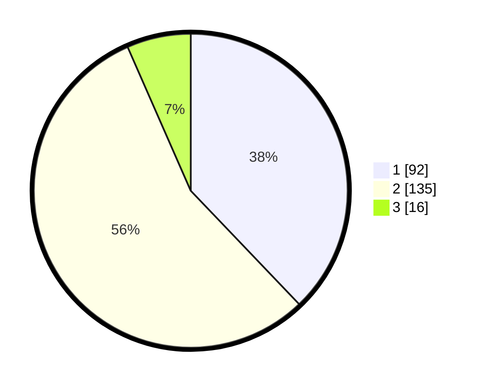

# Hasil

## Grafik

## Tabel

| No. | Nama Paslon    | Suara | Suara (raw) | Persentase |
|:--- |:-------------- | -----:| -----------:| ----------:|
| 1   | ANIES MUHAIMIN | 92    | [92][p-1]   | 37,86      |
| 2   | PRABOWO GIBRAN | 135   | [135][p-2]  | 55,56      |
| 3   | GANJAR MAHFUD  | 16    | [16][p-3]   | 6,58       |

[p-1]: https://github.com/gigit-pemilu/pemilu-2024/blob/main/pilpres/hitung-suara/sub/14-riau/sub/02-indragiri-hulu/sub/14-batang-peranap/sub/2001-pesajian/sub/002-tps/sub/paslon-1.txt
[p-2]: https://github.com/gigit-pemilu/pemilu-2024/blob/main/pilpres/hitung-suara/sub/14-riau/sub/02-indragiri-hulu/sub/14-batang-peranap/sub/2001-pesajian/sub/002-tps/sub/paslon-2.txt
[p-3]: https://github.com/gigit-pemilu/pemilu-2024/blob/main/pilpres/hitung-suara/sub/14-riau/sub/02-indragiri-hulu/sub/14-batang-peranap/sub/2001-pesajian/sub/002-tps/sub/paslon-3.txt

## Foto C Plano

https://sirekap-obj-formc.kpu.go.id/f7c9/pemilu/ppwp/14/02/14/20/01/1402142001002-20240222-003524--3cf3aa9c-d054-4b88-99a5-1dfc782ac378.jpg

https://sirekap-obj-formc.kpu.go.id/f7c9/pemilu/ppwp/14/02/14/20/01/1402142001002-20240222-003600--d2806aaa-5aae-410c-8fcf-14d8b473e04d.jpg

https://sirekap-obj-formc.kpu.go.id/f7c9/pemilu/ppwp/14/02/14/20/01/1402142001002-20240222-003742--7d71870a-b58f-4b27-8821-6c7b25fc20ae.jpg

## Metadata

| Key        | Value               |
| ---------- | ------------------- |
| Time Stamp | 2024-02-24 22:31:28 |

