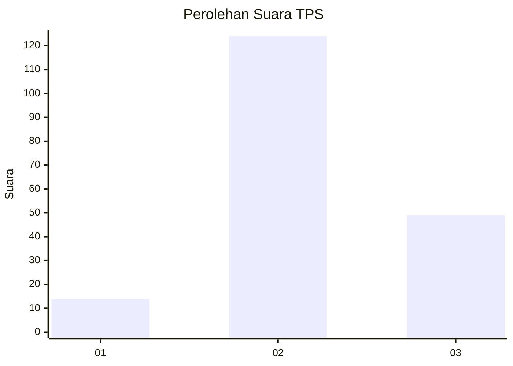

# Hasil

## Grafik

## Tabel

| No. | Nama Paslon    | Suara | Suara (raw) | Persentase |
|:--- |:-------------- | -----:| -----------:| ----------:|
| 1   | ANIES MUHAIMIN | 14    | [14][p-1]   | 7,49       |
| 2   | PRABOWO GIBRAN | 124   | [124][p-2]  | 66,31      |
| 3   | GANJAR MAHFUD  | 49    | [49][p-3]   | 26,20      |

[p-1]: https://github.com/gigit-pemilu/pemilu-2024-14-riau/blob/main/pilpres/hitung-suara/sub/14-riau/sub/02-indragiri-hulu/sub/14-batang-peranap/sub/2001-pesajian/sub/003-tps/sub/paslon-1.txt
[p-2]: https://github.com/gigit-pemilu/pemilu-2024-14-riau/blob/main/pilpres/hitung-suara/sub/14-riau/sub/02-indragiri-hulu/sub/14-batang-peranap/sub/2001-pesajian/sub/003-tps/sub/paslon-2.txt
[p-3]: https://github.com/gigit-pemilu/pemilu-2024-14-riau/blob/main/pilpres/hitung-suara/sub/14-riau/sub/02-indragiri-hulu/sub/14-batang-peranap/sub/2001-pesajian/sub/003-tps/sub/paslon-3.txt

## Foto C Plano

https://sirekap-obj-formc.kpu.go.id/6eff/pemilu/ppwp/14/02/14/20/01/1402142001003-20240221-230839--bab2ff7d-54b7-4385-9481-13f287db4783.jpg

https://sirekap-obj-formc.kpu.go.id/6eff/pemilu/ppwp/14/02/14/20/01/1402142001003-20240221-231011--c376f8e7-b9ca-4eb4-984e-a5f61e8eb0ef.jpg

https://sirekap-obj-formc.kpu.go.id/6eff/pemilu/ppwp/14/02/14/20/01/1402142001003-20240221-231040--d0d16edb-87bc-4ef9-8fd7-6baa6bd285e7.jpg

## Metadata

| Key        | Value               |
| ---------- | ------------------- |
| Time Stamp | 2024-02-24 22:31:28 |

