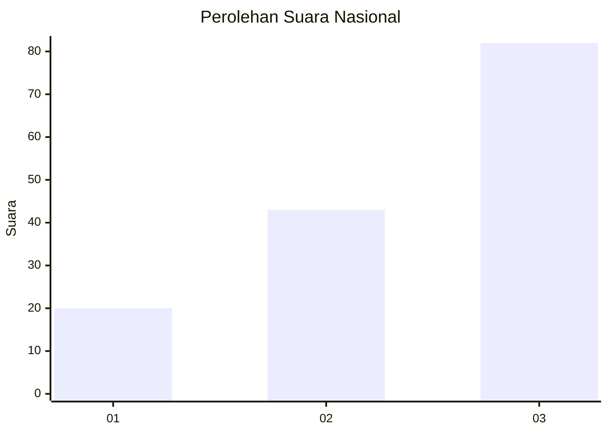
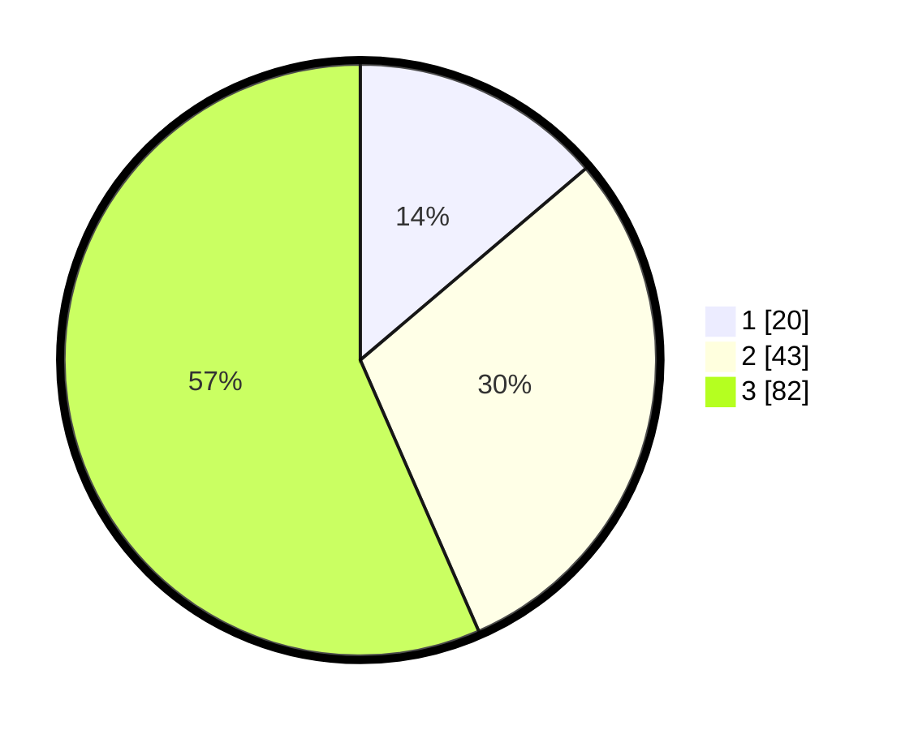

# Hasil

## Grafik

## Tabel

| No. | Nama Paslon    | Suara | Suara (raw) | Persentase |
|:--- |:-------------- | -----:| -----------:| ----------:|
| 1   | ANIES MUHAIMIN | 20    | [20][p-1]   | 13,79      |
| 2   | PRABOWO GIBRAN | 43    | [43][p-2]   | 29,66      |
| 3   | GANJAR MAHFUD  | 82    | [82][p-3]   | 56,55      |

[p-1]: https://github.com/gigit-pemilu/pemilu-2024/blob/main/pilpres/hitung-suara/sub/14-riau/sub/02-indragiri-hulu/sub/14-batang-peranap/sub/2001-pesajian/sub/004-tps/sub/paslon-1.txt
[p-2]: https://github.com/gigit-pemilu/pemilu-2024/blob/main/pilpres/hitung-suara/sub/14-riau/sub/02-indragiri-hulu/sub/14-batang-peranap/sub/2001-pesajian/sub/004-tps/sub/paslon-2.txt
[p-3]: https://github.com/gigit-pemilu/pemilu-2024/blob/main/pilpres/hitung-suara/sub/14-riau/sub/02-indragiri-hulu/sub/14-batang-peranap/sub/2001-pesajian/sub/004-tps/sub/paslon-3.txt

## Foto C Plano

https://sirekap-obj-formc.kpu.go.id/881b/pemilu/ppwp/14/02/14/20/01/1402142001004-20240222-134030--c9880a02-89c3-4668-bd83-c02267606025.jpg

https://sirekap-obj-formc.kpu.go.id/881b/pemilu/ppwp/14/02/14/20/01/1402142001004-20240222-134132--b77a7994-315d-4e32-bd94-bc60960bdd5f.jpg

https://sirekap-obj-formc.kpu.go.id/881b/pemilu/ppwp/14/02/14/20/01/1402142001004-20240222-134242--6e45157c-0e4c-4447-9e03-c479a532db6d.jpg

## Metadata

| Key        | Value               |
| ---------- | ------------------- |
| Time Stamp | 2024-02-25 12:00:00 |

