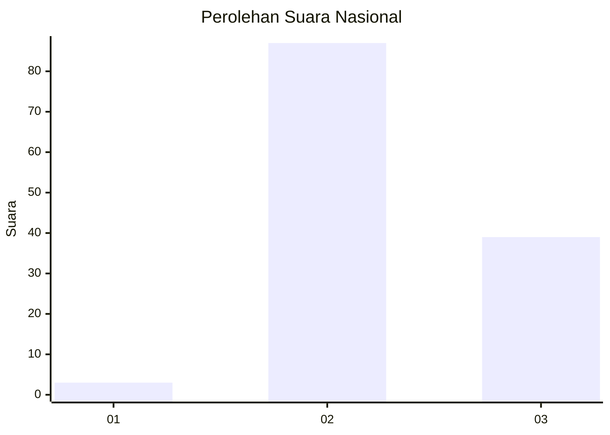
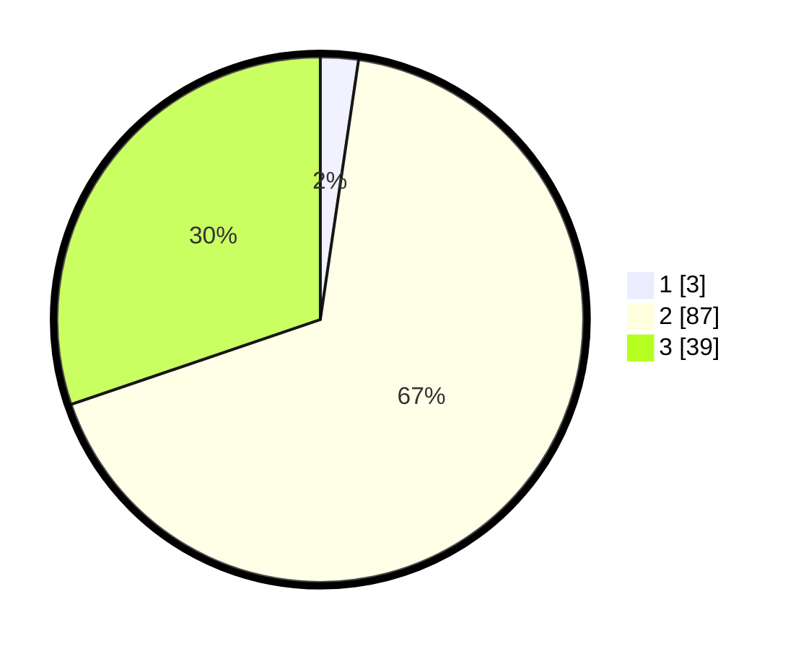

# Hasil

## Grafik

## Tabel

| No. | Nama Paslon    | Suara | Suara (raw) | Persentase |
|:--- |:-------------- | -----:| -----------:| ----------:|
| 1   | ANIES MUHAIMIN | 3     | [3][p-1]    | 2,33       |
| 2   | PRABOWO GIBRAN | 87    | [87][p-2]   | 67,44      |
| 3   | GANJAR MAHFUD  | 39    | [39][p-3]   | 30,23      |

[p-1]: https://github.com/gigit-pemilu/pemilu-2024/blob/main/pilpres/hitung-suara/sub/14-riau/sub/02-indragiri-hulu/sub/14-batang-peranap/sub/2001-pesajian/sub/005-tps/sub/paslon-1.txt
[p-2]: https://github.com/gigit-pemilu/pemilu-2024/blob/main/pilpres/hitung-suara/sub/14-riau/sub/02-indragiri-hulu/sub/14-batang-peranap/sub/2001-pesajian/sub/005-tps/sub/paslon-2.txt
[p-3]: https://github.com/gigit-pemilu/pemilu-2024/blob/main/pilpres/hitung-suara/sub/14-riau/sub/02-indragiri-hulu/sub/14-batang-peranap/sub/2001-pesajian/sub/005-tps/sub/paslon-3.txt

## Foto C Plano

https://sirekap-obj-formc.kpu.go.id/5543/pemilu/ppwp/14/02/14/20/01/1402142001005-20240222-154201--8358ff75-3e02-4f98-b096-70339de8987e.jpg

https://sirekap-obj-formc.kpu.go.id/5543/pemilu/ppwp/14/02/14/20/01/1402142001005-20240222-154259--ffa53fcb-0ff9-42bb-b0b3-afef2b33a7ba.jpg

https://sirekap-obj-formc.kpu.go.id/5543/pemilu/ppwp/14/02/14/20/01/1402142001005-20240222-154342--e127ad6c-f20a-4676-9b50-0b24df71ca4f.jpg

## Metadata

| Key        | Value               |
| ---------- | ------------------- |
| Time Stamp | 2024-02-25 16:00:00 |

