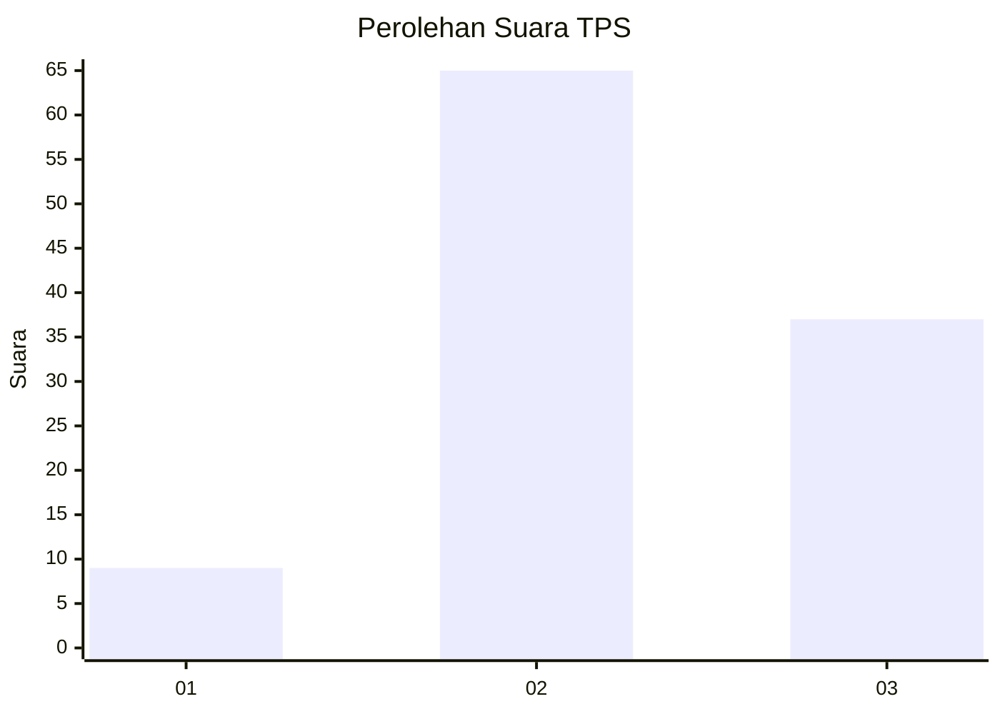
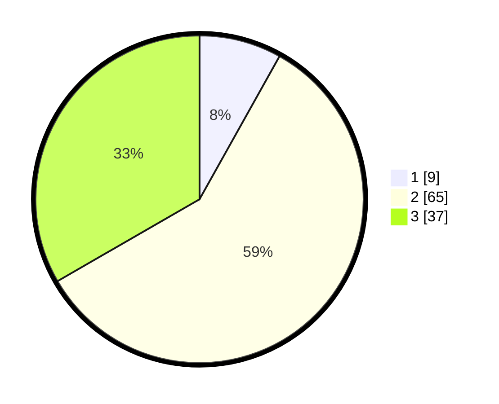

# Hasil

## Grafik

## Tabel

| No. | Nama Paslon    | Suara | Suara (raw) | Persentase |
|:--- |:-------------- | -----:| -----------:| ----------:|
| 1   | ANIES MUHAIMIN | 9     | [9][p-1]    | 8,11       |
| 2   | PRABOWO GIBRAN | 65    | [65][p-2]   | 58,56      |
| 3   | GANJAR MAHFUD  | 37    | [37][p-3]   | 33,33      |

[p-1]: https://github.com/gigit-pemilu/pemilu-2024-14-riau/blob/main/pilpres/hitung-suara/sub/14-riau/sub/02-indragiri-hulu/sub/14-batang-peranap/sub/2001-pesajian/sub/006-tps/sub/paslon-1.txt
[p-2]: https://github.com/gigit-pemilu/pemilu-2024-14-riau/blob/main/pilpres/hitung-suara/sub/14-riau/sub/02-indragiri-hulu/sub/14-batang-peranap/sub/2001-pesajian/sub/006-tps/sub/paslon-2.txt
[p-3]: https://github.com/gigit-pemilu/pemilu-2024-14-riau/blob/main/pilpres/hitung-suara/sub/14-riau/sub/02-indragiri-hulu/sub/14-batang-peranap/sub/2001-pesajian/sub/006-tps/sub/paslon-3.txt

## Foto C Plano

https://sirekap-obj-formc.kpu.go.id/98a0/pemilu/ppwp/14/02/14/20/01/1402142001006-20240222-165306--5535bfb1-758e-4f47-8230-9b4f15df1720.jpg

https://sirekap-obj-formc.kpu.go.id/98a0/pemilu/ppwp/14/02/14/20/01/1402142001006-20240222-165721--a6790084-842a-4354-a2fb-23c155e127cc.jpg

https://sirekap-obj-formc.kpu.go.id/98a0/pemilu/ppwp/14/02/14/20/01/1402142001006-20240222-165839--e5c6c07c-1c14-4ff0-9278-92631f71764c.jpg

## Metadata

| Key        | Value               |
| ---------- | ------------------- |
| Time Stamp | 2024-02-25 16:00:00 |

