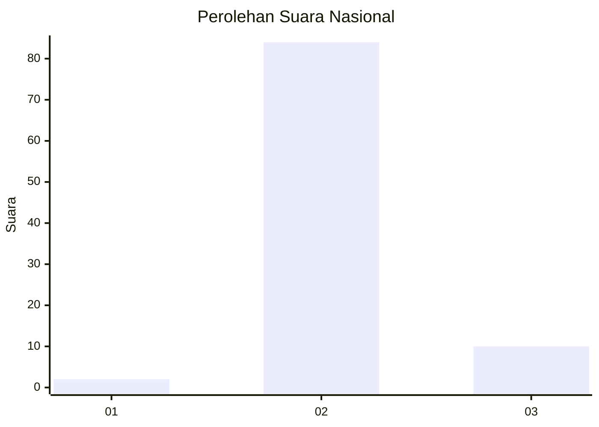
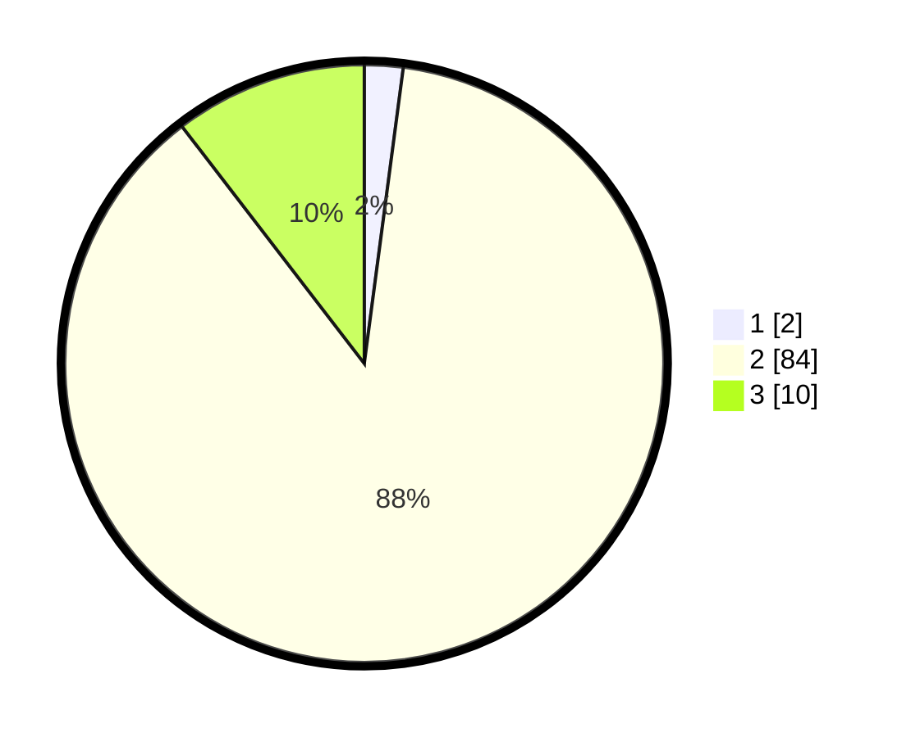

# Hasil

## Grafik

## Tabel

| No. | Nama Paslon    | Suara | Suara (raw) | Persentase |
|:--- |:-------------- | -----:| -----------:| ----------:|
| 1   | ANIES MUHAIMIN | 2     | [2][p-1]    | 2,08       |
| 2   | PRABOWO GIBRAN | 84    | [84][p-2]   | 87,50      |
| 3   | GANJAR MAHFUD  | 10    | [10][p-3]   | 10,42      |

[p-1]: https://github.com/gigit-pemilu/pemilu-2024/blob/main/pilpres/hitung-suara/sub/14-riau/sub/02-indragiri-hulu/sub/14-batang-peranap/sub/2001-pesajian/sub/010-tps/sub/paslon-1.txt
[p-2]: https://github.com/gigit-pemilu/pemilu-2024/blob/main/pilpres/hitung-suara/sub/14-riau/sub/02-indragiri-hulu/sub/14-batang-peranap/sub/2001-pesajian/sub/010-tps/sub/paslon-2.txt
[p-3]: https://github.com/gigit-pemilu/pemilu-2024/blob/main/pilpres/hitung-suara/sub/14-riau/sub/02-indragiri-hulu/sub/14-batang-peranap/sub/2001-pesajian/sub/010-tps/sub/paslon-3.txt

## Foto C Plano

https://sirekap-obj-formc.kpu.go.id/2b31/pemilu/ppwp/14/02/14/20/01/1402142001010-20240222-224947--04719eb2-cd44-44bc-ba4f-0cf2d124f1af.jpg

https://sirekap-obj-formc.kpu.go.id/2b31/pemilu/ppwp/14/02/14/20/01/1402142001010-20240222-225312--79ff2dcd-906c-46a2-8159-f7074bbfff8d.jpg

https://sirekap-obj-formc.kpu.go.id/2b31/pemilu/ppwp/14/02/14/20/01/1402142001010-20240222-225342--c27d9331-ba76-4249-8769-35875e9d0f7e.jpg

## Metadata

| Key        | Value               |
| ---------- | ------------------- |
| Time Stamp | 2024-02-26 12:00:00 |

