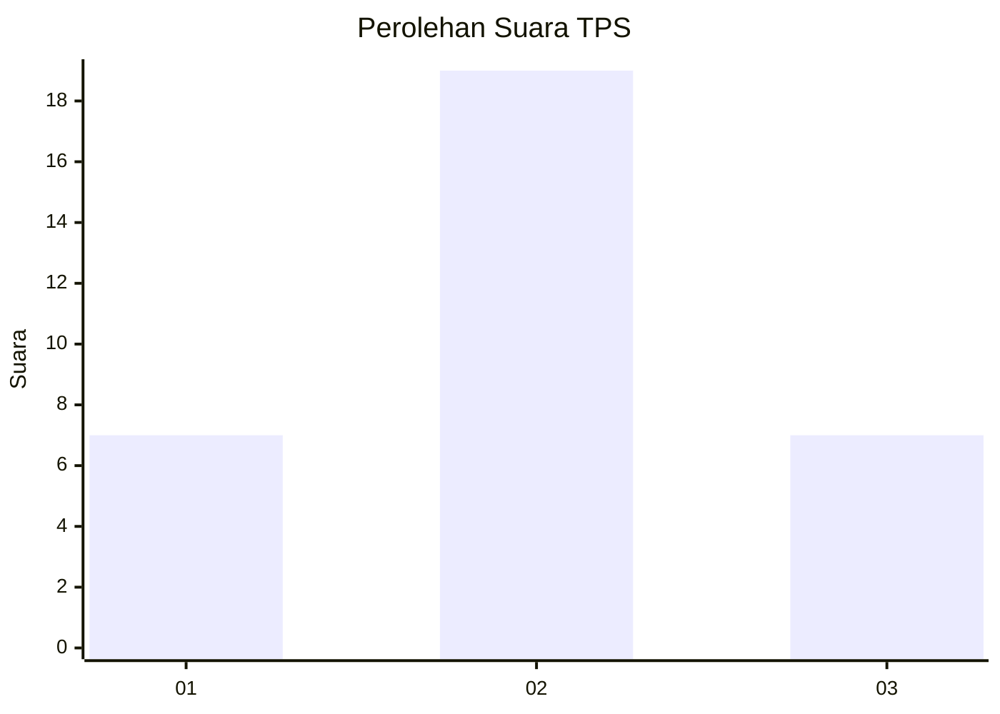
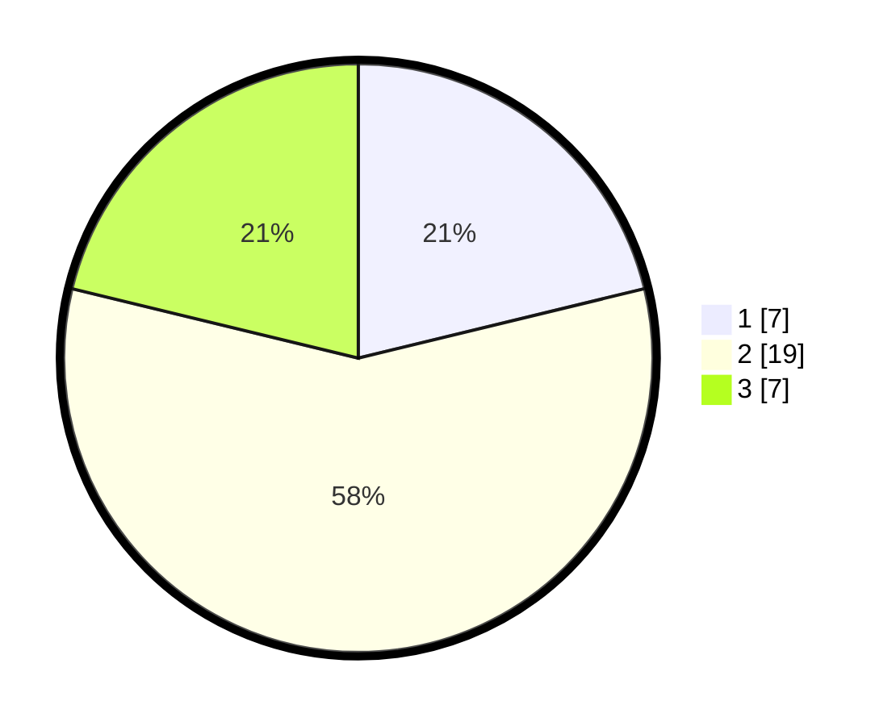

# Hasil

## Grafik

## Tabel

| No. | Nama Paslon    | Suara | Suara (raw) | Persentase |
|:--- |:-------------- | -----:| -----------:| ----------:|
| 1   | ANIES MUHAIMIN | 7     | [7][p-1]    | 21,21      |
| 2   | PRABOWO GIBRAN | 19    | [19][p-2]   | 57,58      |
| 3   | GANJAR MAHFUD  | 7     | [7][p-3]    | 21,21      |

[p-1]: https://github.com/gigit-pemilu/pemilu-2024-14-riau/blob/main/pilpres/hitung-suara/sub/14-riau/sub/02-indragiri-hulu/sub/14-batang-peranap/sub/2006-pematang-benteng/sub/003-tps/sub/paslon-1.txt
[p-2]: https://github.com/gigit-pemilu/pemilu-2024-14-riau/blob/main/pilpres/hitung-suara/sub/14-riau/sub/02-indragiri-hulu/sub/14-batang-peranap/sub/2006-pematang-benteng/sub/003-tps/sub/paslon-2.txt
[p-3]: https://github.com/gigit-pemilu/pemilu-2024-14-riau/blob/main/pilpres/hitung-suara/sub/14-riau/sub/02-indragiri-hulu/sub/14-batang-peranap/sub/2006-pematang-benteng/sub/003-tps/sub/paslon-3.txt

## Foto C Plano

https://sirekap-obj-formc.kpu.go.id/22fa/pemilu/ppwp/14/02/14/20/06/1402142006003-20240223-153053--b905986c-3246-4e9e-abbe-f288793b2e8b.jpg

https://sirekap-obj-formc.kpu.go.id/22fa/pemilu/ppwp/14/02/14/20/06/1402142006003-20240223-153148--47d12234-6278-444d-bba3-792a212607df.jpg

https://sirekap-obj-formc.kpu.go.id/22fa/pemilu/ppwp/14/02/14/20/06/1402142006003-20240223-153310--6876d0bd-7d68-4485-a18b-5e084ef8293d.jpg

## Metadata

| Key        | Value               |
| ---------- | ------------------- |
| Time Stamp | 2024-02-25 13:00:00 |

