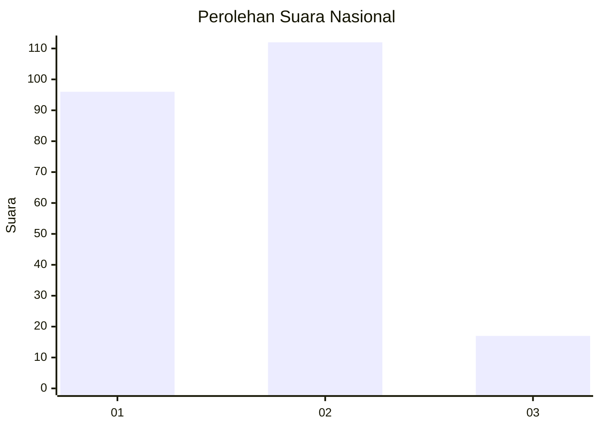
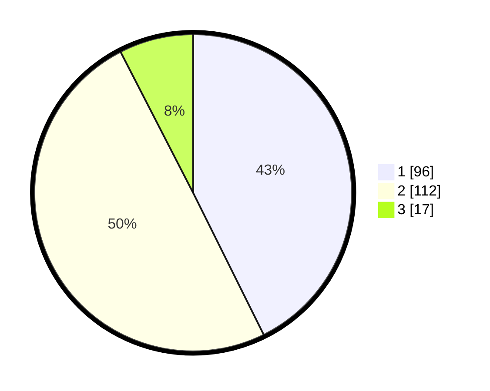

# Hasil

## Grafik

## Tabel

| No. | Nama Paslon    | Suara | Suara (raw) | Persentase |
|:--- |:-------------- | -----:| -----------:| ----------:|
| 1   | ANIES MUHAIMIN | 96    | [96][p-1]   | 42,67      |
| 2   | PRABOWO GIBRAN | 112   | [112][p-2]  | 49,78      |
| 3   | GANJAR MAHFUD  | 17    | [17][p-3]   | 7,56       |

[p-1]: https://github.com/gigit-pemilu/pemilu-2024/blob/main/pilpres/hitung-suara/sub/14-riau/sub/03-bengkalis/sub/01-bengkalis/sub/2004-kelapapati/sub/001-tps/sub/paslon-1.txt
[p-2]: https://github.com/gigit-pemilu/pemilu-2024/blob/main/pilpres/hitung-suara/sub/14-riau/sub/03-bengkalis/sub/01-bengkalis/sub/2004-kelapapati/sub/001-tps/sub/paslon-2.txt
[p-3]: https://github.com/gigit-pemilu/pemilu-2024/blob/main/pilpres/hitung-suara/sub/14-riau/sub/03-bengkalis/sub/01-bengkalis/sub/2004-kelapapati/sub/001-tps/sub/paslon-3.txt

## Foto C Plano

https://sirekap-obj-formc.kpu.go.id/e4e0/pemilu/ppwp/14/03/01/20/04/1403012004001-20240214-162232--0eb28b59-cdef-47ef-974d-d93a9eecd5fc.jpg

https://sirekap-obj-formc.kpu.go.id/e4e0/pemilu/ppwp/14/03/01/20/04/1403012004001-20240214-200805--5e2b3a60-9931-470b-825c-a9bf59261031.jpg

## Metadata

| Key        | Value               |
| ---------- | ------------------- |
| Time Stamp | 2024-02-17 12:00:00 |

