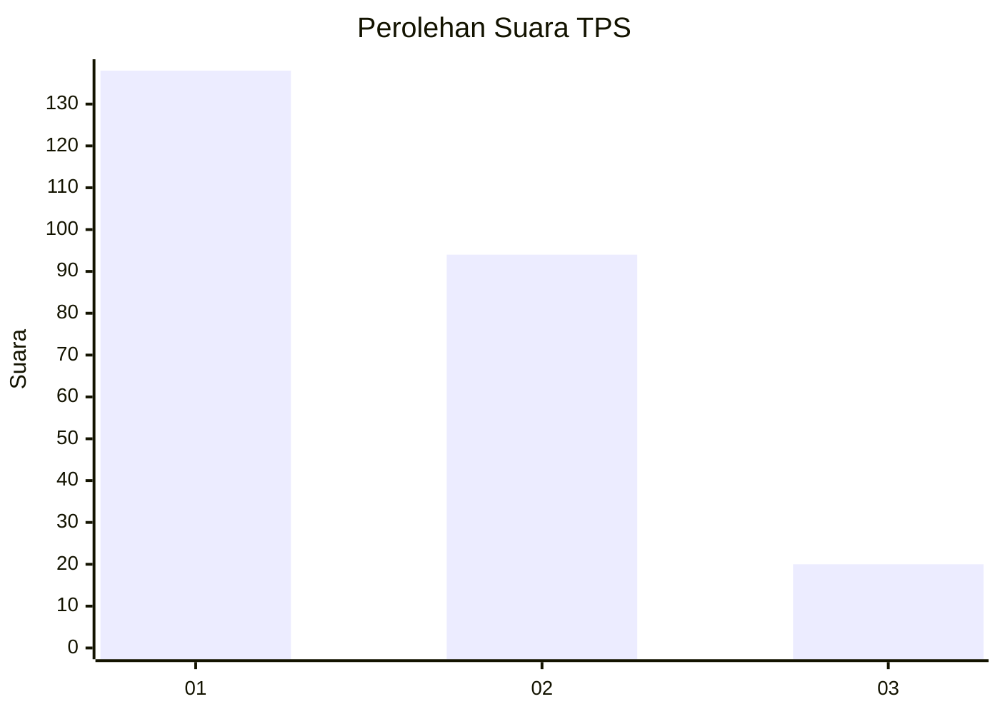
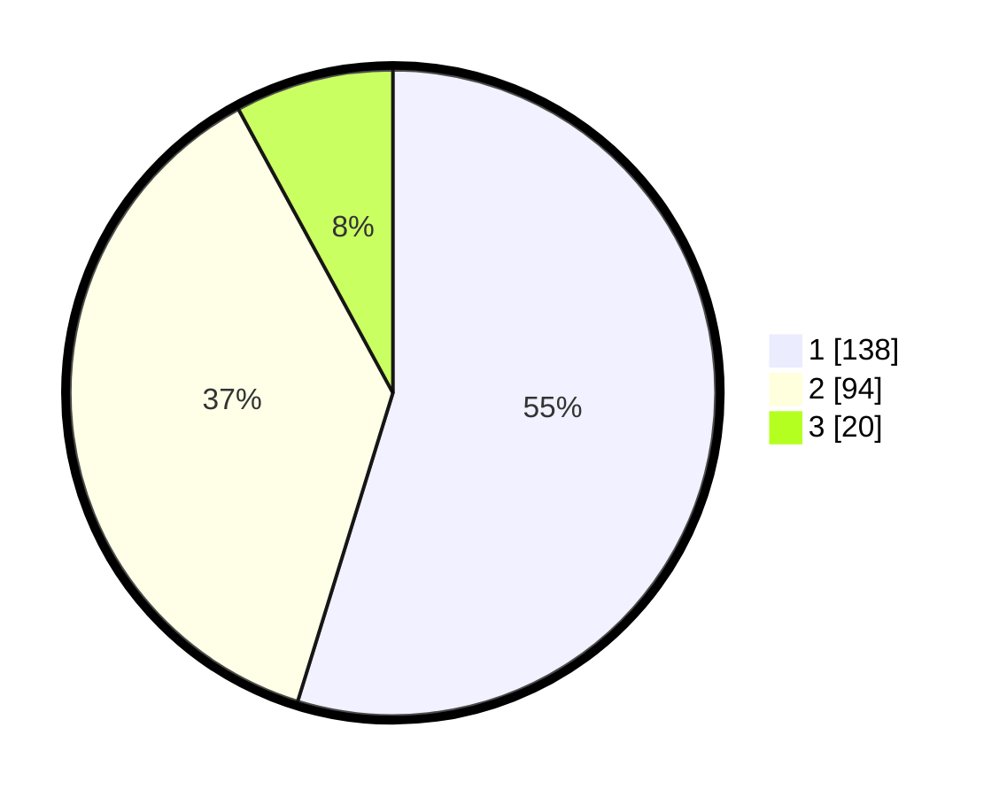

# Hasil

## Grafik

## Tabel

| No. | Nama Paslon    | Suara | Suara (raw) | Persentase |
|:--- |:-------------- | -----:| -----------:| ----------:|
| 1   | ANIES MUHAIMIN | 138   | [138][p-1]  | 54,76      |
| 2   | PRABOWO GIBRAN | 94    | [94][p-2]   | 37,30      |
| 3   | GANJAR MAHFUD  | 20    | [20][p-3]   | 7,94       |

[p-1]: https://github.com/gigit-pemilu/pemilu-2024-14-riau/blob/main/pilpres/hitung-suara/sub/14-riau/sub/03-bengkalis/sub/01-bengkalis/sub/2031-pematang-duku-timur/sub/001-tps/sub/paslon-1.txt
[p-2]: https://github.com/gigit-pemilu/pemilu-2024-14-riau/blob/main/pilpres/hitung-suara/sub/14-riau/sub/03-bengkalis/sub/01-bengkalis/sub/2031-pematang-duku-timur/sub/001-tps/sub/paslon-2.txt
[p-3]: https://github.com/gigit-pemilu/pemilu-2024-14-riau/blob/main/pilpres/hitung-suara/sub/14-riau/sub/03-bengkalis/sub/01-bengkalis/sub/2031-pematang-duku-timur/sub/001-tps/sub/paslon-3.txt

## Foto C Plano

https://sirekap-obj-formc.kpu.go.id/7040/pemilu/ppwp/14/03/01/20/31/1403012031001-20240215-013542--2940546f-26e0-47d9-826b-39f2605a8c4a.jpg

https://sirekap-obj-formc.kpu.go.id/7040/pemilu/ppwp/14/03/01/20/31/1403012031001-20240215-013641--8cf83ec8-9295-4a6a-9bfb-63d3e1f4afed.jpg

https://sirekap-obj-formc.kpu.go.id/7040/pemilu/ppwp/14/03/01/20/31/1403012031001-20240215-013748--4cf90e2e-d7ed-422e-8485-67e20327d7ae.jpg

## Metadata

| Key        | Value               |
| ---------- | ------------------- |
| Time Stamp | 2024-02-15 15:00:29 |

