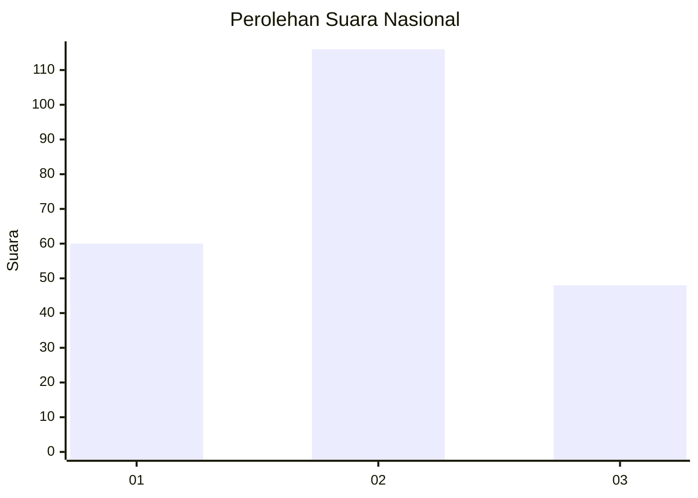
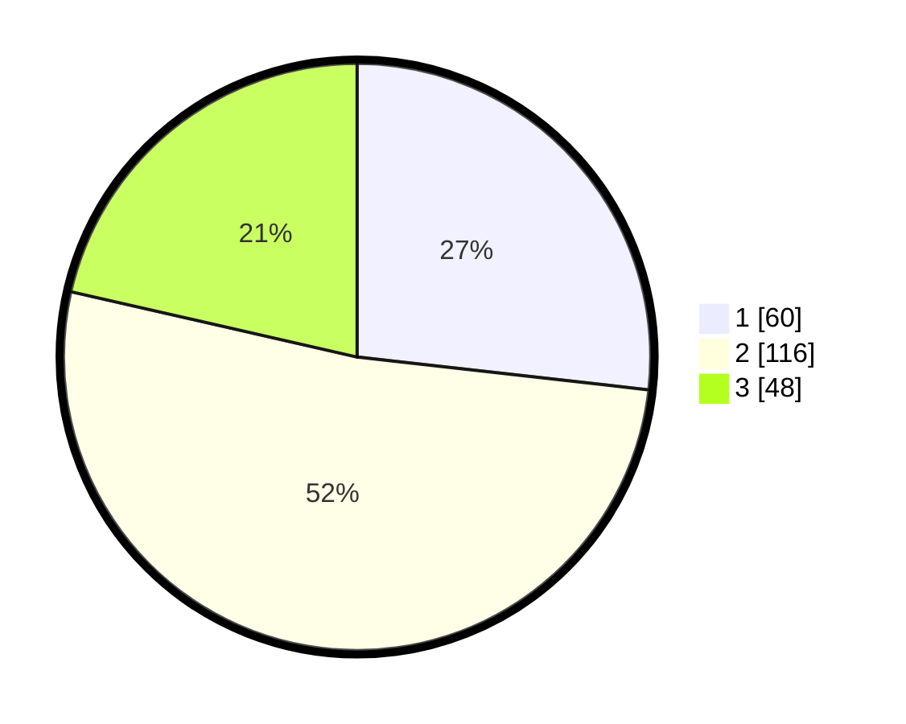

# Hasil

## Grafik

## Tabel

| No. | Nama Paslon    | Suara | Suara (raw) | Persentase |
|:--- |:-------------- | -----:| -----------:| ----------:|
| 1   | ANIES MUHAIMIN | 60    | [60][p-1]   | 26,79      |
| 2   | PRABOWO GIBRAN | 116   | [116][p-2]  | 51,79      |
| 3   | GANJAR MAHFUD  | 48    | [48][p-3]   | 21,43      |

[p-1]: https://github.com/gigit-pemilu/pemilu-2024/blob/main/pilpres/hitung-suara/sub/14-riau/sub/03-bengkalis/sub/09-mandau/sub/1001-air-jamban/sub/011-tps/sub/paslon-1.txt
[p-2]: https://github.com/gigit-pemilu/pemilu-2024/blob/main/pilpres/hitung-suara/sub/14-riau/sub/03-bengkalis/sub/09-mandau/sub/1001-air-jamban/sub/011-tps/sub/paslon-2.txt
[p-3]: https://github.com/gigit-pemilu/pemilu-2024/blob/main/pilpres/hitung-suara/sub/14-riau/sub/03-bengkalis/sub/09-mandau/sub/1001-air-jamban/sub/011-tps/sub/paslon-3.txt

## Foto C Plano

https://sirekap-obj-formc.kpu.go.id/69ee/pemilu/ppwp/14/03/09/10/01/1403091001011-20240214-230721--a1417eda-3a5c-4de6-a98e-16ec3031c6c2.jpg

https://sirekap-obj-formc.kpu.go.id/69ee/pemilu/ppwp/14/03/09/10/01/1403091001011-20240214-231153--aec534d4-5efe-47ea-8d13-abb9bc5840b5.jpg

https://sirekap-obj-formc.kpu.go.id/69ee/pemilu/ppwp/14/03/09/10/01/1403091001011-20240214-231352--d85c248b-94a1-49ff-94bf-1fac12086cdd.jpg

## Metadata

| Key        | Value               |
| ---------- | ------------------- |
| Time Stamp | 2024-02-15 21:30:27 |

