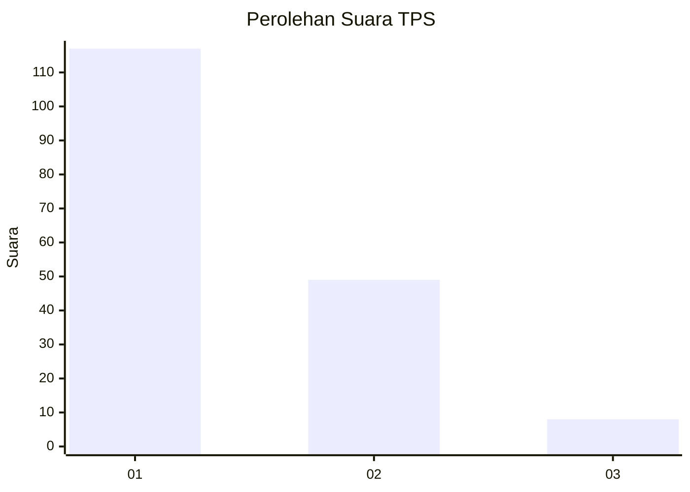
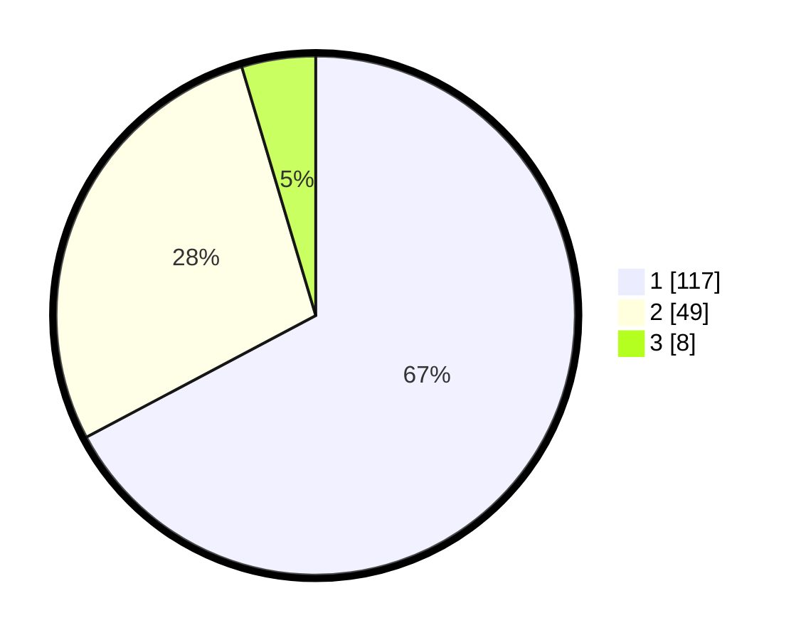

# Hasil

## Grafik

## Tabel

| No. | Nama Paslon    | Suara | Suara (raw) | Persentase |
|:--- |:-------------- | -----:| -----------:| ----------:|
| 1   | ANIES MUHAIMIN | 117   | [117][p-1]  | 67,24      |
| 2   | PRABOWO GIBRAN | 49    | [49][p-2]   | 28,16      |
| 3   | GANJAR MAHFUD  | 8     | [8][p-3]    | 4,60       |

[p-1]: https://github.com/gigit-pemilu/pemilu-2024-14-riau/blob/main/pilpres/hitung-suara/sub/14-riau/sub/03-bengkalis/sub/09-mandau/sub/1001-air-jamban/sub/017-tps/sub/paslon-1.txt
[p-2]: https://github.com/gigit-pemilu/pemilu-2024-14-riau/blob/main/pilpres/hitung-suara/sub/14-riau/sub/03-bengkalis/sub/09-mandau/sub/1001-air-jamban/sub/017-tps/sub/paslon-2.txt
[p-3]: https://github.com/gigit-pemilu/pemilu-2024-14-riau/blob/main/pilpres/hitung-suara/sub/14-riau/sub/03-bengkalis/sub/09-mandau/sub/1001-air-jamban/sub/017-tps/sub/paslon-3.txt

## Foto C Plano

https://sirekap-obj-formc.kpu.go.id/9edc/pemilu/ppwp/14/03/09/10/01/1403091001017-20240214-155744--d04f520b-b009-43d0-9112-1689ec98ee19.jpg

https://sirekap-obj-formc.kpu.go.id/9edc/pemilu/ppwp/14/03/09/10/01/1403091001017-20240214-155802--486043d7-82d5-4940-bad4-b32b48f970a8.jpg

https://sirekap-obj-formc.kpu.go.id/9edc/pemilu/ppwp/14/03/09/10/01/1403091001017-20240214-155804--ee89c82f-85a6-4983-9825-063a5caaa594.jpg

## Metadata

| Key        | Value               |
| ---------- | ------------------- |
| Time Stamp | 2024-02-15 22:00:27 |

