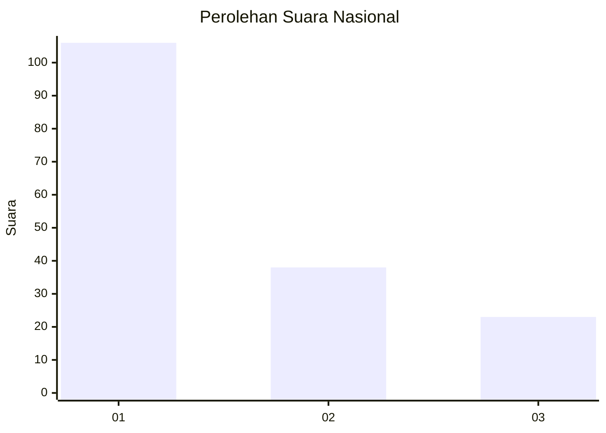
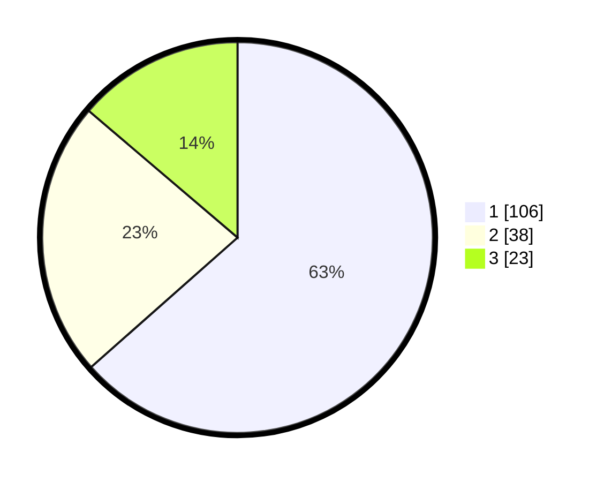

# Hasil

## Grafik

## Tabel

| No. | Nama Paslon    | Suara | Suara (raw) | Persentase |
|:--- |:-------------- | -----:| -----------:| ----------:|
| 1   | ANIES MUHAIMIN | 106   | [106][p-1]  | 63,47      |
| 2   | PRABOWO GIBRAN | 38    | [38][p-2]   | 22,75      |
| 3   | GANJAR MAHFUD  | 23    | [23][p-3]   | 13,77      |

[p-1]: https://github.com/gigit-pemilu/pemilu-2024/blob/main/pilpres/hitung-suara/sub/14-riau/sub/03-bengkalis/sub/09-mandau/sub/1001-air-jamban/sub/070-tps/sub/paslon-1.txt
[p-2]: https://github.com/gigit-pemilu/pemilu-2024/blob/main/pilpres/hitung-suara/sub/14-riau/sub/03-bengkalis/sub/09-mandau/sub/1001-air-jamban/sub/070-tps/sub/paslon-2.txt
[p-3]: https://github.com/gigit-pemilu/pemilu-2024/blob/main/pilpres/hitung-suara/sub/14-riau/sub/03-bengkalis/sub/09-mandau/sub/1001-air-jamban/sub/070-tps/sub/paslon-3.txt

## Foto C Plano

https://sirekap-obj-formc.kpu.go.id/0445/pemilu/ppwp/14/03/09/10/01/1403091001070-20240216-215405--996c5674-b744-4677-911a-f574004d238d.jpg

https://sirekap-obj-formc.kpu.go.id/0445/pemilu/ppwp/14/03/09/10/01/1403091001070-20240216-215508--1cdf1591-35eb-4275-a599-36051e0c4128.jpg

https://sirekap-obj-formc.kpu.go.id/0445/pemilu/ppwp/14/03/09/10/01/1403091001070-20240216-152336--f172ac80-90f5-44a2-a2f7-597fd5c3896e.jpg

## Metadata

| Key        | Value               |
| ---------- | ------------------- |
| Time Stamp | 2024-02-24 22:31:28 |

