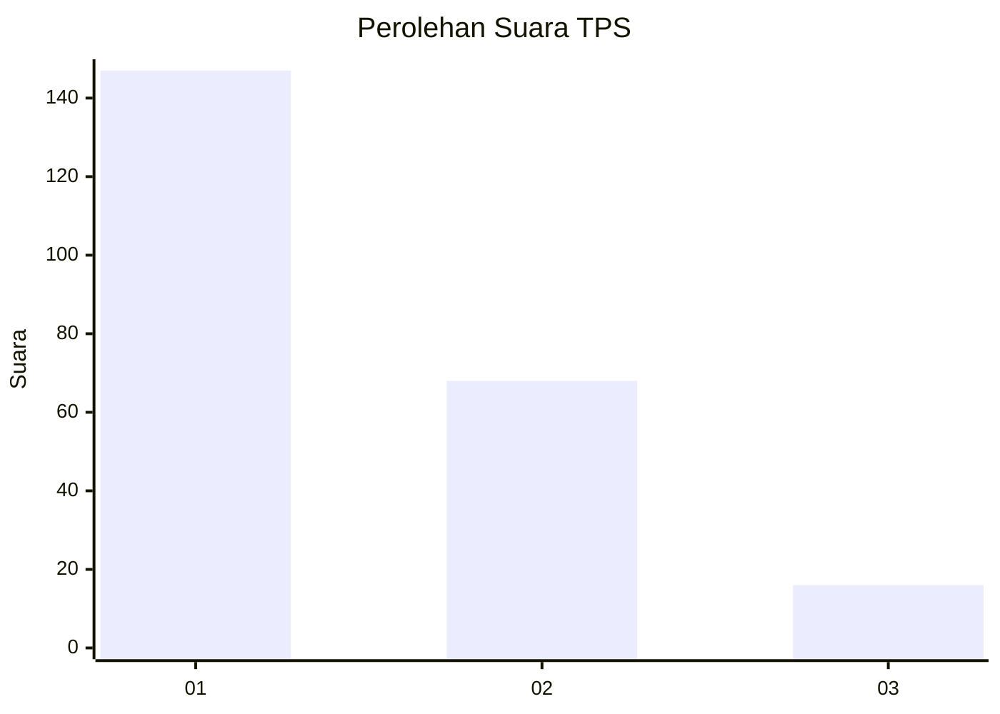
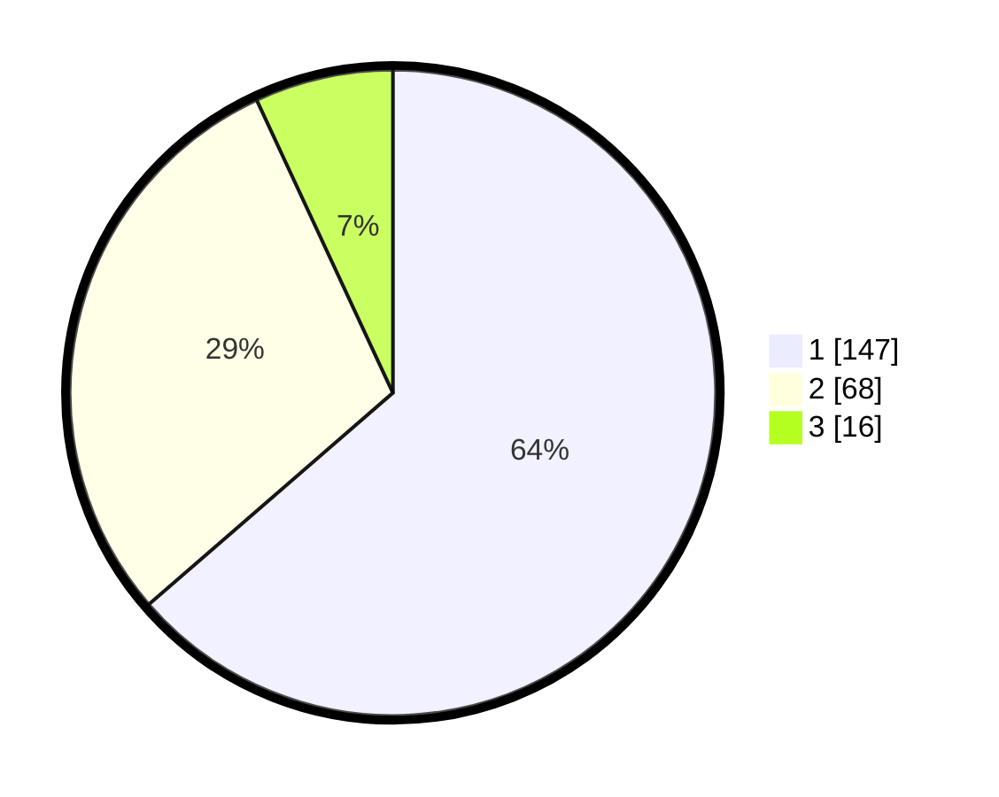

# Hasil

## Grafik

## Tabel

| No. | Nama Paslon    | Suara | Suara (raw) | Persentase |
|:--- |:-------------- | -----:| -----------:| ----------:|
| 1   | ANIES MUHAIMIN | 147   | [147][p-1]  | 63,64      |
| 2   | PRABOWO GIBRAN | 68    | [68][p-2]   | 29,44      |
| 3   | GANJAR MAHFUD  | 16    | [16][p-3]   | 6,93       |

[p-1]: https://github.com/gigit-pemilu/pemilu-2024-14-riau/blob/main/pilpres/hitung-suara/sub/14-riau/sub/03-bengkalis/sub/09-mandau/sub/1001-air-jamban/sub/113-tps/sub/paslon-1.txt
[p-2]: https://github.com/gigit-pemilu/pemilu-2024-14-riau/blob/main/pilpres/hitung-suara/sub/14-riau/sub/03-bengkalis/sub/09-mandau/sub/1001-air-jamban/sub/113-tps/sub/paslon-2.txt
[p-3]: https://github.com/gigit-pemilu/pemilu-2024-14-riau/blob/main/pilpres/hitung-suara/sub/14-riau/sub/03-bengkalis/sub/09-mandau/sub/1001-air-jamban/sub/113-tps/sub/paslon-3.txt

## Foto C Plano

https://sirekap-obj-formc.kpu.go.id/ae66/pemilu/ppwp/14/03/09/10/01/1403091001113-20240214-232810--fd5a9a86-05ad-4302-a106-50486445b742.jpg

https://sirekap-obj-formc.kpu.go.id/ae66/pemilu/ppwp/14/03/09/10/01/1403091001113-20240214-233420--87b0f0b4-59a1-4e7c-990a-fabe2c243104.jpg

https://sirekap-obj-formc.kpu.go.id/ae66/pemilu/ppwp/14/03/09/10/01/1403091001113-20240214-233552--578042fb-8149-4cd9-916d-1e50d8b7ba8d.jpg

## Metadata

| Key        | Value               |
| ---------- | ------------------- |
| Time Stamp | 2024-02-25 13:00:00 |

