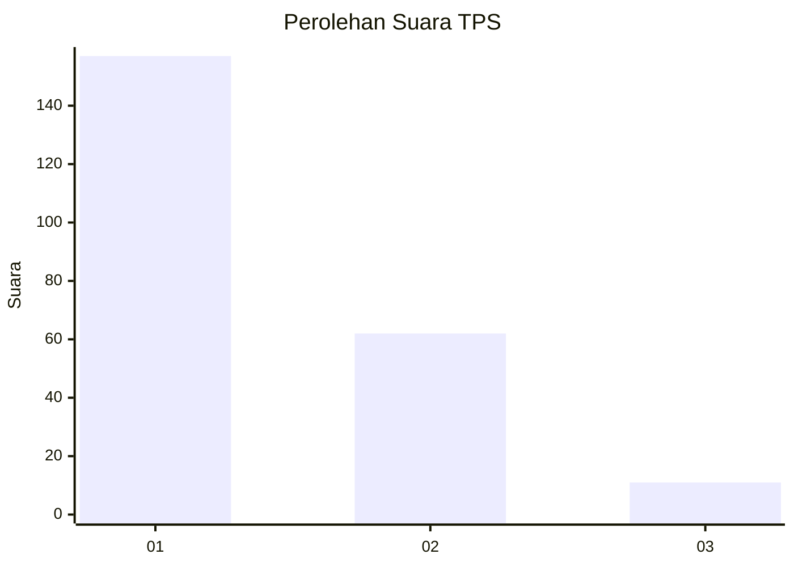
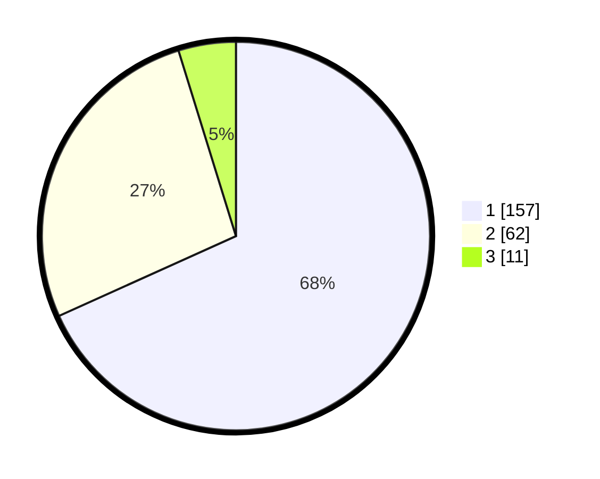

# Hasil

## Grafik

## Tabel

| No. | Nama Paslon    | Suara | Suara (raw) | Persentase |
|:--- |:-------------- | -----:| -----------:| ----------:|
| 1   | ANIES MUHAIMIN | 157   | [157][p-1]  | 68,26      |
| 2   | PRABOWO GIBRAN | 62    | [62][p-2]   | 26,96      |
| 3   | GANJAR MAHFUD  | 11    | [11][p-3]   | 4,78       |

[p-1]: https://github.com/gigit-pemilu/pemilu-2024-14-riau/blob/main/pilpres/hitung-suara/sub/14-riau/sub/03-bengkalis/sub/09-mandau/sub/1001-air-jamban/sub/122-tps/sub/paslon-1.txt
[p-2]: https://github.com/gigit-pemilu/pemilu-2024-14-riau/blob/main/pilpres/hitung-suara/sub/14-riau/sub/03-bengkalis/sub/09-mandau/sub/1001-air-jamban/sub/122-tps/sub/paslon-2.txt
[p-3]: https://github.com/gigit-pemilu/pemilu-2024-14-riau/blob/main/pilpres/hitung-suara/sub/14-riau/sub/03-bengkalis/sub/09-mandau/sub/1001-air-jamban/sub/122-tps/sub/paslon-3.txt

## Foto C Plano

https://sirekap-obj-formc.kpu.go.id/e886/pemilu/ppwp/14/03/09/10/01/1403091001122-20240215-001319--ace15629-1b17-4b23-8834-4202129533e6.jpg

https://sirekap-obj-formc.kpu.go.id/e886/pemilu/ppwp/14/03/09/10/01/1403091001122-20240215-000551--8fdae5f1-b820-4641-9985-26f7d03b4095.jpg

https://sirekap-obj-formc.kpu.go.id/e886/pemilu/ppwp/14/03/09/10/01/1403091001122-20240215-000721--527c042c-f4ff-4528-b5cd-9fcc264d803b.jpg

## Metadata

| Key        | Value               |
| ---------- | ------------------- |
| Time Stamp | 2024-02-15 15:00:29 |

