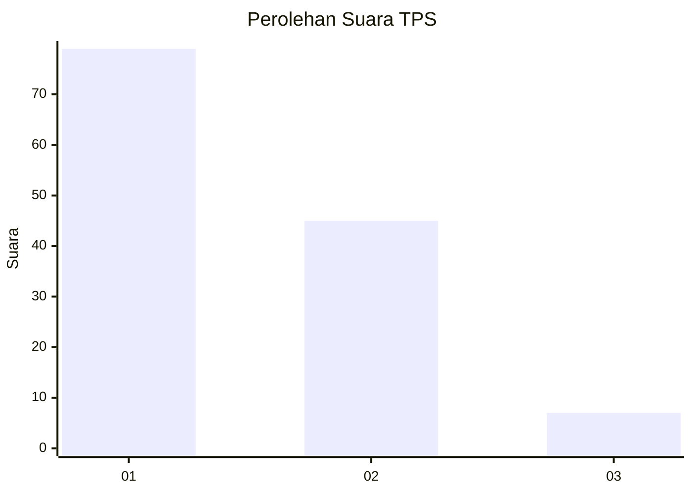
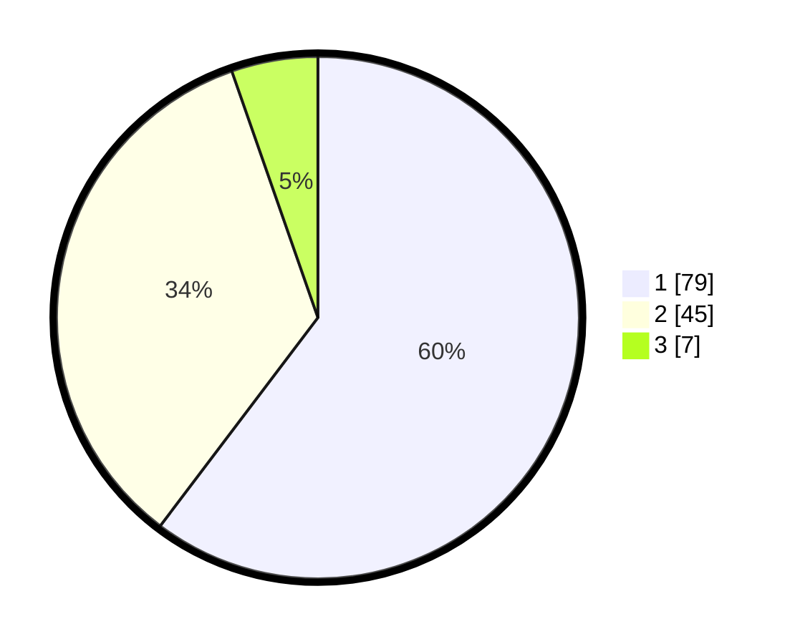

# Hasil

## Grafik

## Tabel

| No. | Nama Paslon    | Suara | Suara (raw) | Persentase |
|:--- |:-------------- | -----:| -----------:| ----------:|
| 1   | ANIES MUHAIMIN | 79    | [79][p-1]   | 60,31      |
| 2   | PRABOWO GIBRAN | 45    | [45][p-2]   | 34,35      |
| 3   | GANJAR MAHFUD  | 7     | [7][p-3]    | 5,34       |

[p-1]: https://github.com/gigit-pemilu/pemilu-2024-14-riau/blob/main/pilpres/hitung-suara/sub/14-riau/sub/03-bengkalis/sub/09-mandau/sub/1002-babussalam/sub/011-tps/sub/paslon-1.txt
[p-2]: https://github.com/gigit-pemilu/pemilu-2024-14-riau/blob/main/pilpres/hitung-suara/sub/14-riau/sub/03-bengkalis/sub/09-mandau/sub/1002-babussalam/sub/011-tps/sub/paslon-2.txt
[p-3]: https://github.com/gigit-pemilu/pemilu-2024-14-riau/blob/main/pilpres/hitung-suara/sub/14-riau/sub/03-bengkalis/sub/09-mandau/sub/1002-babussalam/sub/011-tps/sub/paslon-3.txt

## Foto C Plano

https://sirekap-obj-formc.kpu.go.id/cf6d/pemilu/ppwp/14/03/09/10/02/1403091002011-20240214-155115--20acd8b6-e8cd-4596-a25e-8c375f4726c9.jpg

https://sirekap-obj-formc.kpu.go.id/cf6d/pemilu/ppwp/14/03/09/10/02/1403091002011-20240214-155613--1c25e3dc-c029-46fa-a90a-201064576016.jpg

https://sirekap-obj-formc.kpu.go.id/cf6d/pemilu/ppwp/14/03/09/10/02/1403091002011-20240214-160100--4fb649de-b4c2-4bff-9d84-44b212285dbe.jpg

## Metadata

| Key        | Value               |
| ---------- | ------------------- |
| Time Stamp | 2024-02-14 21:46:01 |

