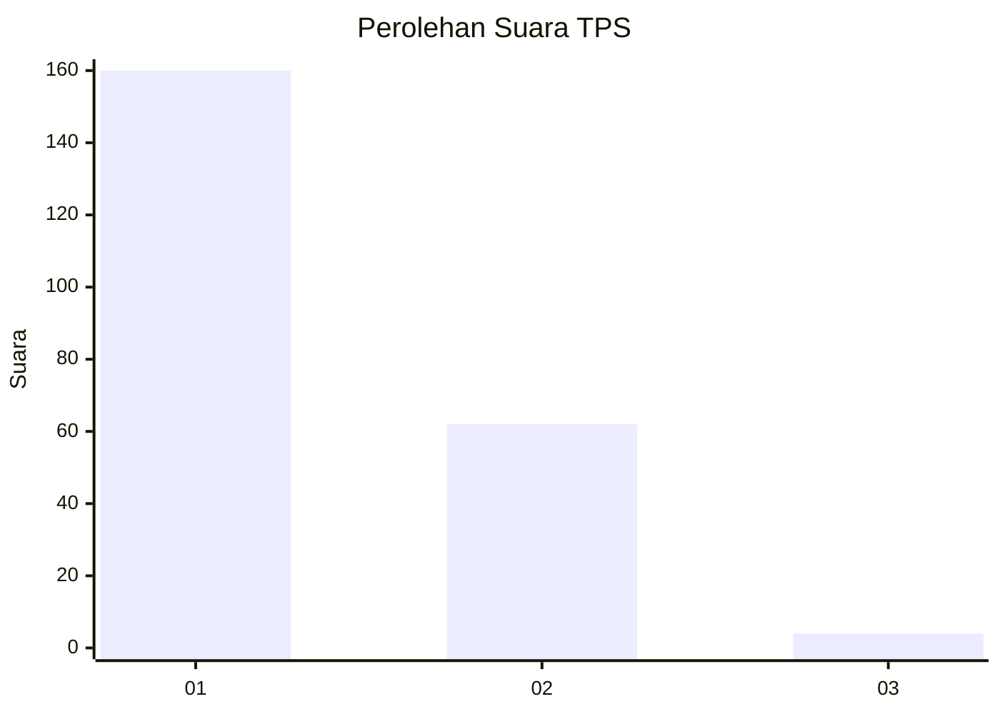
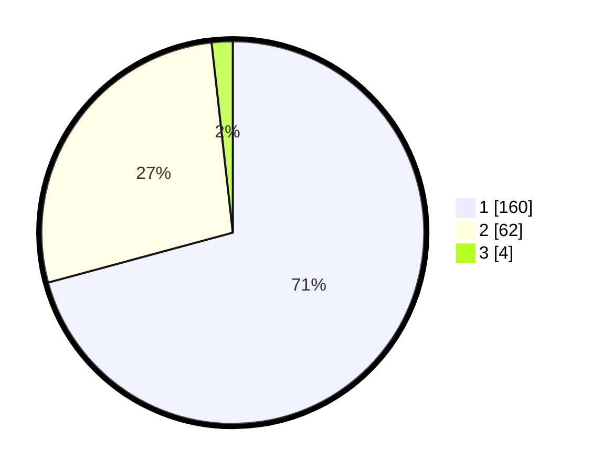

# Hasil

## Grafik

## Tabel

| No. | Nama Paslon    | Suara | Suara (raw) | Persentase |
|:--- |:-------------- | -----:| -----------:| ----------:|
| 1   | ANIES MUHAIMIN | 160   | [160][p-1]  | 70,80      |
| 2   | PRABOWO GIBRAN | 62    | [62][p-2]   | 27,43      |
| 3   | GANJAR MAHFUD  | 4     | [4][p-3]    | 1,77       |

[p-1]: https://github.com/gigit-pemilu/pemilu-2024-14-riau/blob/main/pilpres/hitung-suara/sub/14-riau/sub/03-bengkalis/sub/09-mandau/sub/1004-balik-alam/sub/006-tps/sub/paslon-1.txt
[p-2]: https://github.com/gigit-pemilu/pemilu-2024-14-riau/blob/main/pilpres/hitung-suara/sub/14-riau/sub/03-bengkalis/sub/09-mandau/sub/1004-balik-alam/sub/006-tps/sub/paslon-2.txt
[p-3]: https://github.com/gigit-pemilu/pemilu-2024-14-riau/blob/main/pilpres/hitung-suara/sub/14-riau/sub/03-bengkalis/sub/09-mandau/sub/1004-balik-alam/sub/006-tps/sub/paslon-3.txt

## Foto C Plano

https://sirekap-obj-formc.kpu.go.id/cbdf/pemilu/ppwp/14/03/09/10/04/1403091004006-20240215-005715--6161c6db-fa23-4866-9731-d6408ba334eb.jpg

https://sirekap-obj-formc.kpu.go.id/cbdf/pemilu/ppwp/14/03/09/10/04/1403091004006-20240215-005821--78355250-a172-45f2-8bfd-2b31e0ca1c5d.jpg

https://sirekap-obj-formc.kpu.go.id/cbdf/pemilu/ppwp/14/03/09/10/04/1403091004006-20240215-005920--4493a43c-f903-4298-8ba8-072dadfdd36c.jpg

## Metadata

| Key        | Value               |
| ---------- | ------------------- |
| Time Stamp | 2024-02-25 21:00:00 |

