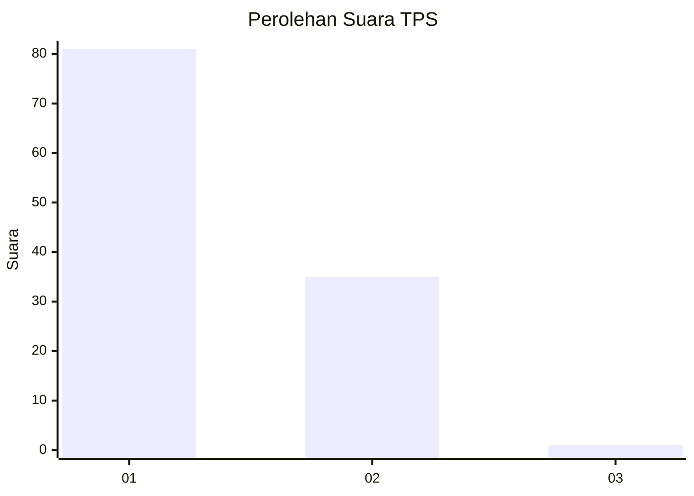
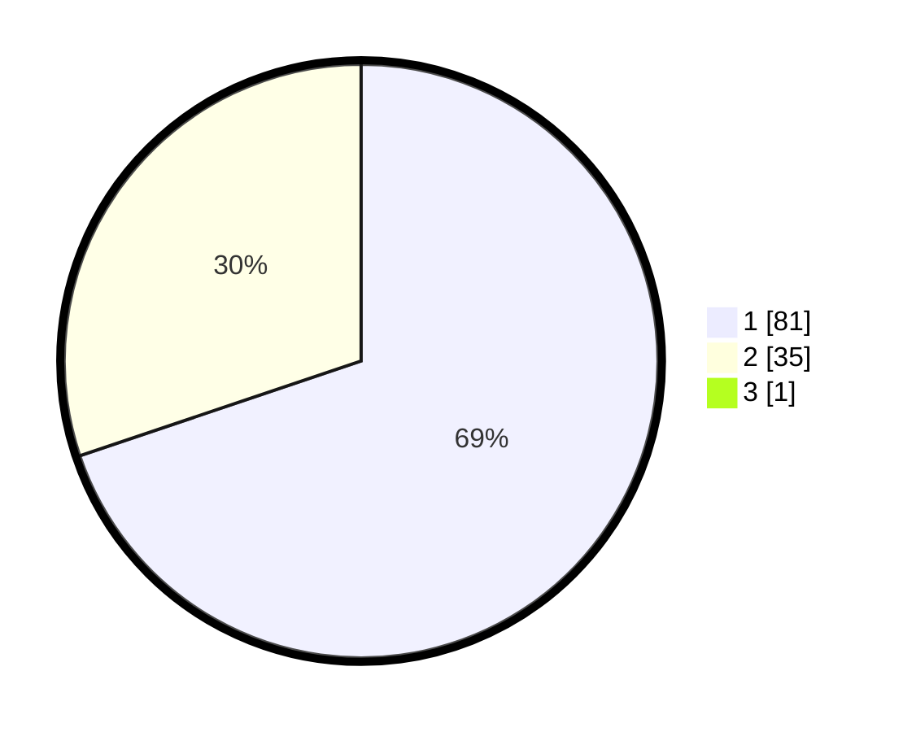

# Hasil

## Grafik

## Tabel

| No. | Nama Paslon    | Suara | Suara (raw) | Persentase |
|:--- |:-------------- | -----:| -----------:| ----------:|
| 1   | ANIES MUHAIMIN | 81    | [81][p-1]   | 69,23      |
| 2   | PRABOWO GIBRAN | 35    | [35][p-2]   | 29,91      |
| 3   | GANJAR MAHFUD  | 1     | [1][p-3]    | 0,85       |

[p-1]: https://github.com/gigit-pemilu/pemilu-2024-14-riau/blob/main/pilpres/hitung-suara/sub/14-riau/sub/03-bengkalis/sub/09-mandau/sub/1006-duri-barat/sub/027-tps/sub/paslon-1.txt
[p-2]: https://github.com/gigit-pemilu/pemilu-2024-14-riau/blob/main/pilpres/hitung-suara/sub/14-riau/sub/03-bengkalis/sub/09-mandau/sub/1006-duri-barat/sub/027-tps/sub/paslon-2.txt
[p-3]: https://github.com/gigit-pemilu/pemilu-2024-14-riau/blob/main/pilpres/hitung-suara/sub/14-riau/sub/03-bengkalis/sub/09-mandau/sub/1006-duri-barat/sub/027-tps/sub/paslon-3.txt

## Foto C Plano

https://sirekap-obj-formc.kpu.go.id/ce95/pemilu/ppwp/14/03/09/10/06/1403091006027-20240214-230423--1c88d390-a518-40de-984a-06956189a433.jpg

https://sirekap-obj-formc.kpu.go.id/ce95/pemilu/ppwp/14/03/09/10/06/1403091006027-20240214-230739--8c3e1f52-3007-49dd-a05b-c23de843f374.jpg

https://sirekap-obj-formc.kpu.go.id/ce95/pemilu/ppwp/14/03/09/10/06/1403091006027-20240214-231007--8b84632d-cc8d-446e-a57d-aa0da0acaaf4.jpg

## Metadata

| Key        | Value               |
| ---------- | ------------------- |
| Time Stamp | 2024-02-24 22:31:28 |

