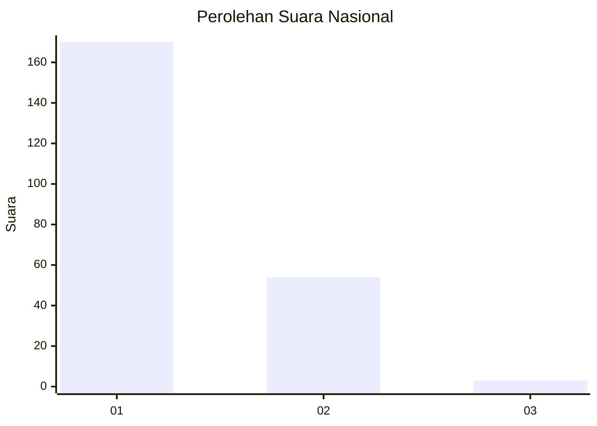
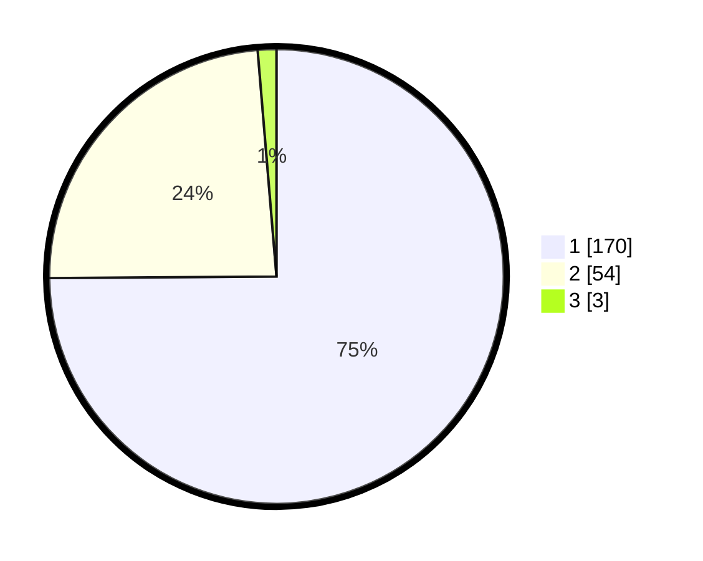

# Hasil

## Grafik

## Tabel

| No. | Nama Paslon    | Suara | Suara (raw) | Persentase |
|:--- |:-------------- | -----:| -----------:| ----------:|
| 1   | ANIES MUHAIMIN | 170   | [170][p-1]  | 74,89      |
| 2   | PRABOWO GIBRAN | 54    | [54][p-2]   | 23,79      |
| 3   | GANJAR MAHFUD  | 3     | [3][p-3]    | 1,32       |

[p-1]: https://github.com/gigit-pemilu/pemilu-2024/blob/main/pilpres/hitung-suara/sub/14-riau/sub/03-bengkalis/sub/09-mandau/sub/1006-duri-barat/sub/037-tps/sub/paslon-1.txt
[p-2]: https://github.com/gigit-pemilu/pemilu-2024/blob/main/pilpres/hitung-suara/sub/14-riau/sub/03-bengkalis/sub/09-mandau/sub/1006-duri-barat/sub/037-tps/sub/paslon-2.txt
[p-3]: https://github.com/gigit-pemilu/pemilu-2024/blob/main/pilpres/hitung-suara/sub/14-riau/sub/03-bengkalis/sub/09-mandau/sub/1006-duri-barat/sub/037-tps/sub/paslon-3.txt

## Foto C Plano

https://sirekap-obj-formc.kpu.go.id/dc32/pemilu/ppwp/14/03/09/10/06/1403091006037-20240214-215808--3a63d178-1a31-420e-8596-ef7fbf258012.jpg

https://sirekap-obj-formc.kpu.go.id/dc32/pemilu/ppwp/14/03/09/10/06/1403091006037-20240214-220059--9d4906c5-129e-4c35-95e1-516a2c50bfbe.jpg

https://sirekap-obj-formc.kpu.go.id/dc32/pemilu/ppwp/14/03/09/10/06/1403091006037-20240214-215441--e4bc8e8e-9536-4134-a51e-b39f82db5e55.jpg

## Metadata

| Key        | Value               |
| ---------- | ------------------- |
| Time Stamp | 2024-02-25 12:00:00 |

