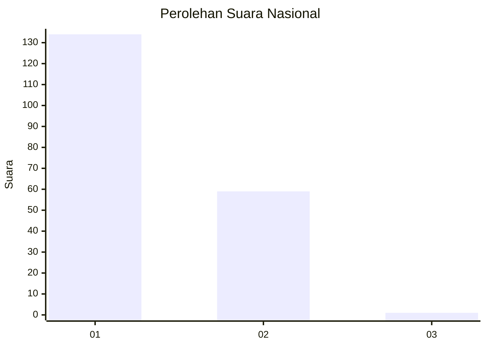
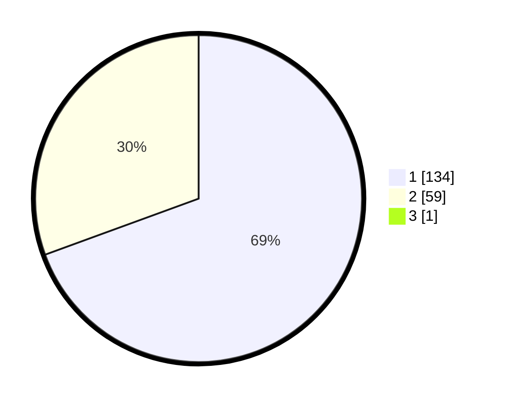

# Hasil

## Grafik

## Tabel

| No. | Nama Paslon    | Suara | Suara (raw) | Persentase |
|:--- |:-------------- | -----:| -----------:| ----------:|
| 1   | ANIES MUHAIMIN | 134   | [134][p-1]  | 69,07      |
| 2   | PRABOWO GIBRAN | 59    | [59][p-2]   | 30,41      |
| 3   | GANJAR MAHFUD  | 1     | [1][p-3]    | 0,52       |

[p-1]: https://github.com/gigit-pemilu/pemilu-2024/blob/main/pilpres/hitung-suara/sub/14-riau/sub/03-bengkalis/sub/09-mandau/sub/1009-talang-mandi/sub/045-tps/sub/paslon-1.txt
[p-2]: https://github.com/gigit-pemilu/pemilu-2024/blob/main/pilpres/hitung-suara/sub/14-riau/sub/03-bengkalis/sub/09-mandau/sub/1009-talang-mandi/sub/045-tps/sub/paslon-2.txt
[p-3]: https://github.com/gigit-pemilu/pemilu-2024/blob/main/pilpres/hitung-suara/sub/14-riau/sub/03-bengkalis/sub/09-mandau/sub/1009-talang-mandi/sub/045-tps/sub/paslon-3.txt

## Foto C Plano

https://sirekap-obj-formc.kpu.go.id/b2f2/pemilu/ppwp/14/03/09/10/09/1403091009045-20240214-234116--2faba245-b47d-44dc-9058-fb010a41eab4.jpg

https://sirekap-obj-formc.kpu.go.id/b2f2/pemilu/ppwp/14/03/09/10/09/1403091009045-20240215-001623--320c687a-ba70-4f08-a08e-b71273474efd.jpg

https://sirekap-obj-formc.kpu.go.id/b2f2/pemilu/ppwp/14/03/09/10/09/1403091009045-20240215-001919--5764335d-68a4-47af-a888-d50d05696aa7.jpg

## Metadata

| Key        | Value               |
| ---------- | ------------------- |
| Time Stamp | 2024-02-15 15:00:29 |

