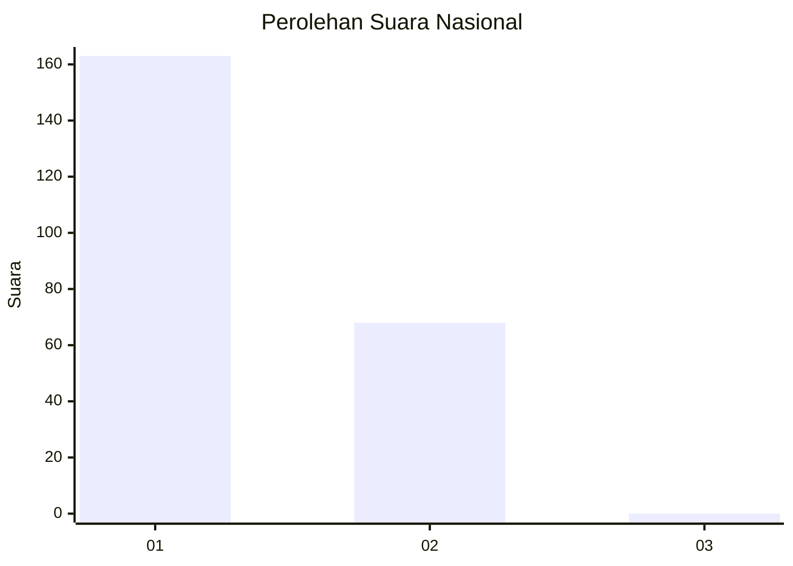
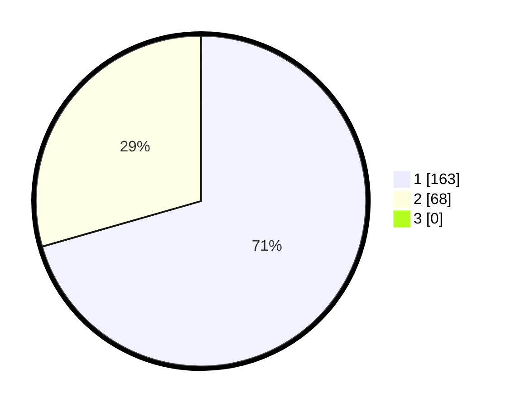

# Hasil

## Grafik

## Tabel

| No. | Nama Paslon    | Suara | Suara (raw) | Persentase |
|:--- |:-------------- | -----:| -----------:| ----------:|
| 1   | ANIES MUHAIMIN | 163   | [163][p-1]  | 70,56      |
| 2   | PRABOWO GIBRAN | 68    | [68][p-2]   | 29,44      |
| 3   | GANJAR MAHFUD  | 0     | [0][p-3]    | 0,00       |

[p-1]: https://github.com/gigit-pemilu/pemilu-2024/blob/main/pilpres/hitung-suara/sub/14-riau/sub/03-bengkalis/sub/09-mandau/sub/1010-pematang-pudu/sub/009-tps/sub/paslon-1.txt
[p-2]: https://github.com/gigit-pemilu/pemilu-2024/blob/main/pilpres/hitung-suara/sub/14-riau/sub/03-bengkalis/sub/09-mandau/sub/1010-pematang-pudu/sub/009-tps/sub/paslon-2.txt
[p-3]: https://github.com/gigit-pemilu/pemilu-2024/blob/main/pilpres/hitung-suara/sub/14-riau/sub/03-bengkalis/sub/09-mandau/sub/1010-pematang-pudu/sub/009-tps/sub/paslon-3.txt

## Foto C Plano

https://sirekap-obj-formc.kpu.go.id/765d/pemilu/ppwp/14/03/09/10/10/1403091010009-20240215-035502--ab5764b7-e3cc-4614-be5a-b8a2ed6bac20.jpg

https://sirekap-obj-formc.kpu.go.id/765d/pemilu/ppwp/14/03/09/10/10/1403091010009-20240215-035139--ddfe1dd9-74de-4f64-ade3-0398ac4bbce4.jpg

https://sirekap-obj-formc.kpu.go.id/765d/pemilu/ppwp/14/03/09/10/10/1403091010009-20240215-035600--0bfa170c-78c8-4a9d-91e5-cffe77fc9168.jpg

## Metadata

| Key        | Value               |
| ---------- | ------------------- |
| Time Stamp | 2024-02-25 15:00:00 |

