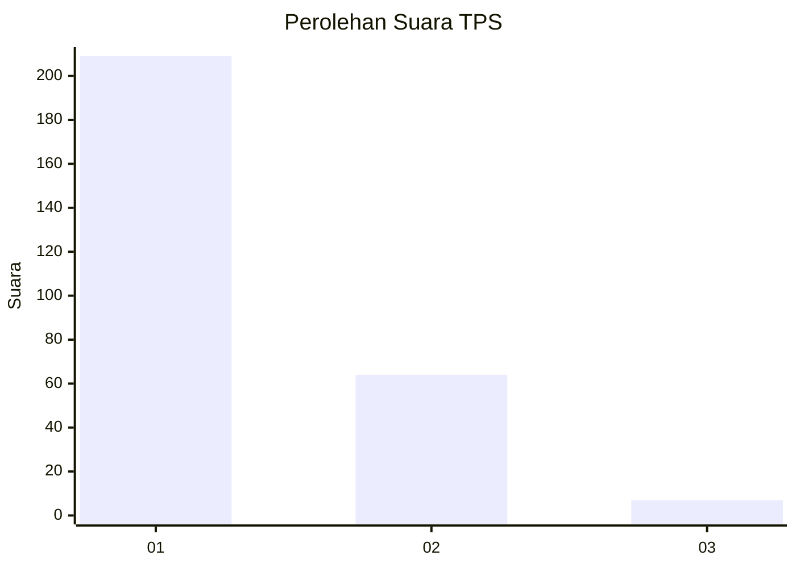
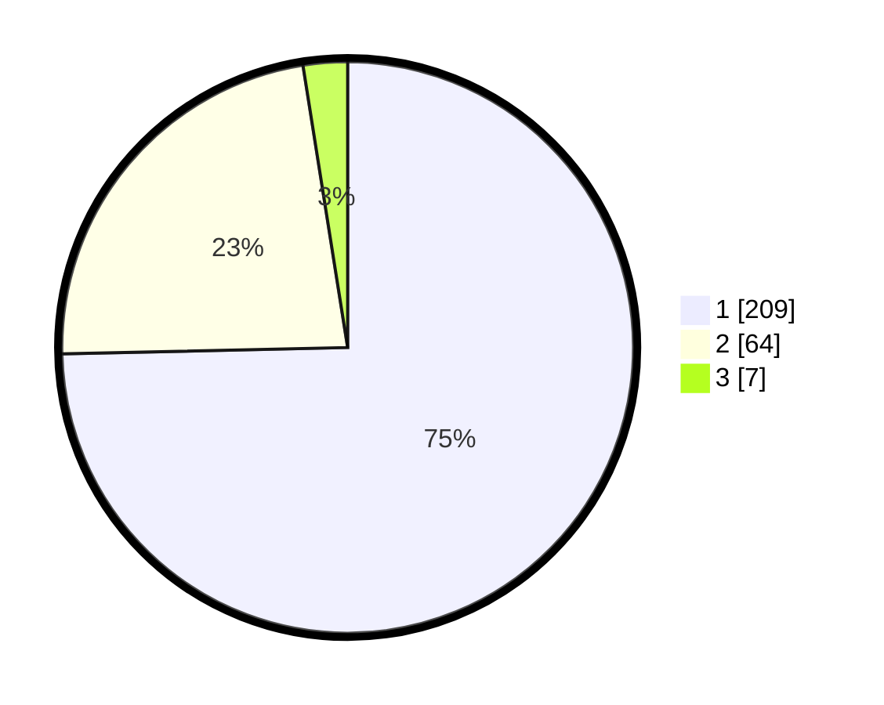

# Hasil

## Grafik

## Tabel

| No. | Nama Paslon    | Suara | Suara (raw) | Persentase |
|:--- |:-------------- | -----:| -----------:| ----------:|
| 1   | ANIES MUHAIMIN | 209   | [209][p-1]  | 74,64      |
| 2   | PRABOWO GIBRAN | 64    | [64][p-2]   | 22,86      |
| 3   | GANJAR MAHFUD  | 7     | [7][p-3]    | 2,50       |

[p-1]: https://github.com/gigit-pemilu/pemilu-2024-14-riau/blob/main/pilpres/hitung-suara/sub/14-riau/sub/03-bengkalis/sub/09-mandau/sub/1010-pematang-pudu/sub/029-tps/sub/paslon-1.txt
[p-2]: https://github.com/gigit-pemilu/pemilu-2024-14-riau/blob/main/pilpres/hitung-suara/sub/14-riau/sub/03-bengkalis/sub/09-mandau/sub/1010-pematang-pudu/sub/029-tps/sub/paslon-2.txt
[p-3]: https://github.com/gigit-pemilu/pemilu-2024-14-riau/blob/main/pilpres/hitung-suara/sub/14-riau/sub/03-bengkalis/sub/09-mandau/sub/1010-pematang-pudu/sub/029-tps/sub/paslon-3.txt

## Foto C Plano

https://sirekap-obj-formc.kpu.go.id/d894/pemilu/ppwp/14/03/09/10/10/1403091010029-20240214-201831--c7ded0c0-1efc-4e7d-9cad-f2565162f412.jpg

https://sirekap-obj-formc.kpu.go.id/d894/pemilu/ppwp/14/03/09/10/10/1403091010029-20240214-201656--9cb213b8-8f20-41e5-922b-3f2756c147f2.jpg

https://sirekap-obj-formc.kpu.go.id/d894/pemilu/ppwp/14/03/09/10/10/1403091010029-20240214-202049--462e1124-cde9-4d27-accb-4a2a25567a28.jpg

## Metadata

| Key        | Value               |
| ---------- | ------------------- |
| Time Stamp | 2024-02-25 12:00:00 |

