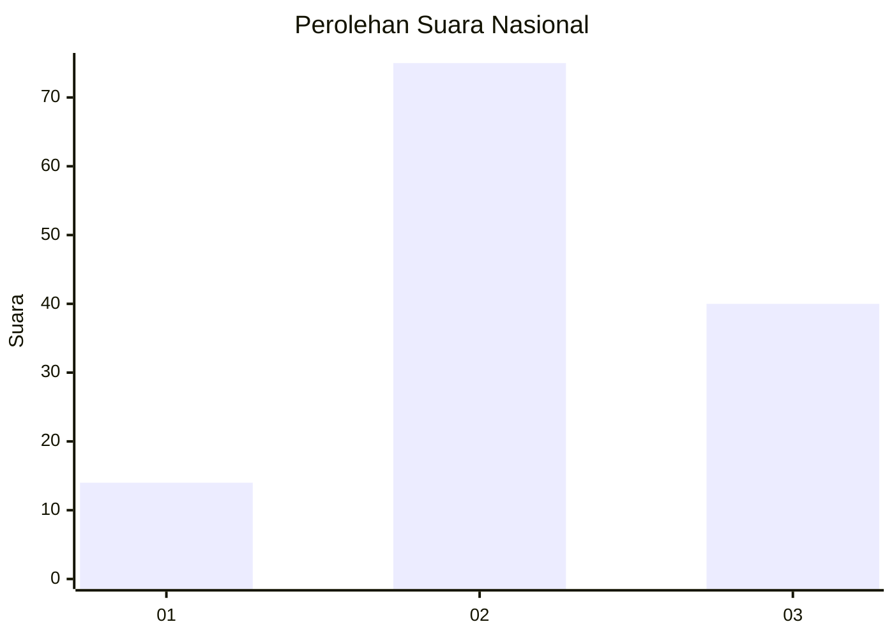
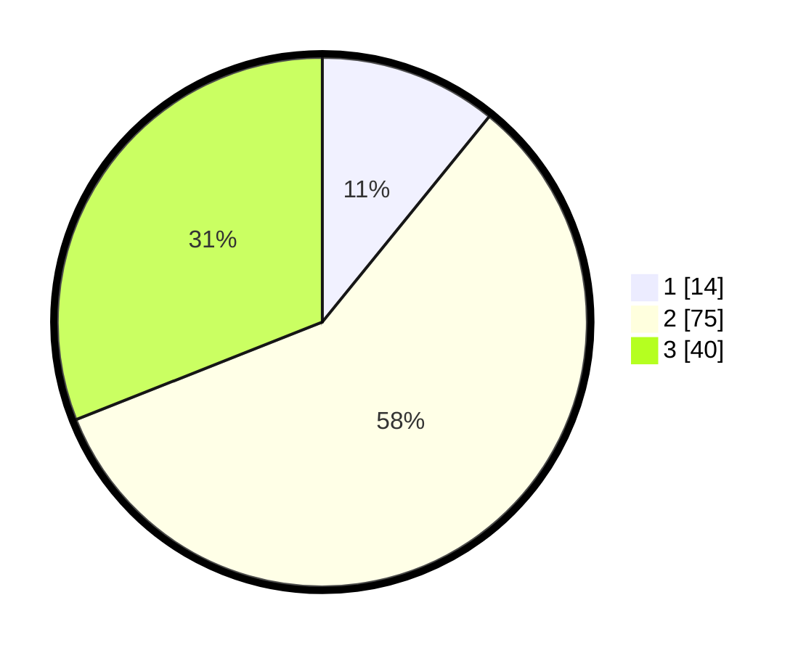

# Hasil

## Grafik

## Tabel

| No. | Nama Paslon    | Suara | Suara (raw) | Persentase |
|:--- |:-------------- | -----:| -----------:| ----------:|
| 1   | ANIES MUHAIMIN | 14    | [14][p-1]   | 10,85      |
| 2   | PRABOWO GIBRAN | 75    | [75][p-2]   | 58,14      |
| 3   | GANJAR MAHFUD  | 40    | [40][p-3]   | 31,01      |

[p-1]: https://github.com/gigit-pemilu/pemilu-2024/blob/main/pilpres/hitung-suara/sub/14-riau/sub/03-bengkalis/sub/09-mandau/sub/2021-bathin-betuah/sub/005-tps/sub/paslon-1.txt
[p-2]: https://github.com/gigit-pemilu/pemilu-2024/blob/main/pilpres/hitung-suara/sub/14-riau/sub/03-bengkalis/sub/09-mandau/sub/2021-bathin-betuah/sub/005-tps/sub/paslon-2.txt
[p-3]: https://github.com/gigit-pemilu/pemilu-2024/blob/main/pilpres/hitung-suara/sub/14-riau/sub/03-bengkalis/sub/09-mandau/sub/2021-bathin-betuah/sub/005-tps/sub/paslon-3.txt

## Foto C Plano

https://sirekap-obj-formc.kpu.go.id/3369/pemilu/ppwp/14/03/09/20/21/1403092021005-20240215-021506--be0e8c4e-8ab8-4d4f-9a83-47b960ca6737.jpg

https://sirekap-obj-formc.kpu.go.id/3369/pemilu/ppwp/14/03/09/20/21/1403092021005-20240215-021654--764deeff-f640-44c5-b984-43c27b448896.jpg

https://sirekap-obj-formc.kpu.go.id/3369/pemilu/ppwp/14/03/09/20/21/1403092021005-20240215-021812--badb4e23-8bf7-4166-b010-b72000e1fe8c.jpg

## Metadata

| Key        | Value               |
| ---------- | ------------------- |
| Time Stamp | 2024-02-15 15:00:29 |

