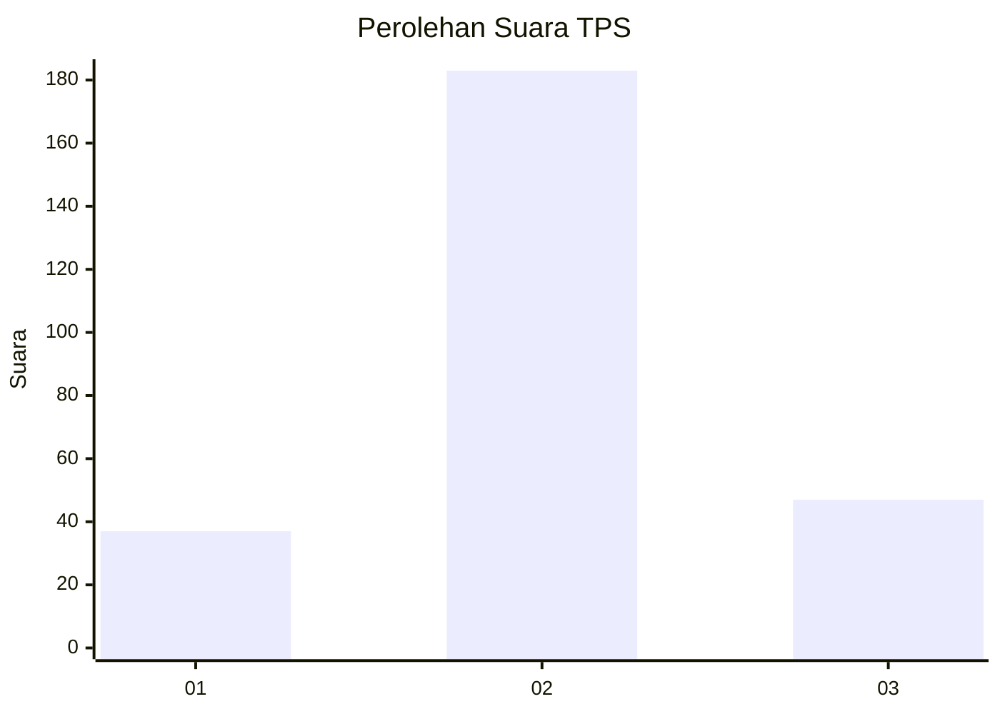
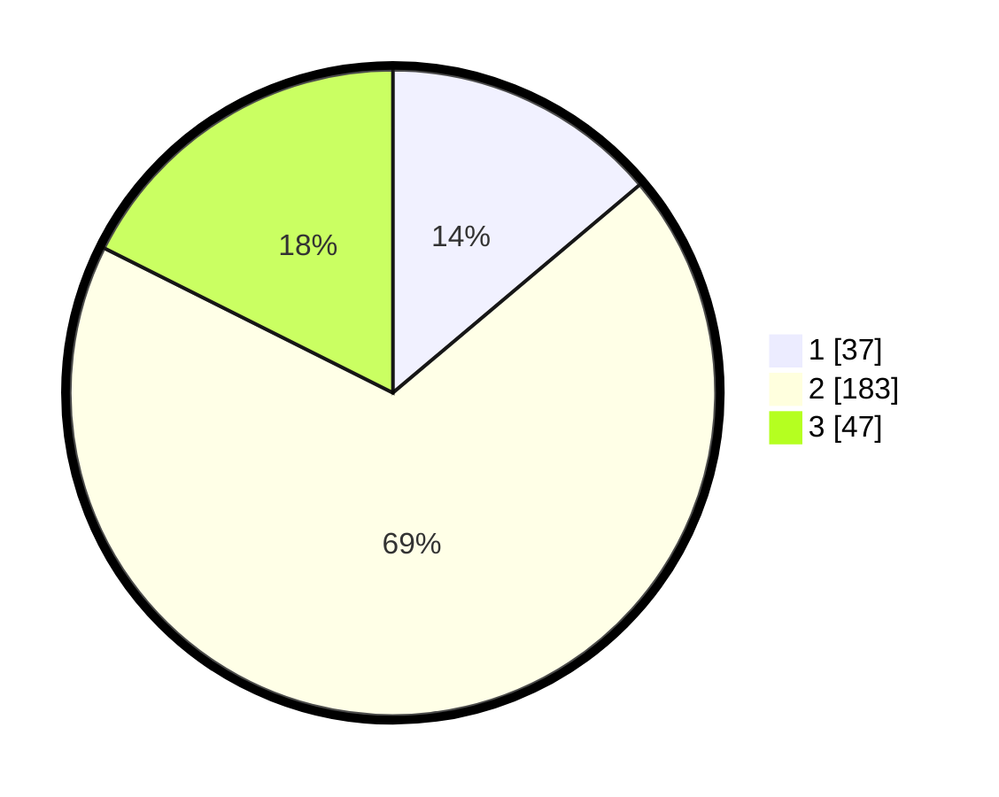

# Hasil

## Grafik

## Tabel

| No. | Nama Paslon    | Suara | Suara (raw) | Persentase |
|:--- |:-------------- | -----:| -----------:| ----------:|
| 1   | ANIES MUHAIMIN | 37    | [37][p-1]   | 13,86      |
| 2   | PRABOWO GIBRAN | 183   | [183][p-2]  | 68,54      |
| 3   | GANJAR MAHFUD  | 47    | [47][p-3]   | 17,60      |

[p-1]: https://github.com/gigit-pemilu/pemilu-2024-14-riau/blob/main/pilpres/hitung-suara/sub/14-riau/sub/03-bengkalis/sub/09-mandau/sub/2021-bathin-betuah/sub/014-tps/sub/paslon-1.txt
[p-2]: https://github.com/gigit-pemilu/pemilu-2024-14-riau/blob/main/pilpres/hitung-suara/sub/14-riau/sub/03-bengkalis/sub/09-mandau/sub/2021-bathin-betuah/sub/014-tps/sub/paslon-2.txt
[p-3]: https://github.com/gigit-pemilu/pemilu-2024-14-riau/blob/main/pilpres/hitung-suara/sub/14-riau/sub/03-bengkalis/sub/09-mandau/sub/2021-bathin-betuah/sub/014-tps/sub/paslon-3.txt

## Foto C Plano

https://sirekap-obj-formc.kpu.go.id/1497/pemilu/ppwp/14/03/09/20/21/1403092021014-20240214-213314--2e42ba43-c2d4-443a-9d86-ec55d4f7390b.jpg

https://sirekap-obj-formc.kpu.go.id/1497/pemilu/ppwp/14/03/09/20/21/1403092021014-20240214-213529--57237ac6-b985-41c5-938f-2482c5100789.jpg

https://sirekap-obj-formc.kpu.go.id/1497/pemilu/ppwp/14/03/09/20/21/1403092021014-20240214-214140--dfdecbfb-525c-44c1-aa2b-2eb081652c93.jpg

## Metadata

| Key        | Value               |
| ---------- | ------------------- |
| Time Stamp | 2024-02-15 15:00:29 |

