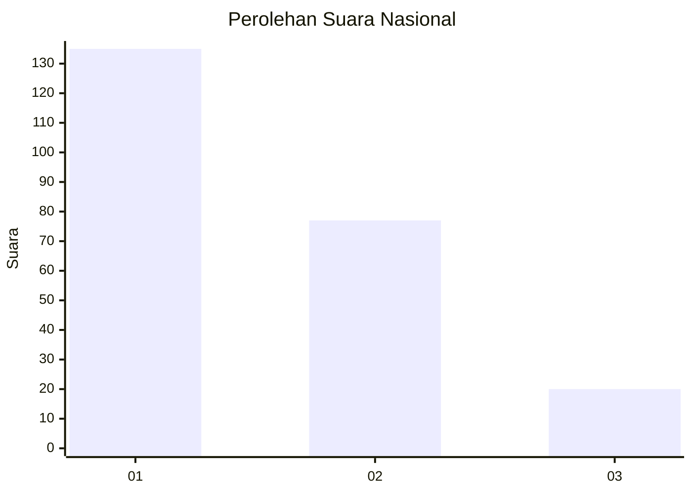
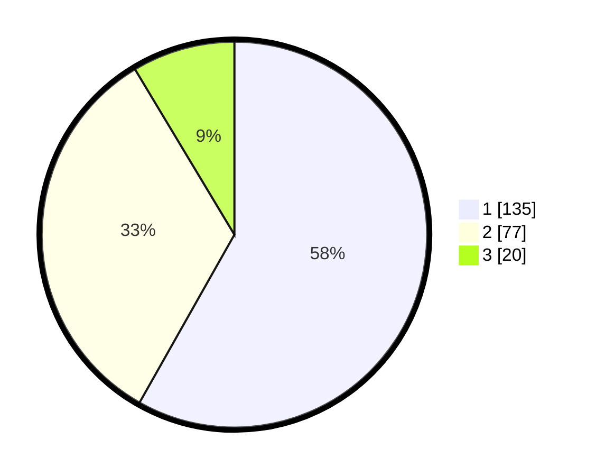

# Hasil

## Grafik

## Tabel

| No. | Nama Paslon    | Suara | Suara (raw) | Persentase |
|:--- |:-------------- | -----:| -----------:| ----------:|
| 1   | ANIES MUHAIMIN | 135   | [135][p-1]  | 58,19      |
| 2   | PRABOWO GIBRAN | 77    | [77][p-2]   | 33,19      |
| 3   | GANJAR MAHFUD  | 20    | [20][p-3]   | 8,62       |

[p-1]: https://github.com/gigit-pemilu/pemilu-2024/blob/main/pilpres/hitung-suara/sub/14-riau/sub/03-bengkalis/sub/10-rupat/sub/1001-batu-panjang/sub/007-tps/sub/paslon-1.txt
[p-2]: https://github.com/gigit-pemilu/pemilu-2024/blob/main/pilpres/hitung-suara/sub/14-riau/sub/03-bengkalis/sub/10-rupat/sub/1001-batu-panjang/sub/007-tps/sub/paslon-2.txt
[p-3]: https://github.com/gigit-pemilu/pemilu-2024/blob/main/pilpres/hitung-suara/sub/14-riau/sub/03-bengkalis/sub/10-rupat/sub/1001-batu-panjang/sub/007-tps/sub/paslon-3.txt

## Foto C Plano

https://sirekap-obj-formc.kpu.go.id/60d4/pemilu/ppwp/14/03/10/10/01/1403101001007-20240215-040647--42a8d8d4-c4e9-417a-8b1c-82836a7d8e69.jpg

https://sirekap-obj-formc.kpu.go.id/60d4/pemilu/ppwp/14/03/10/10/01/1403101001007-20240215-030949--731d7229-572a-4f2e-9fef-afd0acc39860.jpg

https://sirekap-obj-formc.kpu.go.id/60d4/pemilu/ppwp/14/03/10/10/01/1403101001007-20240215-031012--0a050853-6b3e-4eef-a6ae-2258e330e4ad.jpg

## Metadata

| Key        | Value               |
| ---------- | ------------------- |
| Time Stamp | 2024-02-15 15:00:29 |

