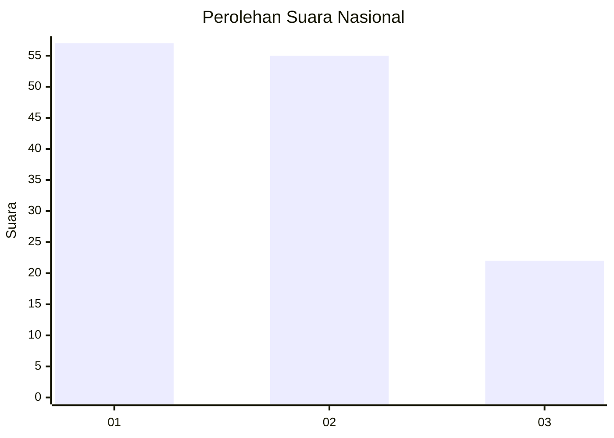
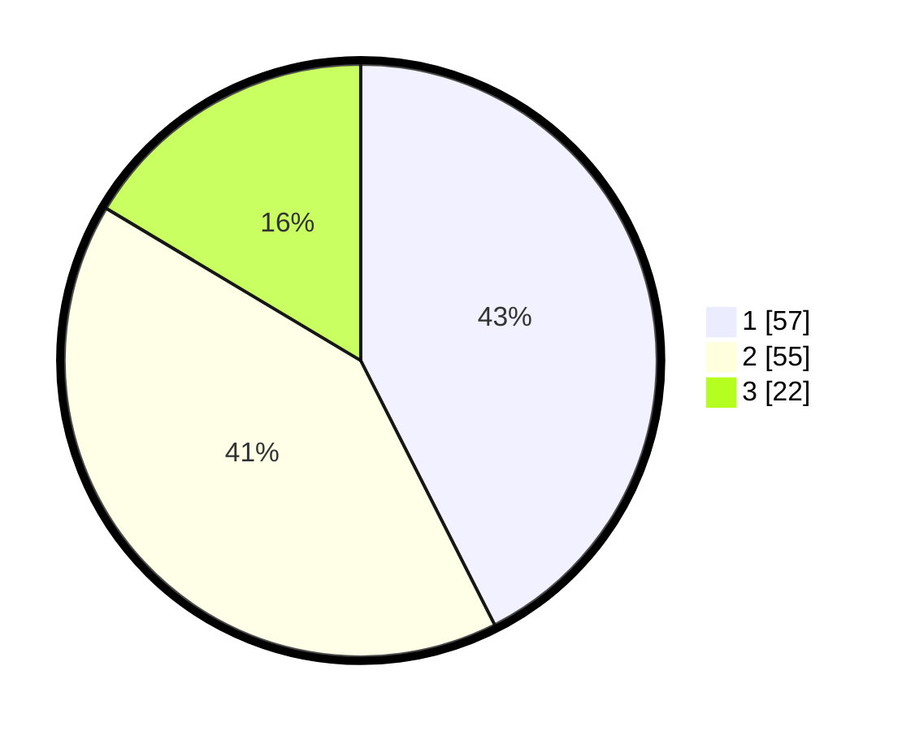

# Hasil

## Grafik

## Tabel

| No. | Nama Paslon    | Suara | Suara (raw) | Persentase |
|:--- |:-------------- | -----:| -----------:| ----------:|
| 1   | ANIES MUHAIMIN | 57    | [57][p-1]   | 42,54      |
| 2   | PRABOWO GIBRAN | 55    | [55][p-2]   | 41,04      |
| 3   | GANJAR MAHFUD  | 22    | [22][p-3]   | 16,42      |

[p-1]: https://github.com/gigit-pemilu/pemilu-2024/blob/main/pilpres/hitung-suara/sub/14-riau/sub/03-bengkalis/sub/11-rupat-utara/sub/2001-tanjung-medang/sub/006-tps/sub/paslon-1.txt
[p-2]: https://github.com/gigit-pemilu/pemilu-2024/blob/main/pilpres/hitung-suara/sub/14-riau/sub/03-bengkalis/sub/11-rupat-utara/sub/2001-tanjung-medang/sub/006-tps/sub/paslon-2.txt
[p-3]: https://github.com/gigit-pemilu/pemilu-2024/blob/main/pilpres/hitung-suara/sub/14-riau/sub/03-bengkalis/sub/11-rupat-utara/sub/2001-tanjung-medang/sub/006-tps/sub/paslon-3.txt

## Foto C Plano

https://sirekap-obj-formc.kpu.go.id/dd88/pemilu/ppwp/14/03/11/20/01/1403112001006-20240219-090614--c854f5b8-1285-4495-b94e-27810813387c.jpg

https://sirekap-obj-formc.kpu.go.id/dd88/pemilu/ppwp/14/03/11/20/01/1403112001006-20240219-091110--a1e53442-80cf-4efe-a3f9-e7c15c24753f.jpg

https://sirekap-obj-formc.kpu.go.id/dd88/pemilu/ppwp/14/03/11/20/01/1403112001006-20240219-091230--6d0482f5-25a1-4c4f-a7fb-cbc0fbf5f5c7.jpg

## Metadata

| Key        | Value               |
| ---------- | ------------------- |
| Time Stamp | 2024-02-19 10:00:00 |

