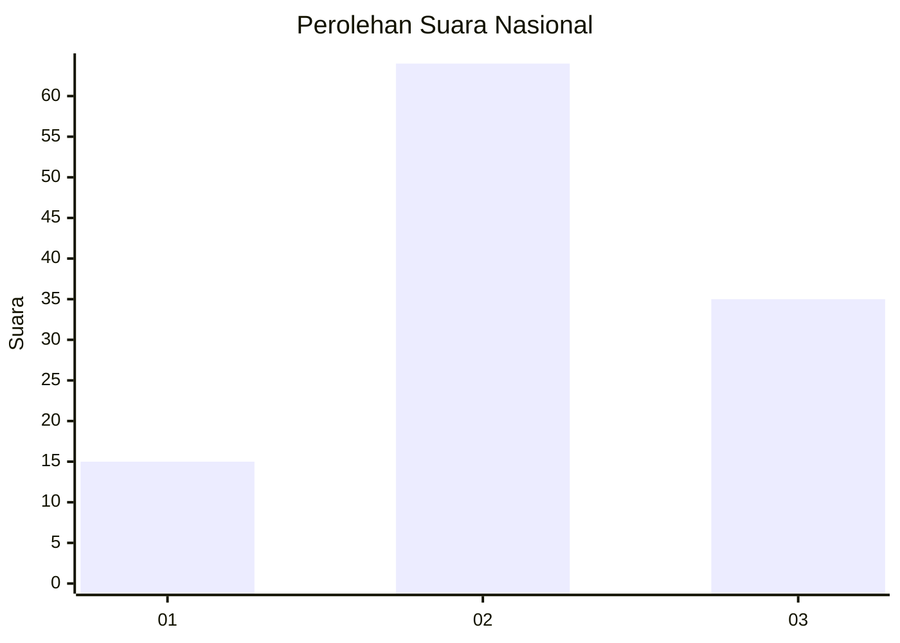
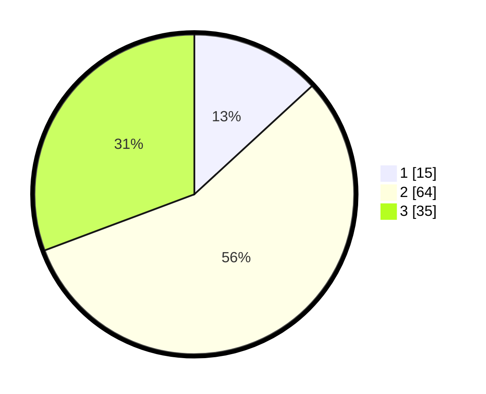

# Hasil

## Grafik

## Tabel

| No. | Nama Paslon    | Suara | Suara (raw) | Persentase |
|:--- |:-------------- | -----:| -----------:| ----------:|
| 1   | ANIES MUHAIMIN | 15    | [15][p-1]   | 13,16      |
| 2   | PRABOWO GIBRAN | 64    | [64][p-2]   | 56,14      |
| 3   | GANJAR MAHFUD  | 35    | [35][p-3]   | 30,70      |

[p-1]: https://github.com/gigit-pemilu/pemilu-2024/blob/main/pilpres/hitung-suara/sub/14-riau/sub/03-bengkalis/sub/11-rupat-utara/sub/2005-titi-akar/sub/001-tps/sub/paslon-1.txt
[p-2]: https://github.com/gigit-pemilu/pemilu-2024/blob/main/pilpres/hitung-suara/sub/14-riau/sub/03-bengkalis/sub/11-rupat-utara/sub/2005-titi-akar/sub/001-tps/sub/paslon-2.txt
[p-3]: https://github.com/gigit-pemilu/pemilu-2024/blob/main/pilpres/hitung-suara/sub/14-riau/sub/03-bengkalis/sub/11-rupat-utara/sub/2005-titi-akar/sub/001-tps/sub/paslon-3.txt

## Foto C Plano

https://sirekap-obj-formc.kpu.go.id/f4ba/pemilu/ppwp/14/03/11/20/05/1403112005001-20240214-155458--c9ee7ed6-2537-48a0-aaa3-3463903ca205.jpg

https://sirekap-obj-formc.kpu.go.id/f4ba/pemilu/ppwp/14/03/11/20/05/1403112005001-20240214-155606--7ad6c6af-2e61-4eb7-9f3f-973d31f07e52.jpg

https://sirekap-obj-formc.kpu.go.id/f4ba/pemilu/ppwp/14/03/11/20/05/1403112005001-20240214-155650--f2df70e1-c3f5-4b94-9096-99110b63176d.jpg

## Metadata

| Key        | Value               |
| ---------- | ------------------- |
| Time Stamp | 2024-02-25 15:00:00 |

