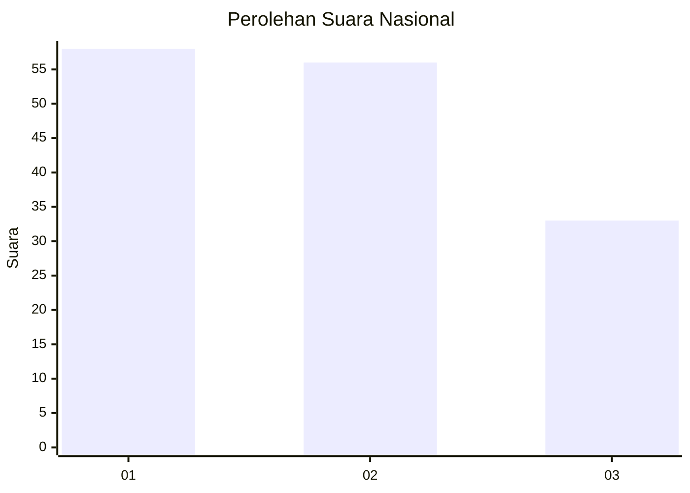
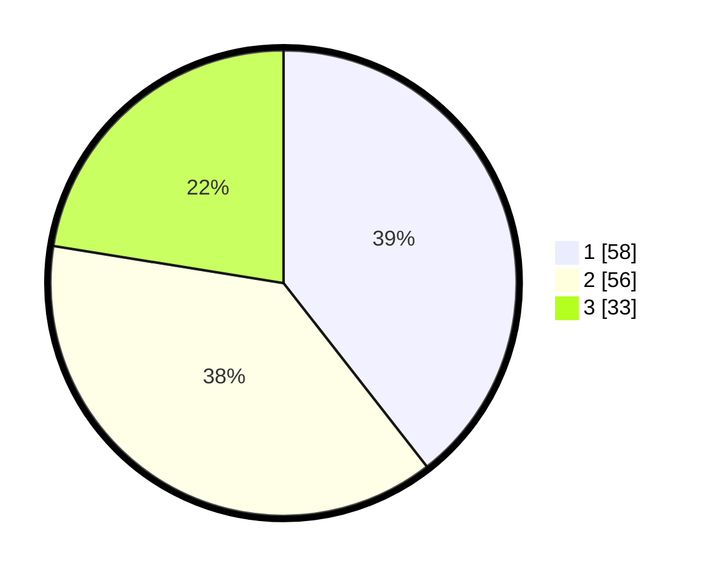

# Hasil

## Grafik

## Tabel

| No. | Nama Paslon    | Suara | Suara (raw) | Persentase |
|:--- |:-------------- | -----:| -----------:| ----------:|
| 1   | ANIES MUHAIMIN | 58    | [58][p-1]   | 39,46      |
| 2   | PRABOWO GIBRAN | 56    | [56][p-2]   | 38,10      |
| 3   | GANJAR MAHFUD  | 33    | [33][p-3]   | 22,45      |

[p-1]: https://github.com/gigit-pemilu/pemilu-2024/blob/main/pilpres/hitung-suara/sub/14-riau/sub/03-bengkalis/sub/12-siak-kecil/sub/2001-lubuk-muda/sub/007-tps/sub/paslon-1.txt
[p-2]: https://github.com/gigit-pemilu/pemilu-2024/blob/main/pilpres/hitung-suara/sub/14-riau/sub/03-bengkalis/sub/12-siak-kecil/sub/2001-lubuk-muda/sub/007-tps/sub/paslon-2.txt
[p-3]: https://github.com/gigit-pemilu/pemilu-2024/blob/main/pilpres/hitung-suara/sub/14-riau/sub/03-bengkalis/sub/12-siak-kecil/sub/2001-lubuk-muda/sub/007-tps/sub/paslon-3.txt

## Foto C Plano

https://sirekap-obj-formc.kpu.go.id/0d2a/pemilu/ppwp/14/03/12/20/01/1403122001007-20240214-155712--07c39db0-5110-4dc8-9ae6-67b2bc6245b4.jpg

https://sirekap-obj-formc.kpu.go.id/0d2a/pemilu/ppwp/14/03/12/20/01/1403122001007-20240214-160112--1e5ef91a-d646-4cd8-9f1d-500233942add.jpg

https://sirekap-obj-formc.kpu.go.id/0d2a/pemilu/ppwp/14/03/12/20/01/1403122001007-20240214-160056--aa94c93a-0435-4c79-8b9c-c606bb71dbf3.jpg

## Metadata

| Key        | Value               |
| ---------- | ------------------- |
| Time Stamp | 2024-02-25 16:00:00 |

