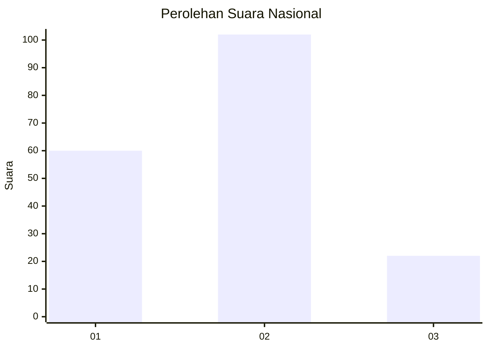
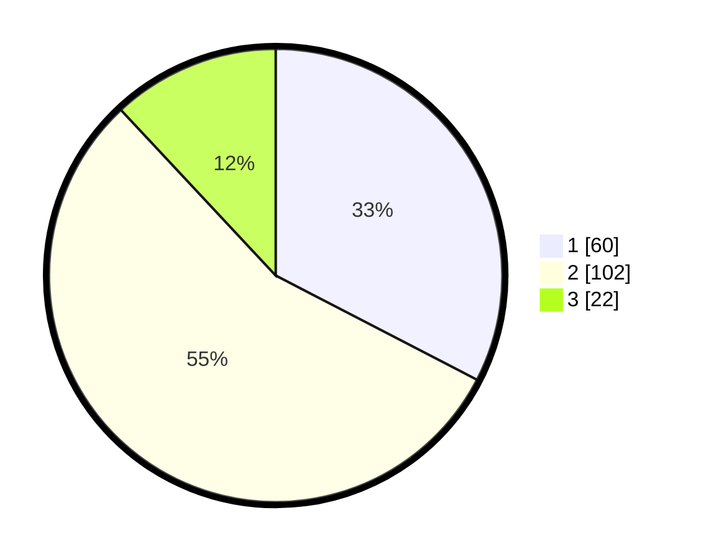

# Hasil

## Grafik

## Tabel

| No. | Nama Paslon    | Suara | Suara (raw) | Persentase |
|:--- |:-------------- | -----:| -----------:| ----------:|
| 1   | ANIES MUHAIMIN | 60    | [60][p-1]   | 32,61      |
| 2   | PRABOWO GIBRAN | 102   | [102][p-2]  | 55,43      |
| 3   | GANJAR MAHFUD  | 22    | [22][p-3]   | 11,96      |

[p-1]: https://github.com/gigit-pemilu/pemilu-2024/blob/main/pilpres/hitung-suara/sub/14-riau/sub/03-bengkalis/sub/12-siak-kecil/sub/2002-tanjung-belit/sub/003-tps/sub/paslon-1.txt
[p-2]: https://github.com/gigit-pemilu/pemilu-2024/blob/main/pilpres/hitung-suara/sub/14-riau/sub/03-bengkalis/sub/12-siak-kecil/sub/2002-tanjung-belit/sub/003-tps/sub/paslon-2.txt
[p-3]: https://github.com/gigit-pemilu/pemilu-2024/blob/main/pilpres/hitung-suara/sub/14-riau/sub/03-bengkalis/sub/12-siak-kecil/sub/2002-tanjung-belit/sub/003-tps/sub/paslon-3.txt

## Foto C Plano

https://sirekap-obj-formc.kpu.go.id/3125/pemilu/ppwp/14/03/12/20/02/1403122002003-20240214-203234--508e2dca-7fb8-4b58-aa7a-8dad3c84d50f.jpg

https://sirekap-obj-formc.kpu.go.id/3125/pemilu/ppwp/14/03/12/20/02/1403122002003-20240214-203319--feb92c00-5642-4169-908b-e6ebe6d34820.jpg

https://sirekap-obj-formc.kpu.go.id/3125/pemilu/ppwp/14/03/12/20/02/1403122002003-20240214-203248--98021ac6-72bd-4ce6-b272-01c4ff7d01d6.jpg

## Metadata

| Key        | Value               |
| ---------- | ------------------- |
| Time Stamp | 2024-02-15 00:41:44 |

