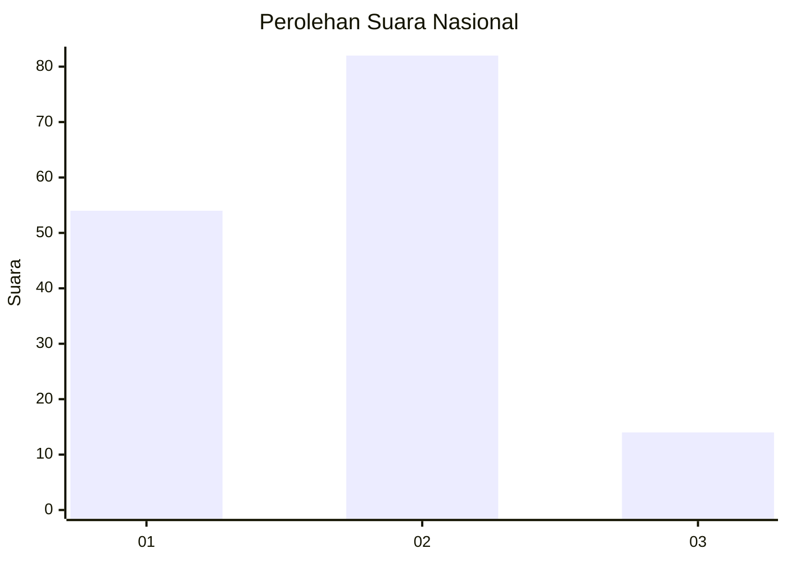
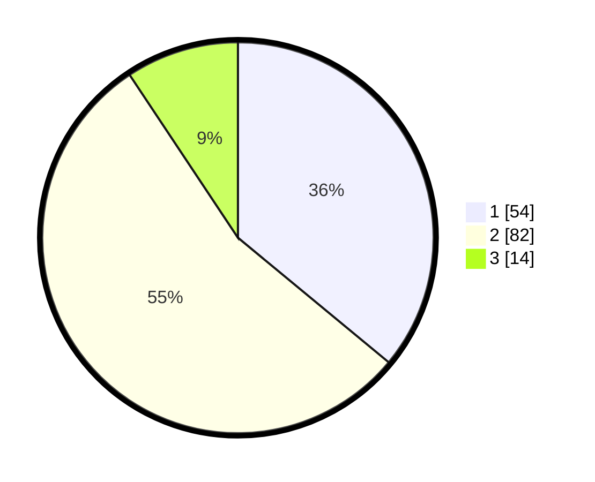

# Hasil

## Grafik

## Tabel

| No. | Nama Paslon    | Suara | Suara (raw) | Persentase |
|:--- |:-------------- | -----:| -----------:| ----------:|
| 1   | ANIES MUHAIMIN | 54    | [54][p-1]   | 36,00      |
| 2   | PRABOWO GIBRAN | 82    | [82][p-2]   | 54,67      |
| 3   | GANJAR MAHFUD  | 14    | [14][p-3]   | 9,33       |

[p-1]: https://github.com/gigit-pemilu/pemilu-2024/blob/main/pilpres/hitung-suara/sub/14-riau/sub/03-bengkalis/sub/12-siak-kecil/sub/2005-lubuk-gaung/sub/006-tps/sub/paslon-1.txt
[p-2]: https://github.com/gigit-pemilu/pemilu-2024/blob/main/pilpres/hitung-suara/sub/14-riau/sub/03-bengkalis/sub/12-siak-kecil/sub/2005-lubuk-gaung/sub/006-tps/sub/paslon-2.txt
[p-3]: https://github.com/gigit-pemilu/pemilu-2024/blob/main/pilpres/hitung-suara/sub/14-riau/sub/03-bengkalis/sub/12-siak-kecil/sub/2005-lubuk-gaung/sub/006-tps/sub/paslon-3.txt

## Foto C Plano

https://sirekap-obj-formc.kpu.go.id/d8ae/pemilu/ppwp/14/03/12/20/05/1403122005006-20240215-003912--7cec444e-6b9e-4b17-9563-bf3c0d22eff3.jpg

https://sirekap-obj-formc.kpu.go.id/d8ae/pemilu/ppwp/14/03/12/20/05/1403122005006-20240214-190751--94c3efc5-0b51-483a-8f15-1882a7f0c606.jpg

https://sirekap-obj-formc.kpu.go.id/d8ae/pemilu/ppwp/14/03/12/20/05/1403122005006-20240215-005011--41349a7f-7d32-47f0-bc3b-fea108927657.jpg

## Metadata

| Key        | Value               |
| ---------- | ------------------- |
| Time Stamp | 2024-02-15 00:56:54 |

