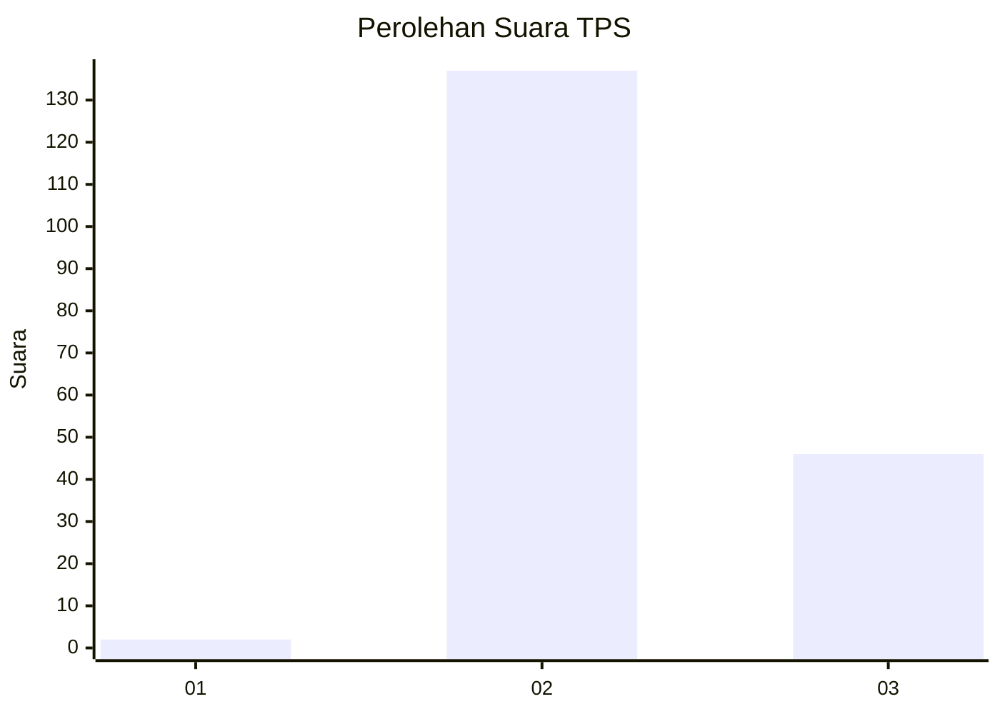
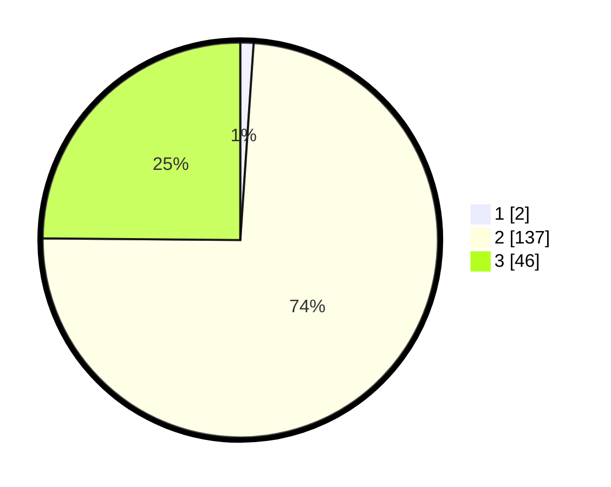

# Hasil

## Grafik

## Tabel

| No. | Nama Paslon    | Suara | Suara (raw) | Persentase |
|:--- |:-------------- | -----:| -----------:| ----------:|
| 1   | ANIES MUHAIMIN | 2     | [2][p-1]    | 1,08       |
| 2   | PRABOWO GIBRAN | 137   | [137][p-2]  | 74,05      |
| 3   | GANJAR MAHFUD  | 46    | [46][p-3]   | 24,86      |

[p-1]: https://github.com/gigit-pemilu/pemilu-2024-14-riau/blob/main/pilpres/hitung-suara/sub/14-riau/sub/03-bengkalis/sub/13-pinggir/sub/1001-titian-antui/sub/014-tps/sub/paslon-1.txt
[p-2]: https://github.com/gigit-pemilu/pemilu-2024-14-riau/blob/main/pilpres/hitung-suara/sub/14-riau/sub/03-bengkalis/sub/13-pinggir/sub/1001-titian-antui/sub/014-tps/sub/paslon-2.txt
[p-3]: https://github.com/gigit-pemilu/pemilu-2024-14-riau/blob/main/pilpres/hitung-suara/sub/14-riau/sub/03-bengkalis/sub/13-pinggir/sub/1001-titian-antui/sub/014-tps/sub/paslon-3.txt

## Foto C Plano

https://sirekap-obj-formc.kpu.go.id/2b93/pemilu/ppwp/14/03/13/10/01/1403131001014-20240215-000539--da30f481-a150-4254-9a2f-6bd1948f204a.jpg

https://sirekap-obj-formc.kpu.go.id/2b93/pemilu/ppwp/14/03/13/10/01/1403131001014-20240215-000721--b6c294d4-20e1-4de5-ac37-987d58a2a719.jpg

https://sirekap-obj-formc.kpu.go.id/2b93/pemilu/ppwp/14/03/13/10/01/1403131001014-20240215-000817--e3339d5c-aff4-4935-88cd-56d7dadf8692.jpg

## Metadata

| Key        | Value               |
| ---------- | ------------------- |
| Time Stamp | 2024-02-15 15:00:29 |

