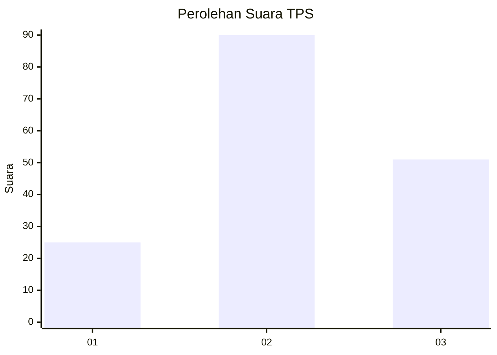
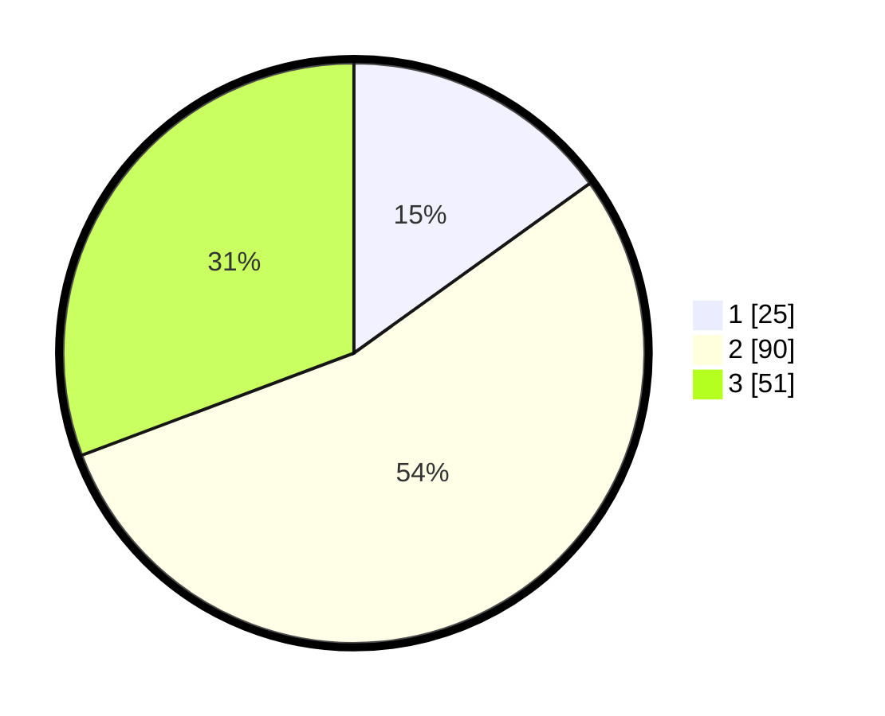

# Hasil

## Grafik

## Tabel

| No. | Nama Paslon    | Suara | Suara (raw) | Persentase |
|:--- |:-------------- | -----:| -----------:| ----------:|
| 1   | ANIES MUHAIMIN | 25    | [25][p-1]   | 15,06      |
| 2   | PRABOWO GIBRAN | 90    | [90][p-2]   | 54,22      |
| 3   | GANJAR MAHFUD  | 51    | [51][p-3]   | 30,72      |

[p-1]: https://github.com/gigit-pemilu/pemilu-2024-14-riau/blob/main/pilpres/hitung-suara/sub/14-riau/sub/03-bengkalis/sub/13-pinggir/sub/1001-titian-antui/sub/018-tps/sub/paslon-1.txt
[p-2]: https://github.com/gigit-pemilu/pemilu-2024-14-riau/blob/main/pilpres/hitung-suara/sub/14-riau/sub/03-bengkalis/sub/13-pinggir/sub/1001-titian-antui/sub/018-tps/sub/paslon-2.txt
[p-3]: https://github.com/gigit-pemilu/pemilu-2024-14-riau/blob/main/pilpres/hitung-suara/sub/14-riau/sub/03-bengkalis/sub/13-pinggir/sub/1001-titian-antui/sub/018-tps/sub/paslon-3.txt

## Foto C Plano

https://sirekap-obj-formc.kpu.go.id/ea82/pemilu/ppwp/14/03/13/10/01/1403131001018-20240214-200423--d98c353b-888a-4c96-8891-9ae666ded71c.jpg

https://sirekap-obj-formc.kpu.go.id/ea82/pemilu/ppwp/14/03/13/10/01/1403131001018-20240214-200450--84da88d8-9172-4f6c-9dce-3cc6543e8a74.jpg

https://sirekap-obj-formc.kpu.go.id/ea82/pemilu/ppwp/14/03/13/10/01/1403131001018-20240214-200516--105e21e3-e55b-4a6a-b26c-484ee873fda3.jpg

## Metadata

| Key        | Value               |
| ---------- | ------------------- |
| Time Stamp | 2024-02-15 00:41:44 |

