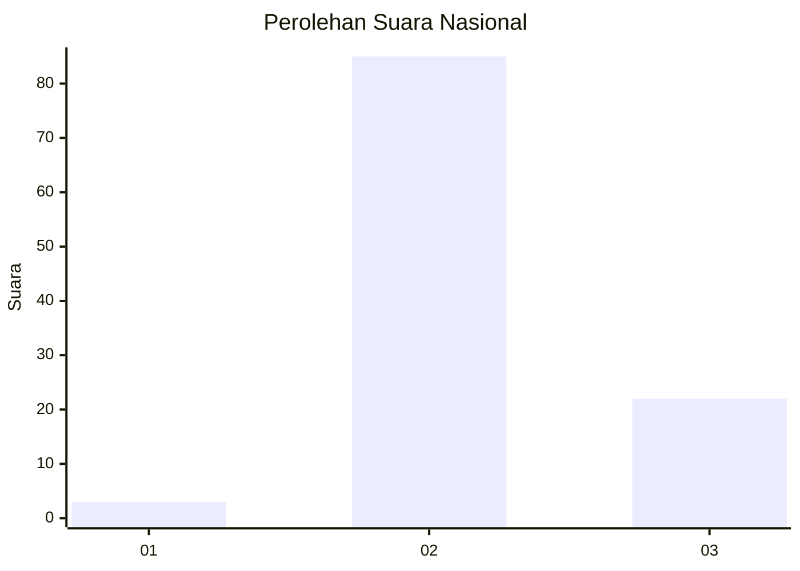

# Hasil

## Grafik

## Tabel

| No. | Nama Paslon    | Suara | Suara (raw) | Persentase |
|:--- |:-------------- | -----:| -----------:| ----------:|
| 1   | ANIES MUHAIMIN | 3     | [3][p-1]    | 2,73       |
| 2   | PRABOWO GIBRAN | 85    | [85][p-2]   | 77,27      |
| 3   | GANJAR MAHFUD  | 22    | [22][p-3]   | 20,00      |

[p-1]: https://github.com/gigit-pemilu/pemilu-2024/blob/main/pilpres/hitung-suara/sub/14-riau/sub/03-bengkalis/sub/13-pinggir/sub/1001-titian-antui/sub/049-tps/sub/paslon-1.txt
[p-2]: https://github.com/gigit-pemilu/pemilu-2024/blob/main/pilpres/hitung-suara/sub/14-riau/sub/03-bengkalis/sub/13-pinggir/sub/1001-titian-antui/sub/049-tps/sub/paslon-2.txt
[p-3]: https://github.com/gigit-pemilu/pemilu-2024/blob/main/pilpres/hitung-suara/sub/14-riau/sub/03-bengkalis/sub/13-pinggir/sub/1001-titian-antui/sub/049-tps/sub/paslon-3.txt

## Foto C Plano

https://sirekap-obj-formc.kpu.go.id/f95f/pemilu/ppwp/14/03/13/10/01/1403131001049-20240215-023348--09210227-213f-4394-8ef8-394e97258e1d.jpg

https://sirekap-obj-formc.kpu.go.id/f95f/pemilu/ppwp/14/03/13/10/01/1403131001049-20240215-023538--4c144fed-5456-4b87-8b81-23cabeca71ca.jpg

https://sirekap-obj-formc.kpu.go.id/f95f/pemilu/ppwp/14/03/13/10/01/1403131001049-20240215-023640--a7fcb7a4-318a-4f8c-b725-0e97f7fd1ffe.jpg

## Metadata

| Key        | Value               |
| ---------- | ------------------- |
| Time Stamp | 2024-02-25 12:00:00 |

