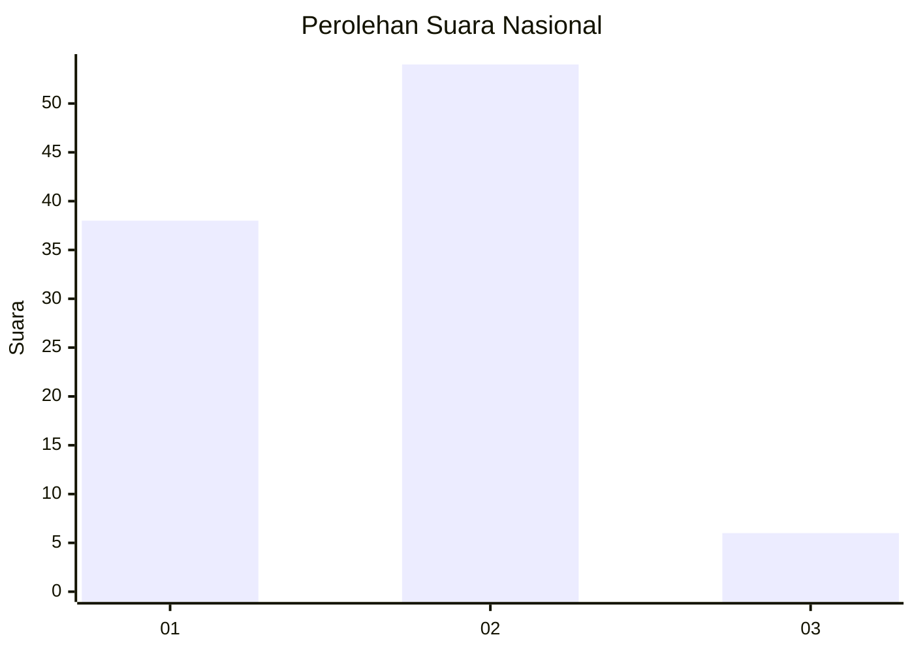
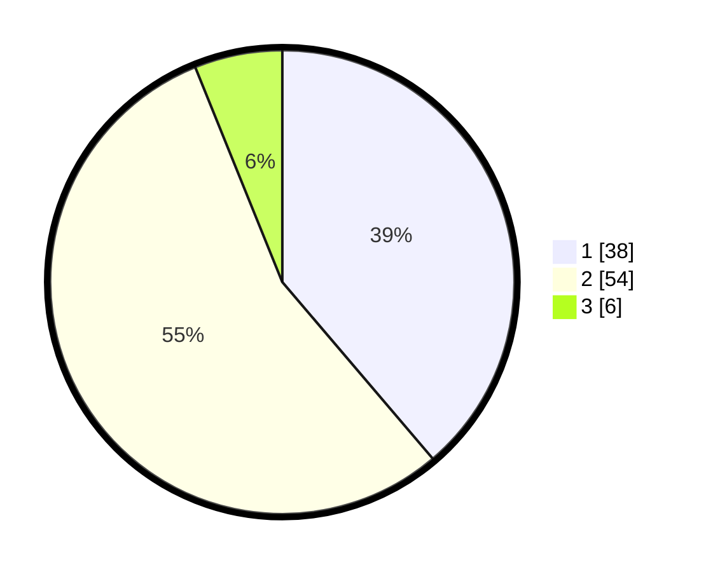

# Hasil

## Grafik

## Tabel

| No. | Nama Paslon    | Suara | Suara (raw) | Persentase |
|:--- |:-------------- | -----:| -----------:| ----------:|
| 1   | ANIES MUHAIMIN | 38    | [38][p-1]   | 38,78      |
| 2   | PRABOWO GIBRAN | 54    | [54][p-2]   | 55,10      |
| 3   | GANJAR MAHFUD  | 6     | [6][p-3]    | 6,12       |

[p-1]: https://github.com/gigit-pemilu/pemilu-2024/blob/main/pilpres/hitung-suara/sub/14-riau/sub/03-bengkalis/sub/13-pinggir/sub/1001-titian-antui/sub/050-tps/sub/paslon-1.txt
[p-2]: https://github.com/gigit-pemilu/pemilu-2024/blob/main/pilpres/hitung-suara/sub/14-riau/sub/03-bengkalis/sub/13-pinggir/sub/1001-titian-antui/sub/050-tps/sub/paslon-2.txt
[p-3]: https://github.com/gigit-pemilu/pemilu-2024/blob/main/pilpres/hitung-suara/sub/14-riau/sub/03-bengkalis/sub/13-pinggir/sub/1001-titian-antui/sub/050-tps/sub/paslon-3.txt

## Foto C Plano

https://sirekap-obj-formc.kpu.go.id/52ad/pemilu/ppwp/14/03/13/10/01/1403131001050-20240214-223734--26f78184-77be-4c4b-ba6e-1049e26569f4.jpg

https://sirekap-obj-formc.kpu.go.id/52ad/pemilu/ppwp/14/03/13/10/01/1403131001050-20240214-223813--7ba8f8db-894b-4ec6-ba1d-b6758b8f23ea.jpg

https://sirekap-obj-formc.kpu.go.id/52ad/pemilu/ppwp/14/03/13/10/01/1403131001050-20240214-223912--1a428a18-a95e-4c6f-8875-ac62e54a726d.jpg

## Metadata

| Key        | Value               |
| ---------- | ------------------- |
| Time Stamp | 2024-02-15 15:00:29 |

