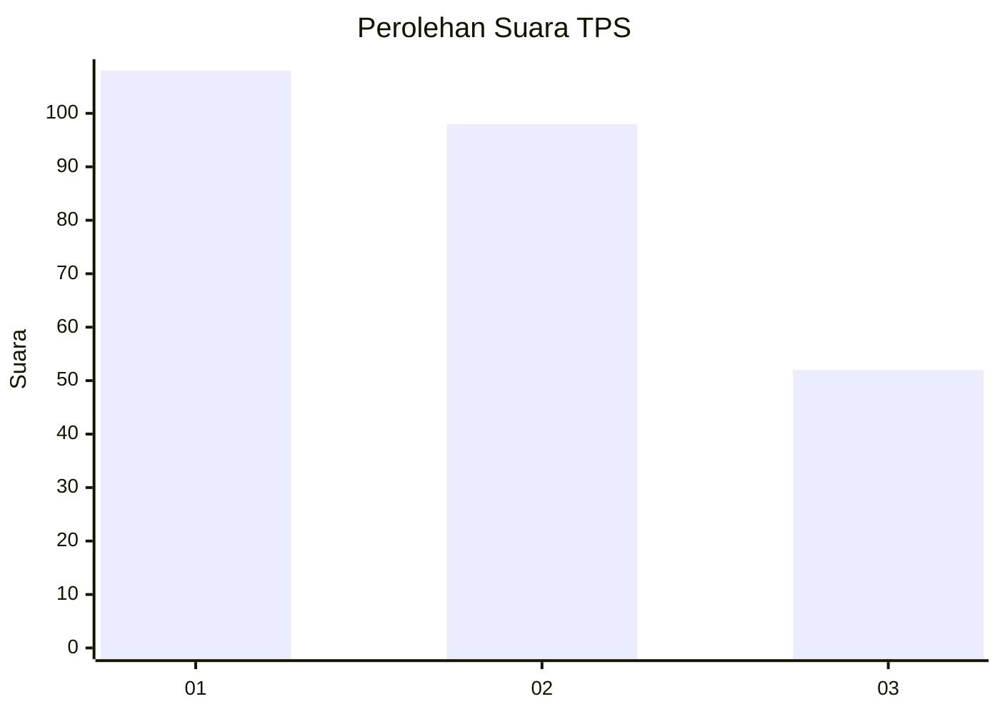
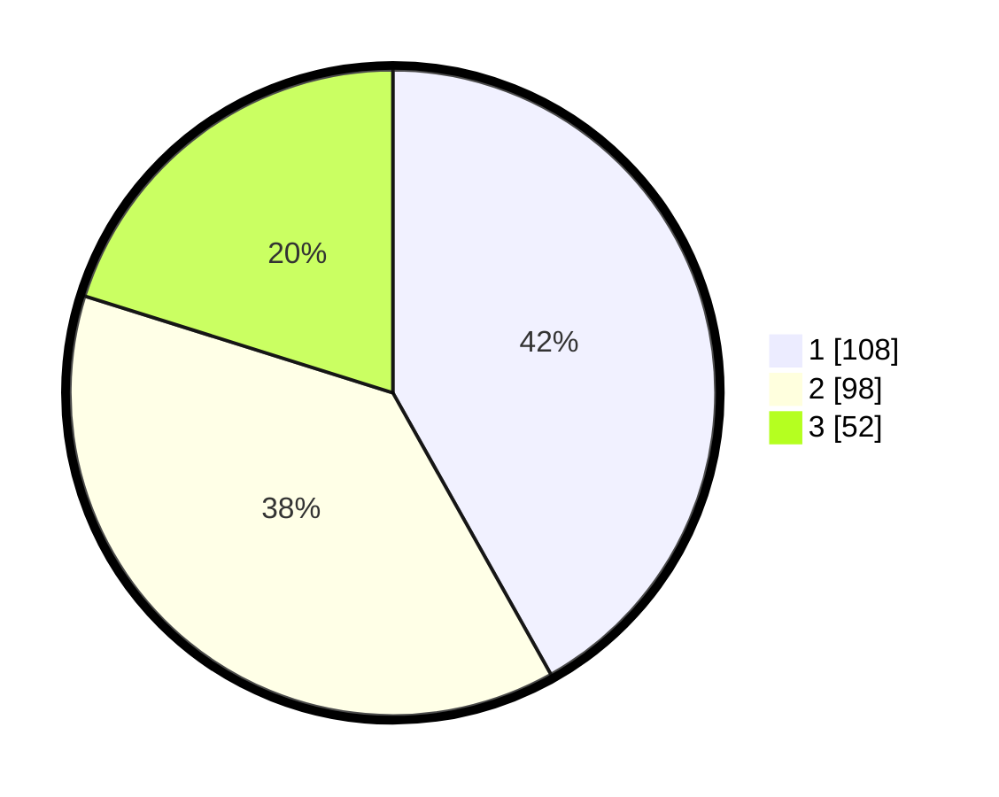

# Hasil

## Grafik

## Tabel

| No. | Nama Paslon    | Suara | Suara (raw) | Persentase |
|:--- |:-------------- | -----:| -----------:| ----------:|
| 1   | ANIES MUHAIMIN | 108   | [108][p-1]  | 41,86      |
| 2   | PRABOWO GIBRAN | 98    | [98][p-2]   | 37,98      |
| 3   | GANJAR MAHFUD  | 52    | [52][p-3]   | 20,16      |

[p-1]: https://github.com/gigit-pemilu/pemilu-2024-14-riau/blob/main/pilpres/hitung-suara/sub/14-riau/sub/03-bengkalis/sub/13-pinggir/sub/2005-muara-basung/sub/004-tps/sub/paslon-1.txt
[p-2]: https://github.com/gigit-pemilu/pemilu-2024-14-riau/blob/main/pilpres/hitung-suara/sub/14-riau/sub/03-bengkalis/sub/13-pinggir/sub/2005-muara-basung/sub/004-tps/sub/paslon-2.txt
[p-3]: https://github.com/gigit-pemilu/pemilu-2024-14-riau/blob/main/pilpres/hitung-suara/sub/14-riau/sub/03-bengkalis/sub/13-pinggir/sub/2005-muara-basung/sub/004-tps/sub/paslon-3.txt

## Foto C Plano

https://sirekap-obj-formc.kpu.go.id/d72b/pemilu/ppwp/14/03/13/20/05/1403132005004-20240215-000813--1ef74e4a-c8ef-493a-9ec5-f11e393f5f09.jpg

https://sirekap-obj-formc.kpu.go.id/d72b/pemilu/ppwp/14/03/13/20/05/1403132005004-20240215-000900--b62638f2-c2a6-4f7d-8b07-a5c14c2e0d85.jpg

https://sirekap-obj-formc.kpu.go.id/d72b/pemilu/ppwp/14/03/13/20/05/1403132005004-20240215-000952--25b7ebb5-1fd9-4af1-8b3b-e1f2fae5fff1.jpg

## Metadata

| Key        | Value               |
| ---------- | ------------------- |
| Time Stamp | 2024-02-25 12:00:00 |

