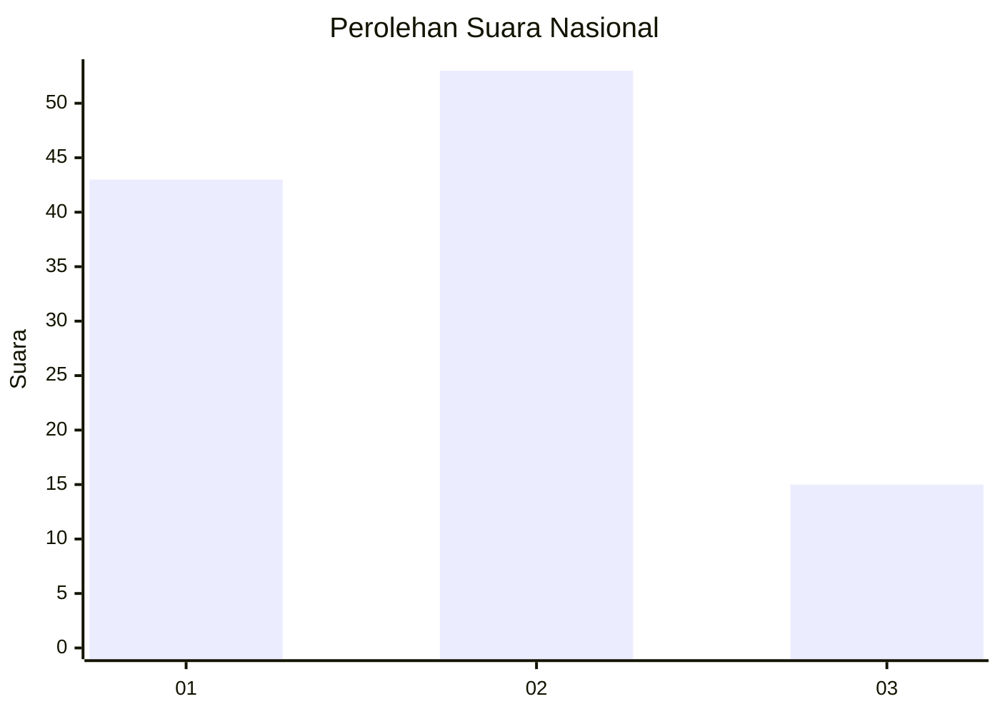
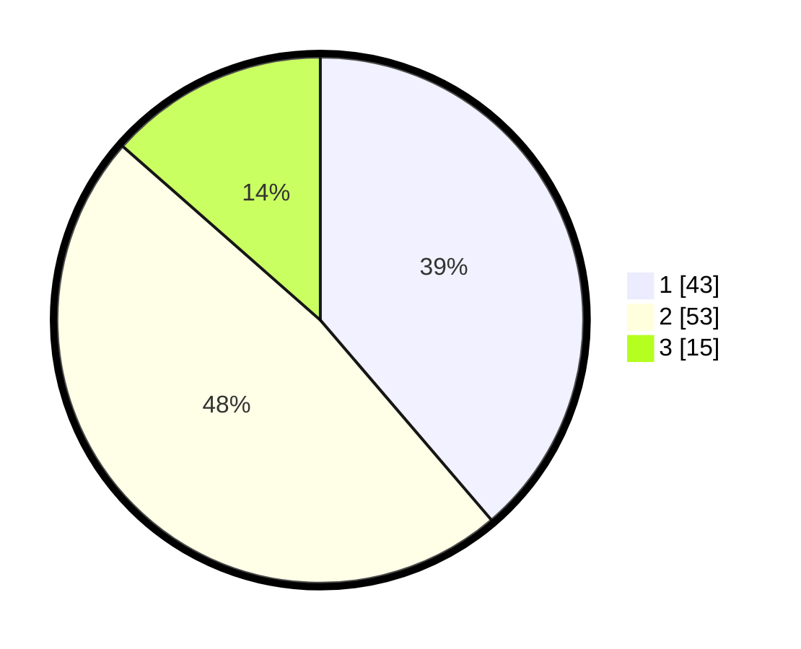

# Hasil

## Grafik

## Tabel

| No. | Nama Paslon    | Suara | Suara (raw) | Persentase |
|:--- |:-------------- | -----:| -----------:| ----------:|
| 1   | ANIES MUHAIMIN | 43    | [43][p-1]   | 38,74      |
| 2   | PRABOWO GIBRAN | 53    | [53][p-2]   | 47,75      |
| 3   | GANJAR MAHFUD  | 15    | [15][p-3]   | 13,51      |

[p-1]: https://github.com/gigit-pemilu/pemilu-2024/blob/main/pilpres/hitung-suara/sub/14-riau/sub/03-bengkalis/sub/13-pinggir/sub/2005-muara-basung/sub/013-tps/sub/paslon-1.txt
[p-2]: https://github.com/gigit-pemilu/pemilu-2024/blob/main/pilpres/hitung-suara/sub/14-riau/sub/03-bengkalis/sub/13-pinggir/sub/2005-muara-basung/sub/013-tps/sub/paslon-2.txt
[p-3]: https://github.com/gigit-pemilu/pemilu-2024/blob/main/pilpres/hitung-suara/sub/14-riau/sub/03-bengkalis/sub/13-pinggir/sub/2005-muara-basung/sub/013-tps/sub/paslon-3.txt

## Foto C Plano

https://sirekap-obj-formc.kpu.go.id/b8fb/pemilu/ppwp/14/03/13/20/05/1403132005013-20240214-202338--2355d800-85b4-4559-927d-e6aa03ae4a49.jpg

https://sirekap-obj-formc.kpu.go.id/b8fb/pemilu/ppwp/14/03/13/20/05/1403132005013-20240214-202623--83cdd9b2-663d-4cc4-a5d6-d998a27db8b1.jpg

https://sirekap-obj-formc.kpu.go.id/b8fb/pemilu/ppwp/14/03/13/20/05/1403132005013-20240214-202742--7f7e2713-b37b-4e9d-87ba-b30cd537691c.jpg

## Metadata

| Key        | Value               |
| ---------- | ------------------- |
| Time Stamp | 2024-02-25 21:00:00 |

