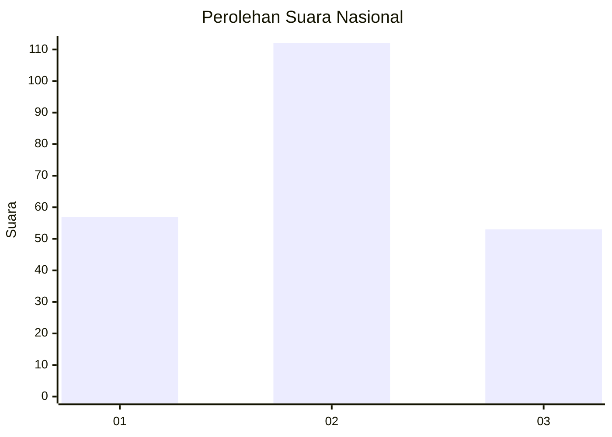
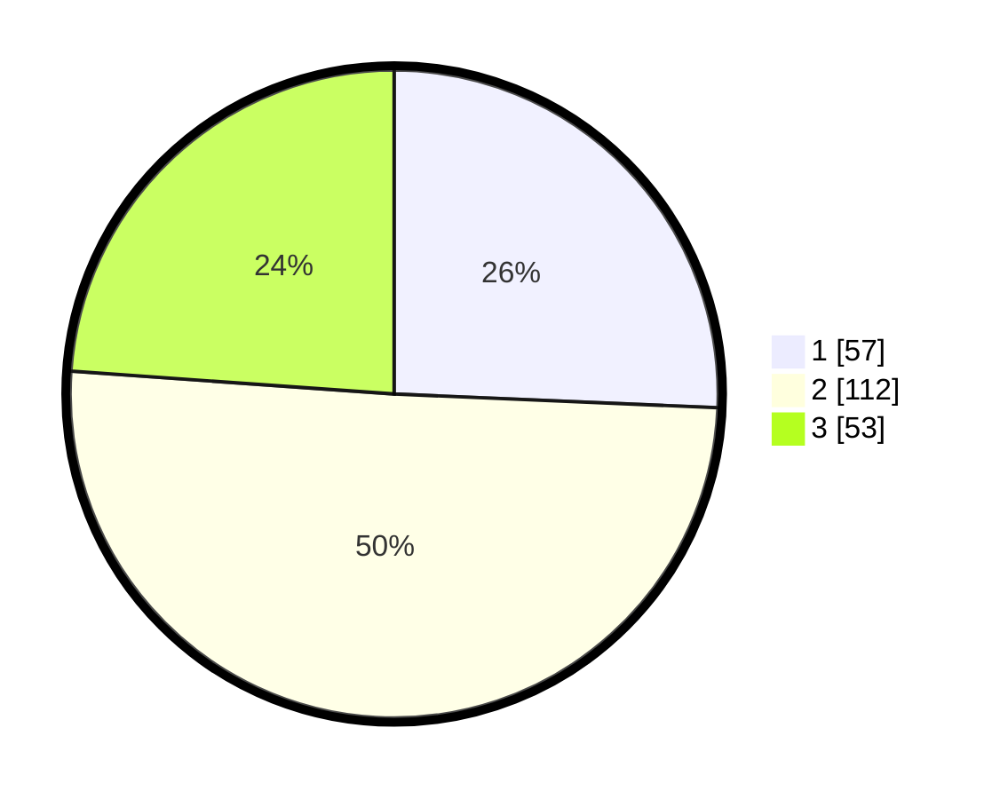

# Hasil

## Grafik

## Tabel

| No. | Nama Paslon    | Suara | Suara (raw) | Persentase |
|:--- |:-------------- | -----:| -----------:| ----------:|
| 1   | ANIES MUHAIMIN | 57    | [57][p-1]   | 25,68      |
| 2   | PRABOWO GIBRAN | 112   | [112][p-2]  | 50,45      |
| 3   | GANJAR MAHFUD  | 53    | [53][p-3]   | 23,87      |

[p-1]: https://github.com/gigit-pemilu/pemilu-2024/blob/main/pilpres/hitung-suara/sub/14-riau/sub/03-bengkalis/sub/13-pinggir/sub/2005-muara-basung/sub/020-tps/sub/paslon-1.txt
[p-2]: https://github.com/gigit-pemilu/pemilu-2024/blob/main/pilpres/hitung-suara/sub/14-riau/sub/03-bengkalis/sub/13-pinggir/sub/2005-muara-basung/sub/020-tps/sub/paslon-2.txt
[p-3]: https://github.com/gigit-pemilu/pemilu-2024/blob/main/pilpres/hitung-suara/sub/14-riau/sub/03-bengkalis/sub/13-pinggir/sub/2005-muara-basung/sub/020-tps/sub/paslon-3.txt

## Foto C Plano

https://sirekap-obj-formc.kpu.go.id/3bd3/pemilu/ppwp/14/03/13/20/05/1403132005020-20240215-103057--77d6f254-a6fa-4188-a6ad-d453610fe182.jpg

https://sirekap-obj-formc.kpu.go.id/3bd3/pemilu/ppwp/14/03/13/20/05/1403132005020-20240214-223249--6a43929c-d981-4e32-bd28-4bf47753e350.jpg

https://sirekap-obj-formc.kpu.go.id/3bd3/pemilu/ppwp/14/03/13/20/05/1403132005020-20240214-223422--8965427a-fa22-48fa-8763-b8486950ecc5.jpg

## Metadata

| Key        | Value               |
| ---------- | ------------------- |
| Time Stamp | 2024-02-25 21:00:00 |

