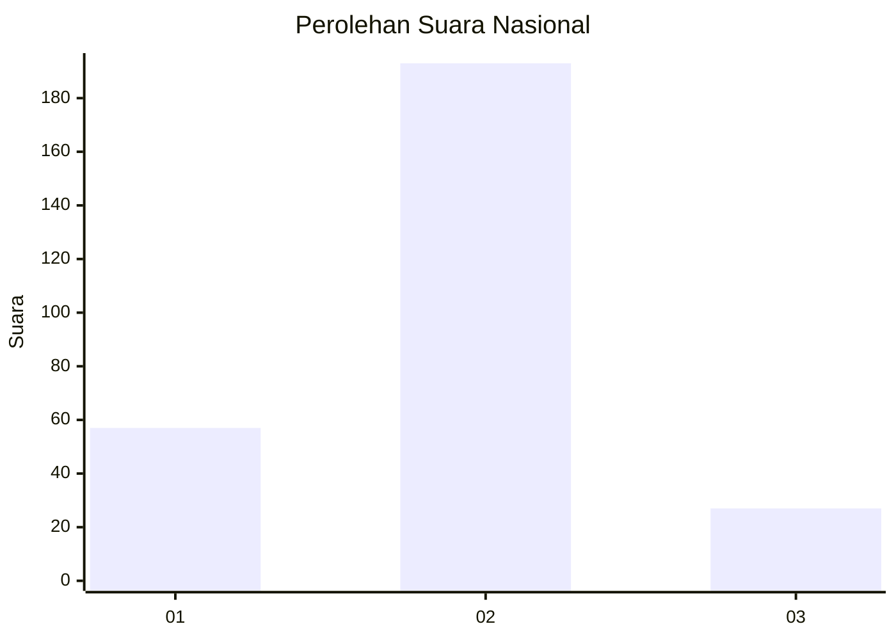

# Hasil

## Grafik

## Tabel

| No. | Nama Paslon    | Suara | Suara (raw) | Persentase |
|:--- |:-------------- | -----:| -----------:| ----------:|
| 1   | ANIES MUHAIMIN | 57    | [57][p-1]   | 20,58      |
| 2   | PRABOWO GIBRAN | 193   | [193][p-2]  | 69,68      |
| 3   | GANJAR MAHFUD  | 27    | [27][p-3]   | 9,75       |

[p-1]: https://github.com/gigit-pemilu/pemilu-2024/blob/main/pilpres/hitung-suara/sub/14-riau/sub/03-bengkalis/sub/13-pinggir/sub/2007-pinggir/sub/021-tps/sub/paslon-1.txt
[p-2]: https://github.com/gigit-pemilu/pemilu-2024/blob/main/pilpres/hitung-suara/sub/14-riau/sub/03-bengkalis/sub/13-pinggir/sub/2007-pinggir/sub/021-tps/sub/paslon-2.txt
[p-3]: https://github.com/gigit-pemilu/pemilu-2024/blob/main/pilpres/hitung-suara/sub/14-riau/sub/03-bengkalis/sub/13-pinggir/sub/2007-pinggir/sub/021-tps/sub/paslon-3.txt

## Foto C Plano

https://sirekap-obj-formc.kpu.go.id/310b/pemilu/ppwp/14/03/13/20/07/1403132007021-20240215-012038--c9d24c94-5995-4e32-ac18-91cd732ee7ec.jpg

https://sirekap-obj-formc.kpu.go.id/310b/pemilu/ppwp/14/03/13/20/07/1403132007021-20240215-011906--11777a74-c75d-461f-832a-fd15fe626292.jpg

https://sirekap-obj-formc.kpu.go.id/310b/pemilu/ppwp/14/03/13/20/07/1403132007021-20240215-012118--d0125424-963a-4f6e-acb6-5667251f8ba8.jpg

## Metadata

| Key        | Value               |
| ---------- | ------------------- |
| Time Stamp | 2024-02-15 16:00:26 |

