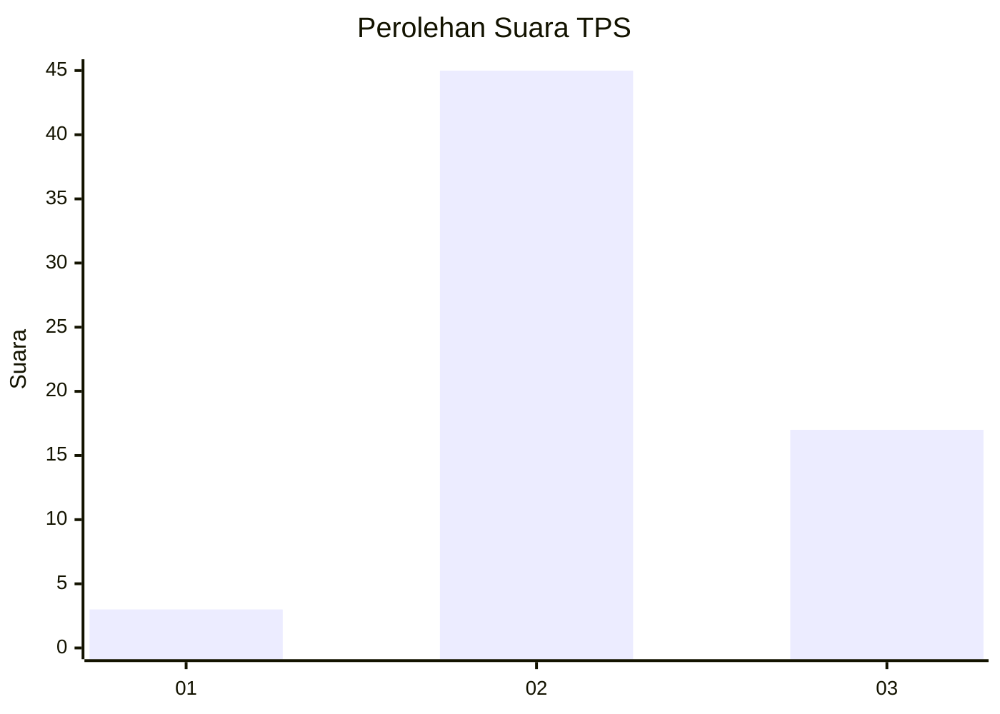
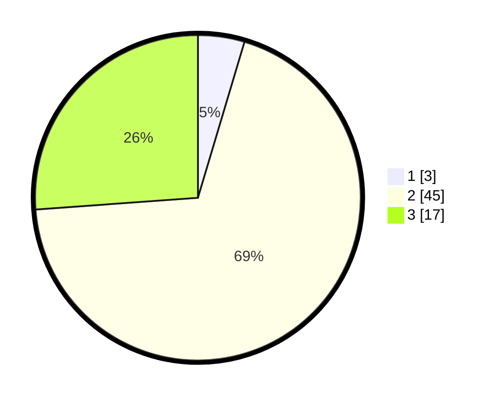

# Hasil

## Grafik

## Tabel

| No. | Nama Paslon    | Suara | Suara (raw) | Persentase |
|:--- |:-------------- | -----:| -----------:| ----------:|
| 1   | ANIES MUHAIMIN | 3     | [3][p-1]    | 4,62       |
| 2   | PRABOWO GIBRAN | 45    | [45][p-2]   | 69,23      |
| 3   | GANJAR MAHFUD  | 17    | [17][p-3]   | 26,15      |

[p-1]: https://github.com/gigit-pemilu/pemilu-2024-14-riau/blob/main/pilpres/hitung-suara/sub/14-riau/sub/03-bengkalis/sub/13-pinggir/sub/2008-semunai/sub/005-tps/sub/paslon-1.txt
[p-2]: https://github.com/gigit-pemilu/pemilu-2024-14-riau/blob/main/pilpres/hitung-suara/sub/14-riau/sub/03-bengkalis/sub/13-pinggir/sub/2008-semunai/sub/005-tps/sub/paslon-2.txt
[p-3]: https://github.com/gigit-pemilu/pemilu-2024-14-riau/blob/main/pilpres/hitung-suara/sub/14-riau/sub/03-bengkalis/sub/13-pinggir/sub/2008-semunai/sub/005-tps/sub/paslon-3.txt

## Foto C Plano

https://sirekap-obj-formc.kpu.go.id/aeb8/pemilu/ppwp/14/03/13/20/08/1403132008005-20240214-141233--1b881fc2-2fdf-470e-b5c9-a1982444b48a.jpg

https://sirekap-obj-formc.kpu.go.id/aeb8/pemilu/ppwp/14/03/13/20/08/1403132008005-20240214-141331--6c8f1297-22a2-4c7f-8f78-442e0a77d3e6.jpg

https://sirekap-obj-formc.kpu.go.id/aeb8/pemilu/ppwp/14/03/13/20/08/1403132008005-20240214-141506--98fdc100-4c9b-4e07-aaa2-ac30c348d8cd.jpg

## Metadata

| Key        | Value               |
| ---------- | ------------------- |
| Time Stamp | 2024-02-15 00:41:44 |

