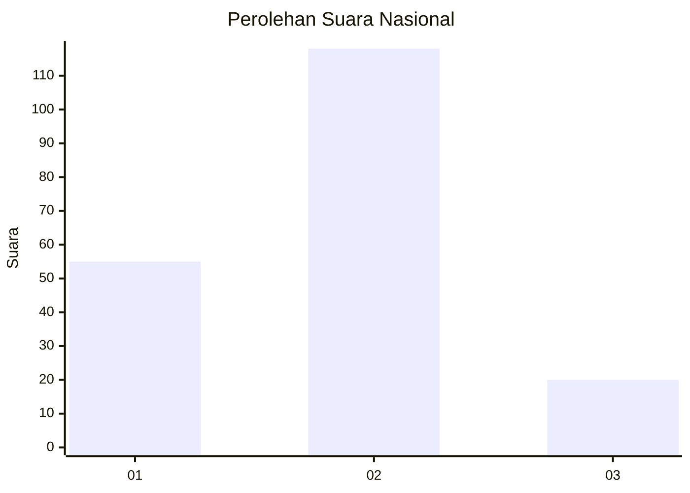
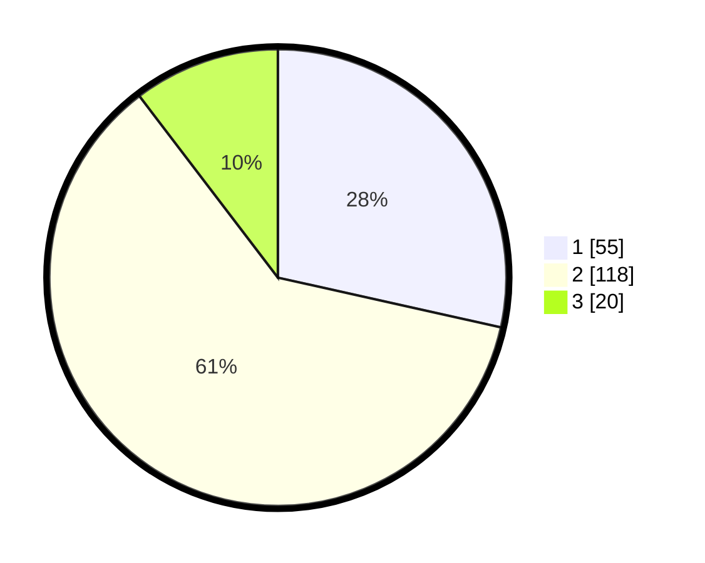

# Hasil

## Grafik

## Tabel

| No. | Nama Paslon    | Suara | Suara (raw) | Persentase |
|:--- |:-------------- | -----:| -----------:| ----------:|
| 1   | ANIES MUHAIMIN | 55    | [55][p-1]   | 28,50      |
| 2   | PRABOWO GIBRAN | 118   | [118][p-2]  | 61,14      |
| 3   | GANJAR MAHFUD  | 20    | [20][p-3]   | 10,36      |

[p-1]: https://github.com/gigit-pemilu/pemilu-2024/blob/main/pilpres/hitung-suara/sub/14-riau/sub/03-bengkalis/sub/13-pinggir/sub/2011-tengganau/sub/004-tps/sub/paslon-1.txt
[p-2]: https://github.com/gigit-pemilu/pemilu-2024/blob/main/pilpres/hitung-suara/sub/14-riau/sub/03-bengkalis/sub/13-pinggir/sub/2011-tengganau/sub/004-tps/sub/paslon-2.txt
[p-3]: https://github.com/gigit-pemilu/pemilu-2024/blob/main/pilpres/hitung-suara/sub/14-riau/sub/03-bengkalis/sub/13-pinggir/sub/2011-tengganau/sub/004-tps/sub/paslon-3.txt

## Foto C Plano

https://sirekap-obj-formc.kpu.go.id/a1c6/pemilu/ppwp/14/03/13/20/11/1403132011004-20240214-141216--d5ec76fd-c5fc-4497-af36-75cb34f05846.jpg

https://sirekap-obj-formc.kpu.go.id/a1c6/pemilu/ppwp/14/03/13/20/11/1403132011004-20240214-141338--c13a514e-4d63-4053-a061-4e09ac4fe00e.jpg

https://sirekap-obj-formc.kpu.go.id/a1c6/pemilu/ppwp/14/03/13/20/11/1403132011004-20240215-002655--6f420418-90ba-473a-bd6e-ba6187bf7fcb.jpg

## Metadata

| Key        | Value               |
| ---------- | ------------------- |
| Time Stamp | 2024-02-15 00:41:44 |

