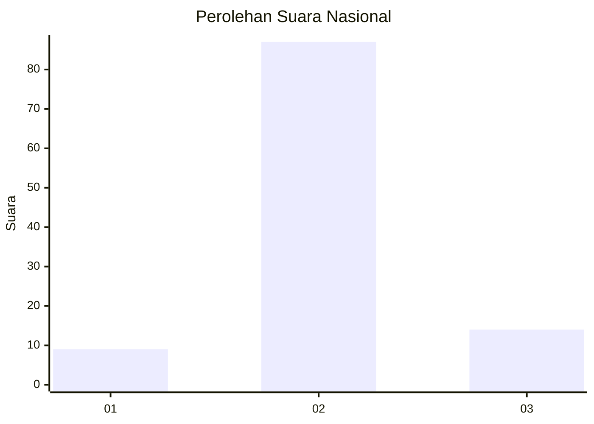
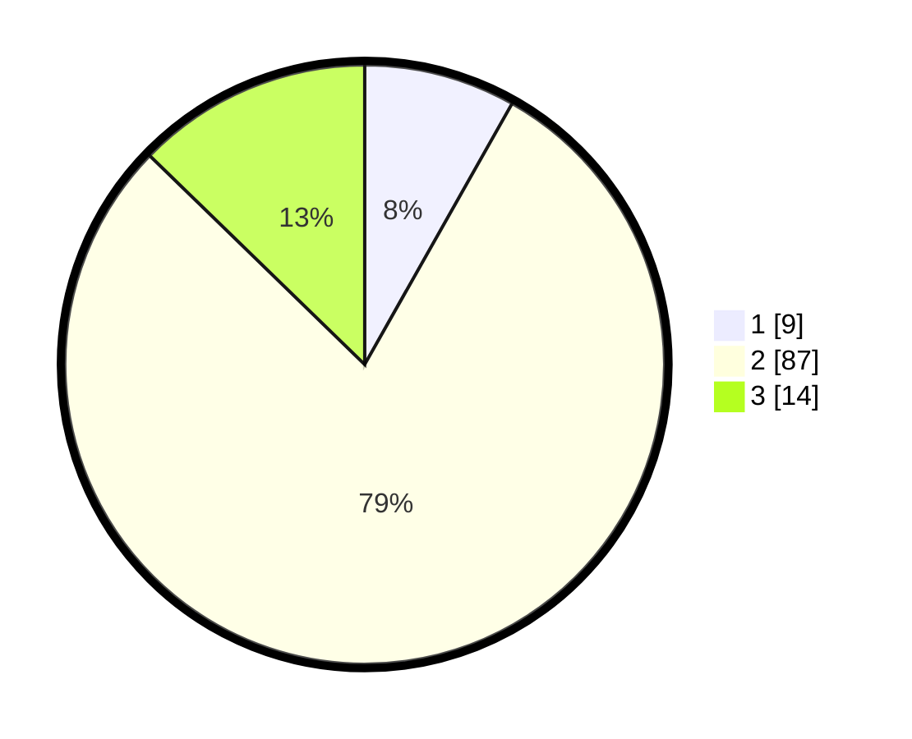

# Hasil

## Grafik

## Tabel

| No. | Nama Paslon    | Suara | Suara (raw) | Persentase |
|:--- |:-------------- | -----:| -----------:| ----------:|
| 1   | ANIES MUHAIMIN | 9     | [9][p-1]    | 8,18       |
| 2   | PRABOWO GIBRAN | 87    | [87][p-2]   | 79,09      |
| 3   | GANJAR MAHFUD  | 14    | [14][p-3]   | 12,73      |

[p-1]: https://github.com/gigit-pemilu/pemilu-2024/blob/main/pilpres/hitung-suara/sub/14-riau/sub/03-bengkalis/sub/13-pinggir/sub/2011-tengganau/sub/008-tps/sub/paslon-1.txt
[p-2]: https://github.com/gigit-pemilu/pemilu-2024/blob/main/pilpres/hitung-suara/sub/14-riau/sub/03-bengkalis/sub/13-pinggir/sub/2011-tengganau/sub/008-tps/sub/paslon-2.txt
[p-3]: https://github.com/gigit-pemilu/pemilu-2024/blob/main/pilpres/hitung-suara/sub/14-riau/sub/03-bengkalis/sub/13-pinggir/sub/2011-tengganau/sub/008-tps/sub/paslon-3.txt

## Foto C Plano

https://sirekap-obj-formc.kpu.go.id/2df5/pemilu/ppwp/14/03/13/20/11/1403132011008-20240215-110510--bfb2c858-d30a-4552-bdfe-f859f006fe71.jpg

https://sirekap-obj-formc.kpu.go.id/2df5/pemilu/ppwp/14/03/13/20/11/1403132011008-20240215-110515--af7cbce2-2b70-41f8-8cca-d6f8f7340a99.jpg

https://sirekap-obj-formc.kpu.go.id/2df5/pemilu/ppwp/14/03/13/20/11/1403132011008-20240215-110519--ba382024-82c2-43bc-9c7b-44d7a3580709.jpg

## Metadata

| Key        | Value               |
| ---------- | ------------------- |
| Time Stamp | 2024-02-15 21:01:18 |

