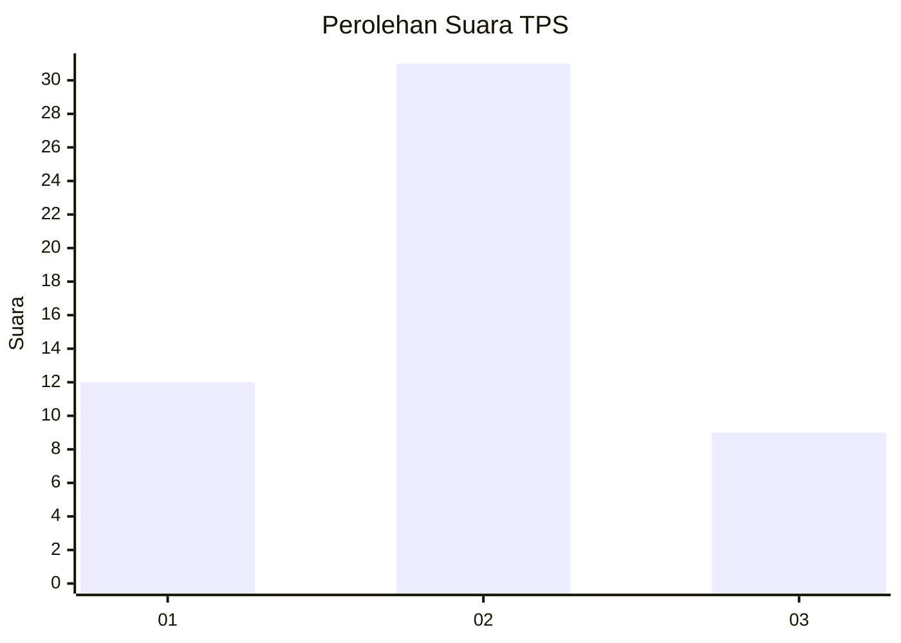

# Hasil

## Grafik

## Tabel

| No. | Nama Paslon    | Suara | Suara (raw) | Persentase |
|:--- |:-------------- | -----:| -----------:| ----------:|
| 1   | ANIES MUHAIMIN | 12    | [12][p-1]   | 23,08      |
| 2   | PRABOWO GIBRAN | 31    | [31][p-2]   | 59,62      |
| 3   | GANJAR MAHFUD  | 9     | [9][p-3]    | 17,31      |

[p-1]: https://github.com/gigit-pemilu/pemilu-2024-14-riau/blob/main/pilpres/hitung-suara/sub/14-riau/sub/03-bengkalis/sub/13-pinggir/sub/2015-pangkalan-libut/sub/008-tps/sub/paslon-1.txt
[p-2]: https://github.com/gigit-pemilu/pemilu-2024-14-riau/blob/main/pilpres/hitung-suara/sub/14-riau/sub/03-bengkalis/sub/13-pinggir/sub/2015-pangkalan-libut/sub/008-tps/sub/paslon-2.txt
[p-3]: https://github.com/gigit-pemilu/pemilu-2024-14-riau/blob/main/pilpres/hitung-suara/sub/14-riau/sub/03-bengkalis/sub/13-pinggir/sub/2015-pangkalan-libut/sub/008-tps/sub/paslon-3.txt

## Foto C Plano

https://sirekap-obj-formc.kpu.go.id/c4b7/pemilu/ppwp/14/03/13/20/15/1403132015008-20240214-141921--72e6c326-a9ee-4395-845c-43b80417323f.jpg

https://sirekap-obj-formc.kpu.go.id/c4b7/pemilu/ppwp/14/03/13/20/15/1403132015008-20240214-141133--a9a14cc4-4a9d-4ea6-b3a4-439def57365c.jpg

https://sirekap-obj-formc.kpu.go.id/c4b7/pemilu/ppwp/14/03/13/20/15/1403132015008-20240214-140936--143b544b-034c-48b8-87d8-531eca1e6b67.jpg

## Metadata

| Key        | Value               |
| ---------- | ------------------- |
| Time Stamp | 2024-02-14 21:46:01 |

